# @fastapi框架


`fastapi`，一个用于构建 API 的现代、快速（高性能）的web框架。

`fastapi`是建立在Starlette和Pydantic基础上的，Pydantic是一个基于Python类型提示来定义数据验证、序列化和文档的库。Starlette是一种轻量级的ASGI框架/工具包，是构建高性能Asyncio服务的理性选择。

> - 快速：可与 NodeJS 和 Go 比肩的`极高性能`（归功于 `Starlette` 和 `Pydantic`），是最快的 Python web 框架之一。
> - 高效编码：提高功能开发速度约 200％ 至 300％。
> - 更少bug：减少约 40％ 的人为（开发者）导致错误。
> - 智能：极佳的编辑器支持。处处皆可自动补全，减少调试时间。
> - 简单：设计的`易于使用和学习`，阅读文档的时间更短。
> - 简短：使代码重复最小化。通过不同的参数声明实现丰富功能。
> - 健壮：生产可用级别的代码。还有`自动生成的交互式文档`。

依赖：Python 3.6 及更高版本，FastAPI 站在以下巨人的肩膀之上


> [Starlette](https://www.starlette.io/) 负责 web 部分(Asyncio)
>
> [Pydantic](https://pydantic-docs.helpmanual.io/) 负责数据部分(类型提示)

FastApi是站在前人肩膀上，集成了多种框架的优点的新秀框架。它出现的比较晚，2018年底才发布在github上。广泛应用于当前各种前后端分离的项目开发，测试运维自动化以及微服务的场景中。

## 一、预备知识点

### 1.1、http协议

````text
1. 什么是请求头请求体，响应头响应体
2. URL地址包括什么
3. get请求和post请求到底是什么
4. Content-Type是什么
````

#### 一、简介

HTTP协议是Hyper Text Transfer Protocol（超文本传输协议）的缩写,是用于万维网（WWW:World Wide Web ）服务器与本地浏览器之间传输超文本的传送协议。HTTP是一个属于应用层的面向对象的协议，由于其简捷、快速的方式，适用于分布式超媒体信息系统。它于1990年提出，经过几年的使用与发展，得到不断地完善和扩展。HTTP协议工作于客户端-服务端架构为上。浏览器作为HTTP客户端通过URL向HTTP服务端即WEB服务器发送所有请求。Web服务器根据接收到的请求后，向客户端发送响应信息。


#### 二、 http协议特性

 ```text
  (1) 基于TCP/IP协议
 
 http协议是基于TCP/IP协议之上的应用层协议。
 
 (2) 基于请求－响应模式
 
 HTTP协议规定,请求从客户端发出,最后服务器端响应该请求并 返回。换句话说,肯定是先从客户端开始建立通信的,服务器端在没有 接收到请求之前不会发送响应
 
  (3) 无状态保存
 
 HTTP是一种不保存状态,即无状态(stateless)协议。HTTP协议 自身不对请求和响应之间的通信状态进行保存。也就是说在HTTP这个 级别,协议对于发送过的请求或响应都不做持久化处理。
 
 使用HTTP协议,每当有新的请求发送时,就会有对应的新响应产 生。协议本身并不保留之前一切的请求或响应报文的信息。这是为了更快地处理大量事务,确保协议的可伸缩性,而特意把HTTP协议设计成 如此简单的。
 
  (4) 短连接
 
 HTTP1.0默认使用的是短连接。浏览器和服务器每进行一次HTTP操作，就建立一次连接，任务结束就中断连接。
 HTTP/1.1起，默认使用长连接。要使用长连接，客户端和服务器的HTTP首部的Connection都要设置为keep-alive，才能支持长连接。
 HTTP长连接，指的是复用TCP连接。多个HTTP请求可以复用同一个TCP连接，这就节省了TCP连接建立和断开的消耗。
 ```

#### 三、http请求协议与响应协议

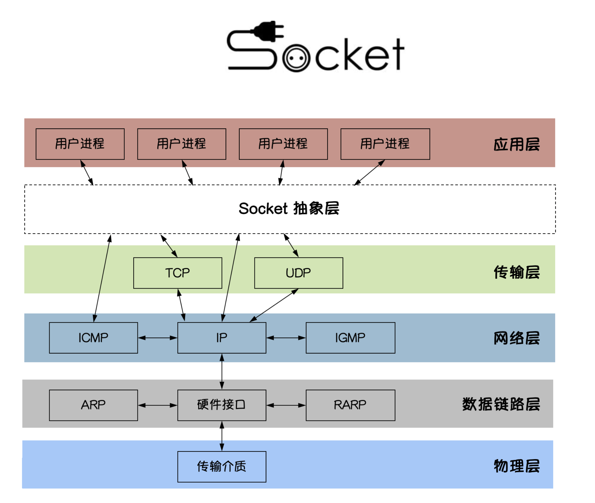

http协议包含由浏览器发送数据到服务器需要遵循的请求协议与服务器发送数据到浏览器需要遵循的请求协议。用于HTTP协议交互的信被为HTTP报文。请求端(客户端)的HTTP报文 做请求报文,响应端(服务器端)的 做响应报文。HTTP报文本身是由多行数据构成的字文本。


> 一个完整的URL包括：协议、ip、端口、路径、参数  
>
> 例如： https://www.baidu.com/s?wd=yuan     其中https是协议，www.baidu.com 是IP，端口默认80，/s是路径，参数是wd=yuan
>
> 请求方式: get与post请求
>
> - GET提交的数据会放在URL之后，以?分割URL和传输数据，参数之间以&相连，如EditBook?name=test1&id=123456. POST方法是把提交的数据放在HTTP包的请求体中.
> - GET提交的数据大小有限制（因为浏览器对URL的长度有限制），而POST方法提交的数据没有限制
>
> 响应状态码：状态码的职 是当客户端向服务器端发送请求时, 返回的请求 结果。借助状态码,用户可以知道服务器端是正常 理了请求,还是出 现了 。状态码如200 OK,以3位数字和原因 组成。

### 1.2、api接口

在开发Web应用中，有两种应用模式：

1. 前后端不分离[客户端看到的内容和所有界面效果都是由服务端提供出来的。]


2. 前后端分离【把前端的界面效果(html，css，js分离到另一个服务端，python服务端只需要返回数据即可)】

前端形成一个独立的网站，服务端构成一个独立的网站

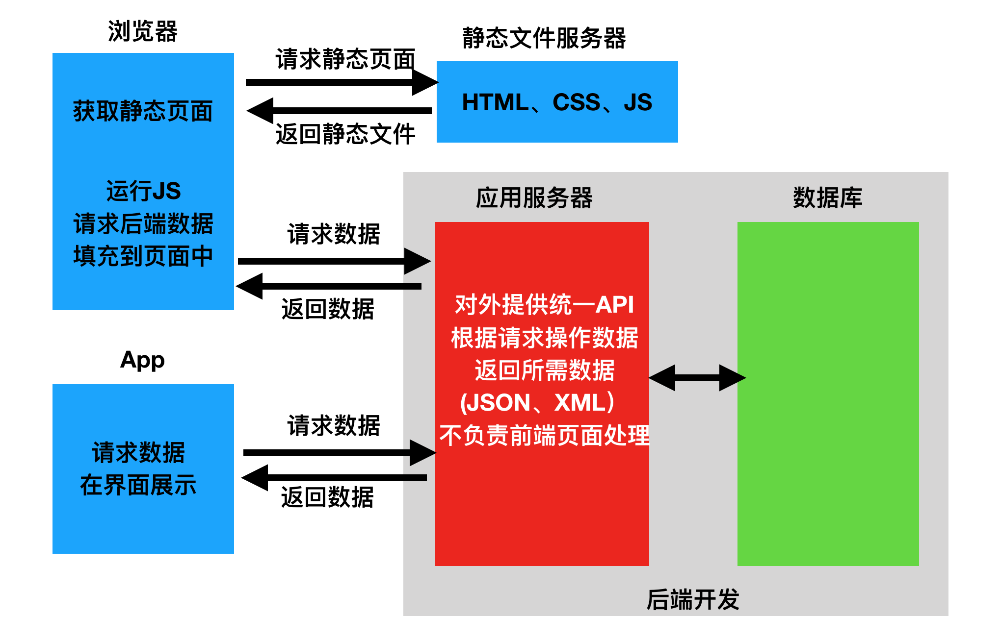

应用程序编程接口（Application Programming Interface，API接口），就是应用程序对外提供了一个操作数据的入口，这个入口可以是一个函数或类方法，也可以是一个url地址或者一个网络地址。当客户端调用这个入口，应用程序则会执行对应代码操作，给客户端完成相对应的功能。

当然，api接口在工作中是比较常见的开发内容，有时候，我们会调用其他人编写的api接口，有时候，我们也需要提供api接口给其他人操作。由此就会带来一个问题，api接口往往都是一个函数、类方法、或者url或其他网络地址，不断是哪一种，当api接口编写过程中，我们都要考虑一个问题就是这个接口应该怎么编写？接口怎么写的更加容易维护和清晰，这就需要大家在调用或者编写api接口的时候要有一个明确的编写规范！！！

为了在团队内部形成共识、防止个人习惯差异引起的混乱，我们都需要找到一种大家都觉得很好的接口实现规范，而且这种规范能够让后端写的接口，用途一目了然，减少客户端和服务端双方之间的合作成本。

目前市面上大部分公司开发人员使用的接口实现规范主要有：restful、RPC。

REST全称是Representational State Transfer，中文意思是表述（编者注：通常译为表征）性状态转移。 它首次出现在2000年Roy Fielding的博士论文中。

RESTful是一种专门为Web 开发而定义API接口的设计风格，尤其适用于前后端分离的应用模式中。

关键：面向资源开发

这种风格的理念认为后端开发任务就是提供数据的，对外提供的是数据资源的访问接口，所以在定义接口时，客户端访问的URL路径就表示这种要操作的数据资源。

而对于数据资源分别使用POST、DELETE、GET、UPDATE等请求动作来表达对数据的增删查改。

| 请求方法 | 请求地址   | 后端操作        |
| :------- | :--------- | :-------------- |
| POST     | /student/  | 增加学生        |
| GET      | /student/  | 获取所有学生    |
| GET      | /student/1 | 获取id为1的学生 |
| PUT      | /student/1 | 修改id为1的学生 |
| DELETE   | /student/1 | 删除id为1的学生 |

restful规范是一种通用的规范，不限制语言和开发框架的使用。事实上，我们可以使用任何一门语言，任何一个框架都可以实现符合restful规范的API接口。

## 二、quick start

### 简单案例

**安装**

```python
pip install fastapi
```

你还会需要一个 ASGI 服务器，生产环境可以使用 [Uvicorn](https://www.uvicorn.org/)

```python
pip install uvicorn
```

**代码**

 ```python
 from fastapi import FastAPI  # FastAPI 是一个为你的 API 提供了所有功能的 Python 类。
 
 app = FastAPI()  # 这个实例将是创建你所有 API 的主要交互对象。这个 app 同样在如下命令中被 uvicorn 所引用
 
 @app.get("/")
 async def root():
     return {"message": "Hello yuan"}
 ```

通过以下命令运行服务器：

```python
uvicorn main:app --reload
```

```python
INFO:     Uvicorn running on http://127.0.0.1:8000 (Press CTRL+C to quit)
INFO:     Started reloader process [73408]
INFO:     Started server process [73408]
INFO:     Waiting for application startup
INFO:     Application startup complete
```

也可以直接运行：

```python
if __name__ == '__main__':
    import uvicorn

    uvicorn.run("main:app", host="127.0.0.1", port=8080, debug=True, reload=True)

```

> （1）导入 FastAPI。
> （2）创建一个 app 实例。
> （3）编写一个路径操作装饰器（如 @app.get("/")）。
> （4）编写一个路径操作函数（如上面的 def root(): ...）
> （5）定义返回值
> （6）运行开发服务器（如 uvicorn main:app --reload）

此外，fastapi有着**非常棒的交互式 API 文档**，这一点很吸引人。

跳转到 [http://127.0.0.1:8000/docs](https://link.zhihu.com/?target=http%3A//127.0.0.1%3A8000/docs)。你将会看到**自动生成**的交互式 API 文档。

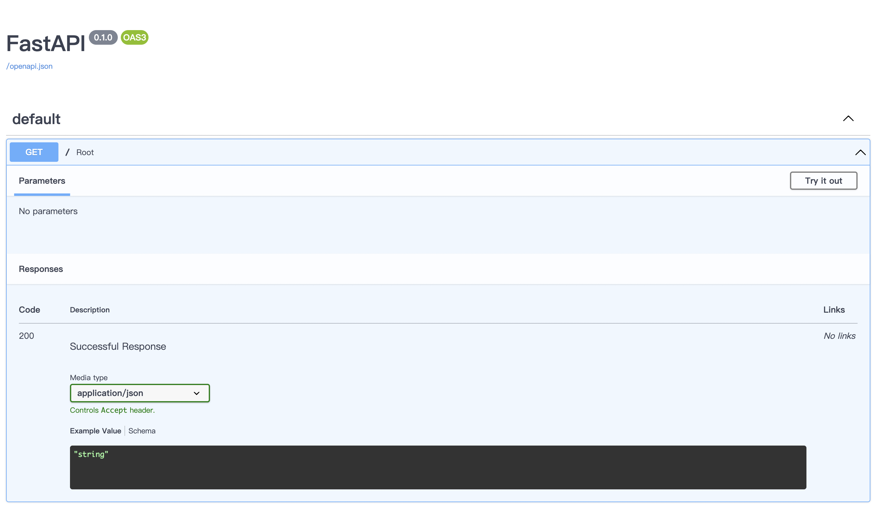

## 三、路径操作

### 路径操作装饰器

fastapi支持各种请求方式：

```python
@app.get()
@app.post()
@app.put()
@app.patch()
@app.delete()
@app.options()
@app.head()
@app.trace()
```

```python
from typing import Union

from fastapi import FastAPI

app = FastAPI()


@app.get("/get")
def get_test():
    return {"method": "get方法"}


@app.post("/post")
def post_test():
    return {"method": "post方法"}


@app.put("/put")
def put_test():
    return {"method": "put方法"}


@app.delete("/delete")
def delete_test():
    return {"method": "delete方法"}

```

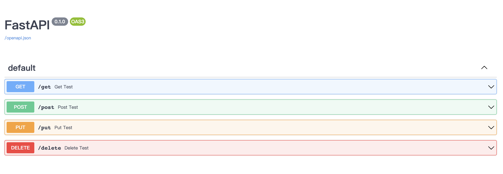

路径操作装饰器参数：

```python
@app.post(
    "/items/{item_id}",
    response_model=Item,
    status_code=status.HTTP_200_OK,
    tags=["AAA"],
    summary="this is summary",
    description="this is description",
    response_description= "this is response_description",
    deprecated=False,
)
```

### include_router

main.py

```python
from typing import Union

from fastapi import FastAPI
import uvicorn

from apps import app01, app02

app = FastAPI()

app.include_router(app01, prefix="/app01", tags=["第一章节：商城接口", ])
app.include_router(app02, prefix="/app02", tags=["第二章节：用户中心接口", ])

if __name__ == '__main__':
    uvicorn.run("main:app", host="127.0.0.1", port=8080, debug=True, reload=True)

```

与main.py同级目录apps：


```python
# __init__.py
from .app01 import app01
from .app02 import app02
```

```python
from fastapi import APIRouter

app01 = APIRouter()


@app01.get("/shop/food")
def shop_food():
    return {"shop": "food"}


@app01.get("/shop/bed")
def shop_food():
    return {"shop": "bed"}
```

```python
from fastapi import APIRouter

app02 = APIRouter()


@app02.post("/user/login")
def user_login():
    return {"user": "login"}


@app02.post("/user/reg")
def user_reg():
    return {"user": "reg"}

```

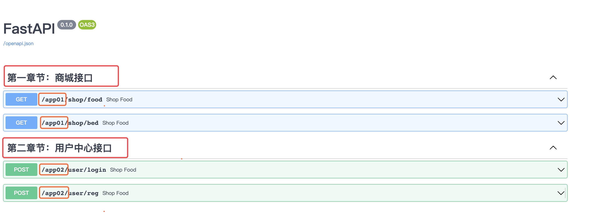

## 四、请求与响应

### 4.1、路径参数

#### （1）基本用法

以使用与 Python 格式化字符串相同的语法来声明路径"参数"或"变量"：

```python
@app.get("/user/{user_id}")
def get_user(user_id):
    print(user_id, type(user_id))
    return {"user_id": user_id}
```

路径参数 `user_id` 的值将作为参数 `user_id` 传递给你的函数。

#### （2）有类型的路径参数

你可以使用标准的 Python 类型标注为函数中的路径参数声明类型。

```python
@app.get("/user/{user_id}")
def get_user(user_id: int):
    print(user_id, type(user_id))
    return {"user_id": user_id}
```

在这个例子中，`user_id` 被声明为 `int` 类型。

> 这将为你的函数提供编辑器支持，包括错误检查、代码补全等等。

#### （3）注意顺序

在创建*路径操作*时，你会发现有些情况下路径是固定的。

比如 `/users/me`，我们假设它用来获取关于当前用户的数据.

然后，你还可以使用路径 `/user/{username}` 来通过用户名 获取关于特定用户的数据。

由于*路径操作*是按顺序依次运行的，你需要确保路径 `/user/me` 声明在路径 `/user/{username}`之前：

```python
@app.get("/user/me")
async def read_user_me():
    return {"username": "the current user"}

@app.get("/user/{username}")
async def read_user(username: str):
    return {"username": username}
```

否则，`/user/{username}` 的路径还将与 `/user/me` 相匹配，"认为"自己正在接收一个值为 `"me"` 的 `username` 参数。

### 4.2、查询参数（请求参数）

 路径函数中声明不属于路径参数的其他函数参数时，它们将被自动解释为"查询字符串"参数，就是 url? 之后用`&`分割的 key-value 键值对。

```python
@app.get("/jobs/{kd}")
async def search_jobs(kd: str, city: Union[str, None] = None, xl: Union[str, None] = None):  # 有默认值即可选，否则必选
    if city or xl:
        return {"kd": kd, "city": city, "xl": xl}
    return {"kd": kd}
```

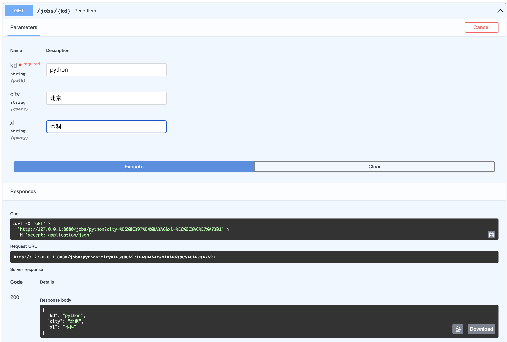

在这个例子中，函数参数 `city`和`xl` 是可选的，并且默认值为 `None`。

自python3.5开始，PEP484为python引入了类型注解(type hints)，typing的主要作用有：

> 1. 类型检查，防止运行时出现参数、返回值类型不符。
> 2. 作为开发文档附加说明，方便使用者调用时传入和返回参数类型。
> 3. 模块加入不会影响程序的运行不会报正式的错误，pycharm支持typing检查错误时会出现黄色警告。

` type hints `主要是要指示函数的输入和输出的数据类型，数据类型在typing 包中，基本类型有str list dict等等，

Union 是当有多种可能的数据类型时使用，比如函数有可能根据不同情况有时返回str或返回list，那么就可以写成Union[list, str]
Optional 是Union的一个简化， 当 数据类型中有可能是None时，比如有可能是str也有可能是None，则Optional[str], 相当于Union[str, None]

### 4.3、请求体数据

当你需要将数据从客户端（例如浏览器）发送给 API 时，你将其作为「请求体」发送。**请求**体是客户端发送给 API 的数据。**响应**体是 API 发送给客户端的数据。

FastAPI 基于 `Pydantic` ，`Pydantic` 主要用来做类型强制检查（校验数据）。不符合类型要求就会抛出异常。

对于 API 服务，支持类型检查非常有用，会让服务更加健壮，也会加快开发速度，因为开发者再也不用自己写一行一行的做类型检查。

安装上手`pip install pydantic`

```python
from typing import Union, List, Optional

from fastapi import FastAPI
from pydantic import BaseModel, Field, ValidationError, validator
import uvicorn
from datetime import date


class Addr(BaseModel):
    province: str
    city: str


class User(BaseModel):
    name = 'root'
    age: int = Field(default=0, lt=100, gt=0)
    birth: Optional[date] = None
    friends: List[int] = []
    description: Union[str, None] = None

    # addr: Union[Addr, None] = None  # 类型嵌套

    @validator('name')
    def name_must_alpha(cls, v):
        assert v.isalpha(), 'name must be alpha'
        return v


class Data(BaseModel):  # 类型嵌套
    users: List[User]


app = FastAPI()


@app.post("/data/")
async def create_data(data: Data):
    # 添加数据库
    return data


if __name__ == '__main__':
    try:
        User(name="",...)
    except ValidationError as e:
        print(e.json())  
    

```

测试：

```json
{
  "name": "rain",
  "age": 32,
  "birth": "2022-09-29",
  "friends": [],
  "description": "最帅的讲fastapi的老师"
}
```

和声明查询参数时一样，当一个模型属性具有默认值时，它不是必需的。否则它是一个必需属性。将默认值设为 `None` 可使其成为可选属性。

FastAPI 会自动将定义的模型类转化为`JSON Schema`，Schema 成为 OpenAPI 生成模式的一部分，并显示在 API 交互文档中，查看 API 交互文档如下，该接口将接收`application/json`类型的参数。

FastAPI 支持同时定义 Path 参数、Query 参数和请求体参数，FastAPI 将会正确识别并获取数据。

> 参数在 url 中也声明了，它将被解释为 path 参数
>
> 参数是单一类型（例如int、float、str、bool等），它将被解释为 query 参数
>
> 参数类型为继承 Pydantic 模块的`BaseModel`类的数据模型类，则它将被解释为请求体参数

### 4.4、form表单数据

在 OAuth2 规范的一种使用方式（密码流）中，需要将用户名、密码作为表单字段发送，而不是 JSON。

FastAPI 可以使用**Form**组件来接收表单数据，需要先使用`pip install python-multipart`命令进行安装。

> pip install python-multipart

```python
from fastapi import FastAPI, Form

app = FastAPI()

@app.post("/regin")
def regin(username: str = Form(..., max_length=16, min_length=8, regex='[a-zA-Z]'),
          password: str = Form(..., max_length=16, min_length=8, regex='[0-9]')):
    print(f"username:{username},password:{password}")
    return {"username": username}

```


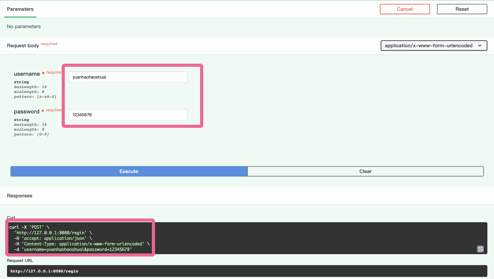

### 4.5、文件上传

```python
from fastapi import FastAPI, File, UploadFile
from typing import List

app = FastAPI()

# file: bytes = File()：适合小文件上传
@app.post("/files/")
async def create_file(file: bytes = File()):
    print("file:", file)
    return {"file_size": len(file)}


@app.post("/multiFiles/")
async def create_files(files: List[bytes] = File()):
    return {"file_sizes": [len(file) for file in files]}


# file: UploadFile：适合大文件上传

@app.post("/uploadFile/")
async def create_upload_file(file: UploadFile):
    with open(f"{file.filename}", 'wb') as f:
        for chunk in iter(lambda: file.file.read(1024), b''):
            f.write(chunk)

    return {"filename": file.filename}


@app.post("/multiUploadFiles/")
async def create_upload_files(files: List[UploadFile]):
    return {"filenames": [file.filename for file in files]}

```

### 4.6、Reqeust对象

有些情况下我们希望能直接访问*Request*对象。例如我们在路径操作函数中想获取客户端的IP地址，需要在函数中声明**Request**类型的参数，FastAPI 就会自动传递 Request 对象给这个参数，我们就可以获取到 Request 对象及其属性信息，例如 header、url、cookie、session 等。

```python

from fastapi import Request


@app.get("/items")
async def items(request: Request):
    return {
        "请求URL：": request.url,
        "请求ip：": request.client.host,
        "请求宿主：": request.headers.get("user-agent"),
        "cookies": request.cookies,
    }
    
```

### 4.7、请求静态文件

在 Web 开发中，需要请求很多静态资源文件（不是由服务器生成的文件），如 css/js 和图片文件等。

```python
from fastapi.staticfiles import StaticFiles

app = FastAPI()
app.mount("/static",StaticFiles(directory="static"))

```

### 4.8、响应模型相关参数

#### （1）response_model

前面写的这么多路径函数最终 return 的都是自定义结构的字典，FastAPI 提供了 response_model 参数，声明 return 响应体的模型

```javascript
# 路径操作
@app.post("/items/", response_model=Item)
# 路径函数
async def create_item(item: Item):
    ...
```

> response_model 是路径操作的参数，并不是路径函数的参数哦

FastAPI将使用`response_model`进行以下操作：

- 将输出数据转换为response_model中声明的数据类型。
- 验证数据结构和类型
- 将输出数据限制为该model定义的
- 添加到OpenAPI中
- 在自动文档系统中使用。

你可以在任意的路径操作中使用 `response_model` 参数来声明用于响应的模型

案例：

- 注册功能
- 输入账号、密码、昵称、邮箱，注册成功后返回个人信息

```python
from typing import Union

from fastapi import FastAPI
from pydantic import BaseModel, EmailStr

app = FastAPI()


class UserIn(BaseModel):
    username: str
    password: str
    email: EmailStr
    full_name: Union[str, None] = None


class UserOut(BaseModel):
    username: str
    email: EmailStr
    full_name: Union[str, None] = None


@app.post("/user/", response_model=UserOut)
async def create_user(user: UserIn):
    return user

```

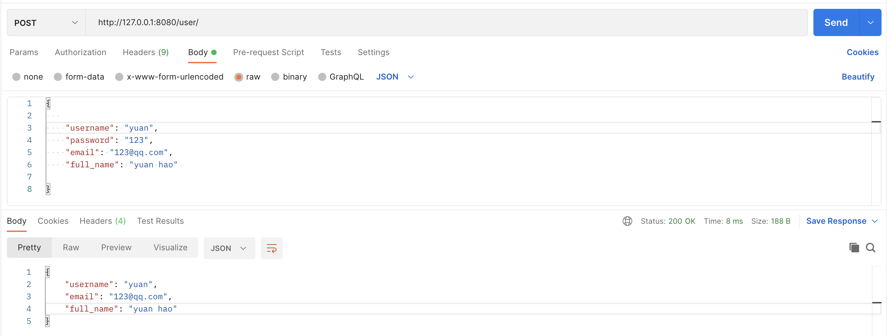

#### （2）response_model_exclude_unset

通过上面的例子，我们学到了如何用response_model控制响应体结构，但是如果它们实际上没有存储，则可能要从结果中忽略它们。例如，如果model在NoSQL数据库中具有很多可选属性，但是不想发送很长的JSON响应，其中包含默认值。

案例：

```python
from typing import List, Union

from fastapi import FastAPI
from pydantic import BaseModel

app = FastAPI()


class Item(BaseModel):
    name: str
    description: Union[str, None] = None
    price: float
    tax: float = 10.5
    tags: List[str] = []


items = {
    "foo": {"name": "Foo", "price": 50.2},
    "bar": {"name": "Bar", "description": "The bartenders", "price": 62, "tax": 20.2},
    "baz": {"name": "Baz", "description": None, "price": 50.2, "tax": 10.5, "tags": []},
}


@app.get("/items/{item_id}", response_model=Item, response_model_exclude_unset=True)
async def read_item(item_id: str):
    return items[item_id]

```

请求：http://127.0.0.1:8080/items/foo

不设置unset参数：

```json
{
  "name": "Foo",
  "description": null,
  "price": 50.2,
  "tax": 10.5,
  "tags": []
}
```

设置unset参数：

```json
{
  "name": "Foo",
  "price": 50.2
}
```

使用路径操作装饰器的 `response_model` 参数来定义响应模型，特别是确保私有数据被过滤掉。使用 `response_model_exclude_unset` 来仅返回显式设定的值。
除了`response_model_exclude_unset`以外，还有`response_model_exclude_defaults`和`response_model_exclude_none`，我们可以很直观的了解到他们的意思，不返回是默认值的字段和不返回是None的字段。

#### （3）INCLUDE和EXCLUDE

```python
# response_model_exclude
@app.get("/items/{item_id}", response_model=Item, response_model_exclude={"description"}, )
async def read_item(item_id: str):
    return items[item_id]

# response_model_include  
@app.get("/items/{item_id}", response_model=Item, response_model_include={"name", "price"}, )
async def read_item(item_id: str):
    return items[item_id]
```

## 五、jinja2模板

要了解jinja2，那么需要先理解模板的概念。模板在Python的web开发中⼴泛使⽤，它能够有效的将业务逻辑和页⾯逻辑分开，使代码可读性增强、并且更加容易理解和维护。
模板简单来说就是⼀个其中包涵占位变量表⽰动态的部分的⽂件，模板⽂件在经过动态赋值后，返回给⽤户。

jinja2是Flask作者开发的⼀个模板系统，起初是仿django模板的⼀个模板引擎，为Flask提供模板⽀持，由于其灵活，快速和安全等优点被⼴泛使⽤。

在jinja2中，存在三种语法：
> 1. 变量取值 {{ }}
> 2. 控制结构 

### 5.1、jinja2 的变量

`Main.py`

```python
from fastapi import FastAPI, Request
from fastapi.templating import Jinja2Templates
import uvicorn

app = FastAPI()  # 实例化 FastAPI对象
templates = Jinja2Templates(directory="templates")  # 实例化Jinja2对象，并将文件夹路径设置为以templates命令的文件夹


@app.get('/')
def hello(request: Request):
    return templates.TemplateResponse(
        'index.html',
        {
            'request': request,  # 注意，返回模板响应时，必须有request键值对，且值为Request请求对象
            'user': 'yuan',
            "books": ["金瓶梅", "聊斋", "剪灯新话", "国色天香"],
            "booksDict": {
                "金瓶梅": {"price": 100, "publish": "苹果出版社"},
                "聊斋": {"price": 200, "publish": "橘子出版社"},
            }
        }
    )
if __name__ == '__main__':
    uvicorn.run("main:app", port=8080, debug=True, reload=True)

```

```html
<!DOCTYPE html>
<html lang="en">
<head>
    <meta charset="UTF-8">
    <title>Title</title>
</head>
<body>


<h1>{{ user}}</h1>

<p>{{ books.0 }}</p>
<p>{{ books.1 }}</p>
<p>{{ books.2 }}</p>
<p>{{ books.3 }}</p>

<p>{{ booksDict.金瓶梅.price }}</p>


</body>
</html>
```

### 5.2、jinja2 的过滤器

变量可以通过“过滤器”进⾏修改，过滤器可以理解为是jinja2⾥⾯的内置函数和字符串处理函数。常⽤的过滤器有：

| 过滤器名称  | 说明                                         |
| ----------- | -------------------------------------------- |
| capitialize | 把值的⾸字母转换成⼤写，其他⼦母转换为⼩写   |
| lower       | 把值转换成⼩写形式                           |
| title       | 把值中每个单词的⾸字母都转换成⼤写           |
| trim        | 把值的⾸尾空格去掉                           |
| striptags   | 渲染之前把值中所有的HTML标签都删掉           |
| join        | 拼接多个值为字符串                           |
| round       | 默认对数字进⾏四舍五⼊，也可以⽤参数进⾏控制 |
| safe        | 渲染时值不转义                               |

那么如何使⽤这些过滤器呢？只需要在变量后⾯使⽤管道(|)分割，多个过滤器可以链式调⽤，前⼀个过滤器的输出会作为后⼀个过滤
器的输⼊。

```jinja2

{{ 'abc'| captialize  }}  # Abc

{{ 'abc'| upper  }} # ABC

{{ 'hello world'| title  }} # Hello World

{{ "hello world"| replace('world','yuan') | upper }} # HELLO YUAN

{{ 18.18 | round | int }} # 18

```

### 5.3、jinja2 的控制结构

#### 5.3.1、分支控制

jinja2中的if语句类似与Python的if语句，它也具有单分⽀，多分⽀等多种结构，不同的是，条件语句不需要使⽤冒号结尾，⽽结束控制语句，需要使⽤endif关键字

```jinja2


    <p>成年区</p>


    
    <p>未成年区</p>


```

#### 5.3.2、循环控制

jinja2中的for循环⽤于迭代Python的数据类型，包括列表，元组和字典。在jinja2中不存在while循环。

```jinja2

    <p>{{ book }}</p>


```

## 六、ORM操作

在大型的web开发中，我们肯定会用到数据库操作，那么FastAPI也支持数据库的开发，你可以用 PostgreSQL、MySQL、 SQLite Oracle 等。本文用SQLite为例。我们看下在fastapi是如何操作设计数据库的。

fastapi是一个很优秀的框架，但是缺少一个合适的orm，官方代码里面使用的是sqlalchemy，Tortoise ORM 是受 Django 启发的易于使用的异步 ORM （对象关系映射器）。


[Tortoise ORM文档](https://tortoise-orm.readthedocs.io/en/latest/index.html)

> Tortoise ORM 目前支持以下[数据库](https://tortoise-orm.readthedocs.io/en/latest/databases.html#databases)：
>
> - PostgreSQL >= 9.4（使用`asyncpg`）
> - SQLite（使用`aiosqlite`）
> - MySQL/MariaDB（使用`aiomysql`或使用[asyncmy](https://github.com/long2ice/asyncmy)）

### 6.1、创建模型

以选课系统为例：

`models.py`

```python
from tortoise.models import Model
from tortoise import fields


class Clas(Model):
    name = fields.CharField(max_length=255, description='班级名称')


class Teacher(Model):
    id = fields.IntField(pk=True)
    name = fields.CharField(max_length=255, description='姓名')
    tno = fields.IntField(description='账号')
    pwd = fields.CharField(max_length=255, description='密码')


class Student(Model):
    id = fields.IntField(pk=True)
    sno = fields.IntField(description='学号')
    pwd = fields.CharField(max_length=255, description='密码')
    name = fields.CharField(max_length=255, description='姓名')
    # 一对多
    clas = fields.ForeignKeyField('models.Clas', related_name='students')
    # 多对多
    courses = fields.ManyToManyField('models.Course', related_name='students',description='学生选课表')


class Course(Model):
    id = fields.IntField(pk=True)
    name = fields.CharField(max_length=255, description='课程名')
    teacher = fields.ForeignKeyField('models.Teacher', related_name='courses', description='课程讲师')

```

### 6.2、aerich迁移工具

`main.py`

```python
import uvicorn
from fastapi import FastAPI
from tortoise.contrib.fastapi import register_tortoise
from settings import TORTOISE_ORM


app = FastAPI()

# 该方法会在fastapi启动时触发，内部通过传递进去的app对象，监听服务启动和终止事件
# 当检测到启动事件时，会初始化Tortoise对象，如果generate_schemas为True则还会进行数据库迁移
# 当检测到终止事件时，会关闭连接
register_tortoise(
    app,
    config=TORTOISE_ORM,
    # generate_schemas=True,  # 如果数据库为空，则自动生成对应表单，生产环境不要开
    # add_exception_handlers=True,  # 生产环境不要开，会泄露调试信息
)

if __name__ == '__main__':
    uvicorn.run('main:app', host='127.0.0.1', port=8000, reload=True,
                debug=True, workers=1)

```

`settings.py`

```python
TORTOISE_ORM = {
    'connections': {
        'default': {
            # 'engine': 'tortoise.backends.asyncpg',  PostgreSQL
            'engine': 'tortoise.backends.mysql',  # MySQL or Mariadb
            'credentials': {
                'host': '127.0.0.1',
                'port': '3306',
                'user': 'root',
                'password': 'yuan0316',
                'database': 'fastapi',
                'minsize': 1,
                'maxsize': 5,
                'charset': 'utf8mb4',
                "echo": True
            }
        },
    },
    'apps': {
        'models': {
            'models': ['apps.models', "aerich.models"],
            'default_connection': 'default',

        }
    },
    'use_tz': False,
    'timezone': 'Asia/Shanghai'
}
```

`aerich`是一种[ORM](https://so.csdn.net/so/search?q=ORM&spm=1001.2101.3001.7020)迁移工具，需要结合`tortoise`异步orm框架使用。安装`aerich`

```python
pip install aerich
```

#### 1. 初始化配置，只需要使用一次

```python
aerich init -t settings.TORTOISE_ORM # TORTOISE_ORM配置的位置)
```

> 初始化完会在当前目录生成一个文件：pyproject.toml和一个文件夹：migrations
>
> - `pyproject.toml`：保存配置文件路径，低版本可能是`aerich.ini`
> - `migrations`：存放迁移文件

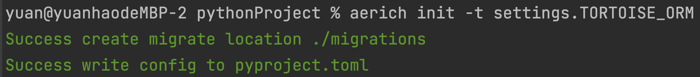

#### 2. 初始化数据库，一般情况下只用一次

```python
aerich init-db
```

> 1. 此时数据库中就有相应的表格
>
> 2. 如果`TORTOISE_ORM`配置文件中的`models`改了名，则执行这条命令时需要增加`--app`参数，来指定你修改的名字

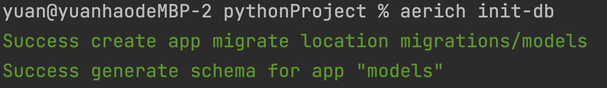

#### 3. 更新模型并进行迁移

修改model类，重新生成迁移文件,比如添加一个字段

```python
class Admin(Model):
    ...
    xxx = fields.CharField(max_length=255)
```

````python
aerich migrate [--name] (标记修改操作) #  aerich migrate --name add_column
````

> 迁移文件名的格式为 {version_num}*{datetime}*{name|update}.json。

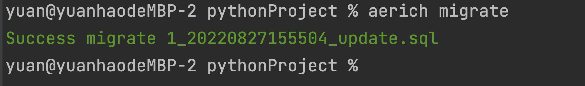

注意，此时sql并没有执行，数据库中admin表中没有xxx字段

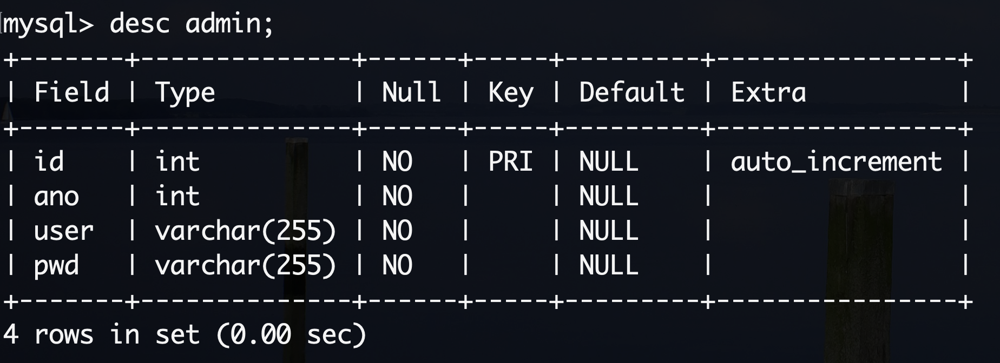

#### 4. 重新执行迁移，写入数据库

```python
aerich upgrade
```

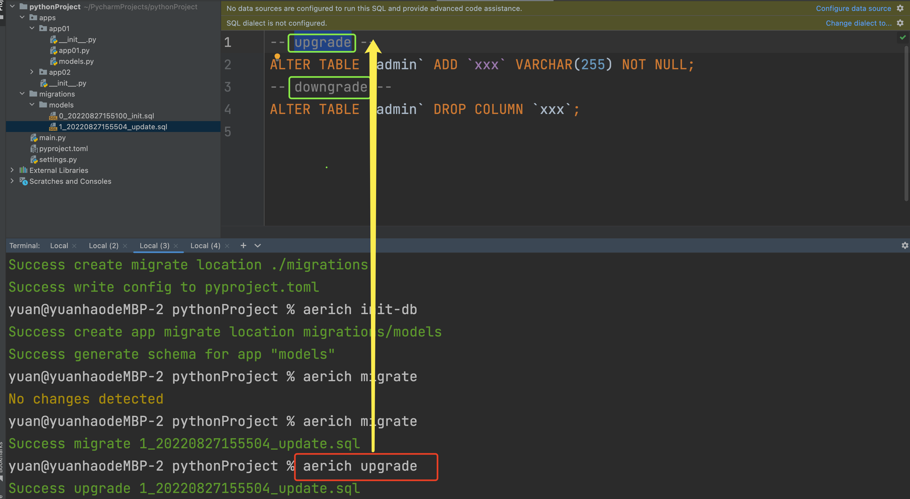

#### 5. 回到上一个版本

```python
aerich downgrade
```


#### 6. 查看历史迁移记录

```python   
aerich history
```

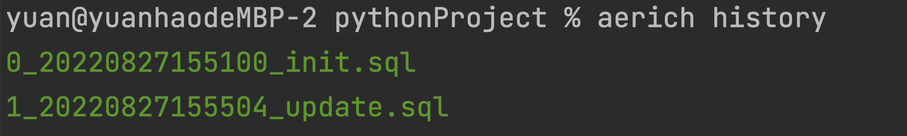

### 6.3、api接口与restful规范

#### api接口

应用程序编程接口（Application Programming Interface，API接口），就是应用程序对外提供了一个操作数据的入口，这个入口可以是一个函数或类方法，也可以是一个url地址或者一个网络地址。当客户端调用这个入口，应用程序则会执行对应代码操作，给客户端完成相对应的功能。


当然，api接口在工作中是比较常见的开发内容，有时候，我们会调用其他人编写的api接口，有时候，我们也需要提供api接口给其他人操作。由此就会带来一个问题，api接口往往都是一个函数、类方法、或者url或其他网络地址，不断是哪一种，当api接口编写过程中，我们都要考虑一个问题就是这个接口应该怎么编写？接口怎么写的更加容易维护和清晰，这就需要大家在调用或者编写api接口的时候要有一个明确的编写规范！！！

#### restful规范

为了在团队内部形成共识、防止个人习惯差异引起的混乱，我们都需要找到一种大家都觉得很好的接口实现规范，而且这种规范能够让后端写的接口，用途一目了然，减少客户端和服务端双方之间的合作成本。

目前市面上大部分公司开发人员使用的接口实现规范主要有：restful、RPC。

REST与技术无关，代表的是一种软件架构风格，REST是Representational State Transfer的简称，中文翻译为“表征状态转移”或“表现层状态转化”。

简单来说，REST的含义就是客户端与Web服务器之间进行交互的时候，使用HTTP协议中的4个请求方法代表不同的动作。

> GET用来获取资源
>
> POST用来新建资源 
>
> PUT用来更新资源
>
> DELETE用来删除资源。

只要API程序遵循了REST风格，那就可以称其为RESTful API。目前在前后端分离的架构中，前后端基本都是通过RESTful API来进行交互。

例如，我们现在要编写一个选课系统的接口，我们可以查询对一个学生进行查询、创建、更新和删除等操作，我们在编写程序的时候就要设计客户端浏览器与我们Web服务端交互的方式和路径。

而对于数据资源分别使用POST、DELETE、GET、UPDATE等请求动作来表达对数据的增删查改。

| GET      | /students   | 获取所有学生      |
| :------- | :---------- | :---------------- |
| 请求方法 | 请求地址    | 后端操作          |
| GET      | /students   | 获取所有学生      |
| POST     | /students   | 增加学生          |
| GET      | /students/1 | 获取编号为1的学生 |
| PUT      | /students/1 | 修改编号为1的学生 |
| DELETE   | /students/1 | 删除编号为1的学生 |

### 6.4、选课系统接口开发

`api/student.py`

```python
from fastapi.exceptions import HTTPException

from models import *

from pydantic import BaseModel
from typing import List, Union
from fastapi import APIRouter

api_student = APIRouter()


@api_student.get("/student")
async def getAllStudent():
    students = await Student.all().values("name", "clas__name")
    # students = await Student.filter(name__icontains='a').values("name", "clas__name")
    # print("students", students)
    # for i in students:
    #     print(i)
    #
    # rain = await Student.get(name='rain')
    # print(rain, type(rain))
    # print(rain.sno)

    return students


class StudentModel(BaseModel):
    name: str
    pwd: str
    sno: int
    clas_id: Union[int, None] = None
    courses: List[int] = []


@api_student.post("/student")
async def addStudent(stu: StudentModel):
    # 添加数据库操作
    # 方式1
    # student = Student(name=stu.name, pwd=stu.pwd, sno=stu.sno, clas_id=stu.clas)
    # await student.save()
    # 方式2
    student = await Student.create(name=stu.name, pwd=stu.pwd, sno=stu.sno, clas_id=stu.clas_id)
    print(student, dir(student))

    # 添加多对多关系记录
    courses = await Course.filter(id__in=stu.courses)
    print("courses", courses)
    await student.courses.add(*courses)
    print("student", student.courses)

    return student


@api_student.put("/student/{student_id}")
async def update_student(student_id: int, student: StudentModel):
    data = student.dict(exclude_unset=True)
    courses = data.pop("courses")
    print(data, courses)
    await Student.filter(id=student_id).update(**data)

    courses = await Course.filter(id__in=student.courses)
    edit_student = await Student.get(id=student_id)
    await edit_student.courses.clear()
    await edit_student.courses.add(*courses)

    return student


@api_student.delete("/student/{student_id}")
async def delete_student(student_id: int):
    deleted_count = await Student.filter(id=student_id).delete()  # 条件删除
    if not deleted_count:
        raise HTTPException(status_code=404, detail=f"Student {student_id} not found")
    return {}

```

## 七、中间件与CORS

### 7.1、中间件

你可以向 **FastAPI** 应用添加中间件.

"中间件"是一个函数,它在每个**请求**被特定的路径操作处理之前,以及在每个**响应**之后工作.


> 如果你使用了 `yield` 关键字依赖, 依赖中的退出代码将在执行中间件*后*执行.
>
> 如果有任何后台任务(稍后记录), 它们将在执行中间件*后*运行.

要创建中间件你可以在函数的顶部使用装饰器 `@app.middleware("http")`.

中间件参数接收如下参数：

> - `request`.
> - 一个函数`call_next`，它将接收request，作为参数.
>   - 这个函数将 `request` 传递给相应的 *路径操作*.
>   - 然后它将返回由相应的*路径操作*生成的 `response`.
> - 然后你可以在返回 `response` 前进一步修改它.

```python
import uvicorn
from fastapi import FastAPI

from fastapi import Request
from fastapi.responses import Response
import time

app = FastAPI()


@app.middleware("http")
async def m2(request: Request, call_next):
    # 请求代码块
    print("m2 request")
    response = await call_next(request)
    # 响应代码块
    response.headers["author"] = "yuan"
    print("m2 response")
    return response


@app.middleware("http")
async def m1(request: Request, call_next):
    # 请求代码块
    print("m1 request")
    # if request.client.host in ["127.0.0.1", ]:  # 黑名单
    #     return Response(content="visit forbidden")

    # if request.url.path in ["/user"]:
    #     return Response(content="visit forbidden")

    start = time.time()

    response = await call_next(request)
    # 响应代码块
    print("m1 response")
    end = time.time()
    response.headers["ProcessTimer"] = str(end - start)
    return response


@app.get("/user")
def get_user():
    time.sleep(3)
    print("get_user函数执行")
    return {
        "user": "current user"
    }


@app.get("/item/{item_id}")
def get_item(item_id: int):
    time.sleep(2)
    print("get_item函数执行")
    return {
        "item_id": item_id
    }


if __name__ == '__main__':
    uvicorn.run('main:app', host='127.0.0.1', port=8030, reload=True,
                debug=True, workers=1)

```

### 7.2、CORS

 ```html
 <!DOCTYPE html>
 <html lang="en">
 <head>
     <meta charset="UTF-8">
     <title>Title</title>
     <script src="https://cdn.bootcdn.net/ajax/libs/jquery/3.6.0/jquery.js"></script>
 </head>
 <body>
 
 <p>click</p>
 
 <script>
   
     $("p").click(function () {
         $.ajax({
             url: "http://127.0.0.1:8080/",
             success: function (res) {
                 $("p").html(res.message)
             },
         })
     })
 
 </script>
 </body>
 </html>
 ```

```python
@app.middleware("http")
async def CORSMiddleware(request: Request, call_next):
    response = await call_next(request)
    print(response.headers)
    return response
```

```python
from fastapi import FastAPI
from fastapi.middleware.cors import CORSMiddleware

app = FastAPI()
origins = [
    "http://localhost:63342"
]

app.add_middleware(
    CORSMiddleware,
    allow_origins=origins,  # *：代表所有客户端
    allow_credentials=True,
    allow_methods=["GET"],
    allow_headers=["*"],
)

@app.get("/")
def main():
    return {"message": "Hello World"}


if __name__ == '__main__':
    import uvicorn

    uvicorn.run("main:app", host="127.0.0.1", port=8080, debug=True, reload=True)

```

