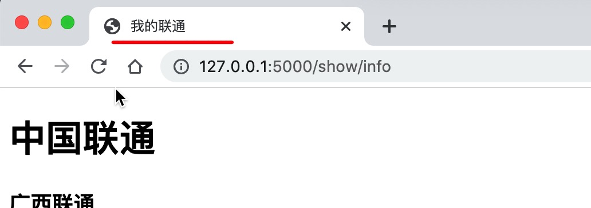
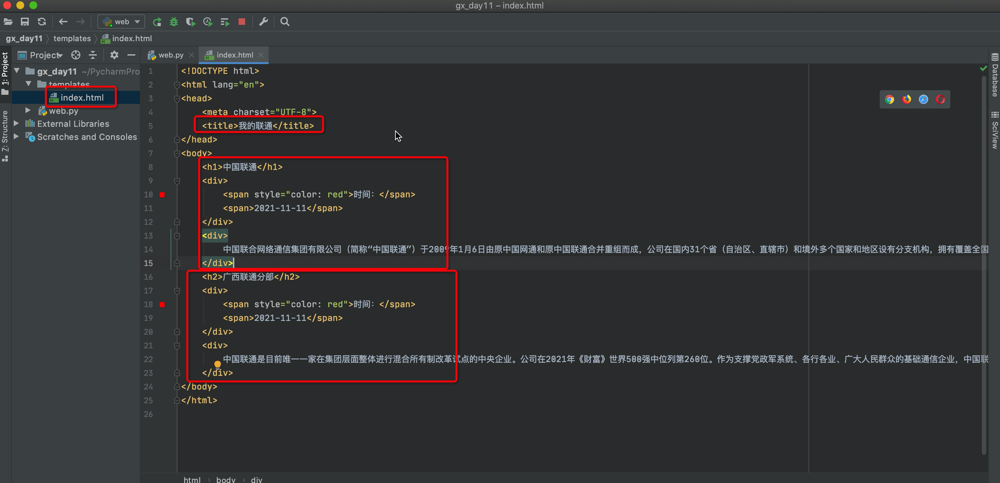
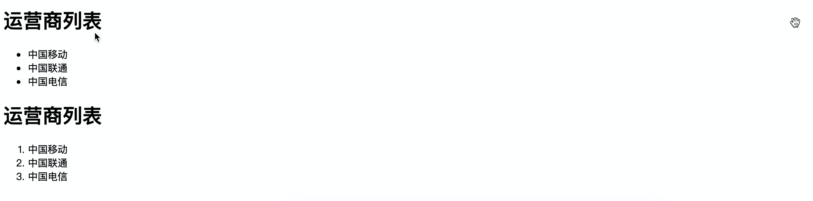
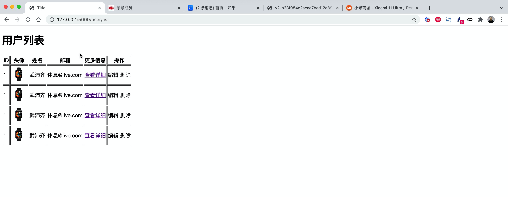
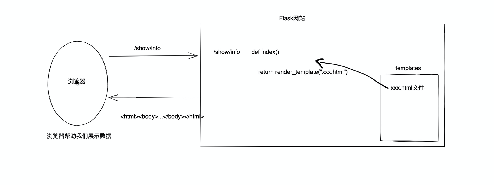
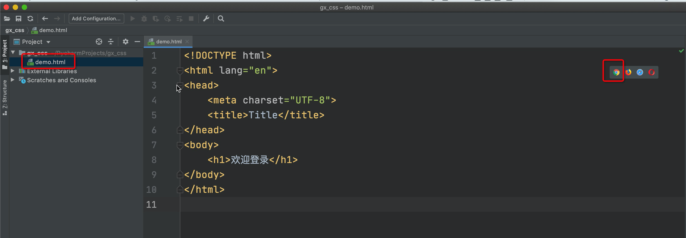
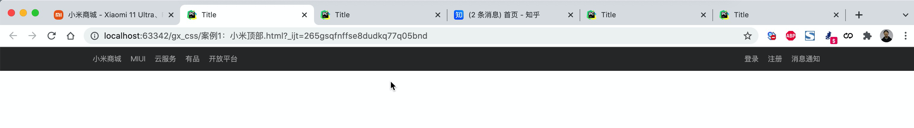
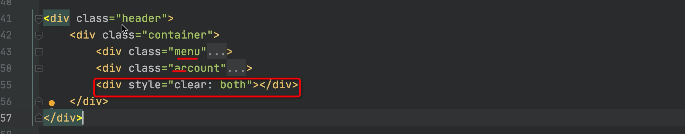
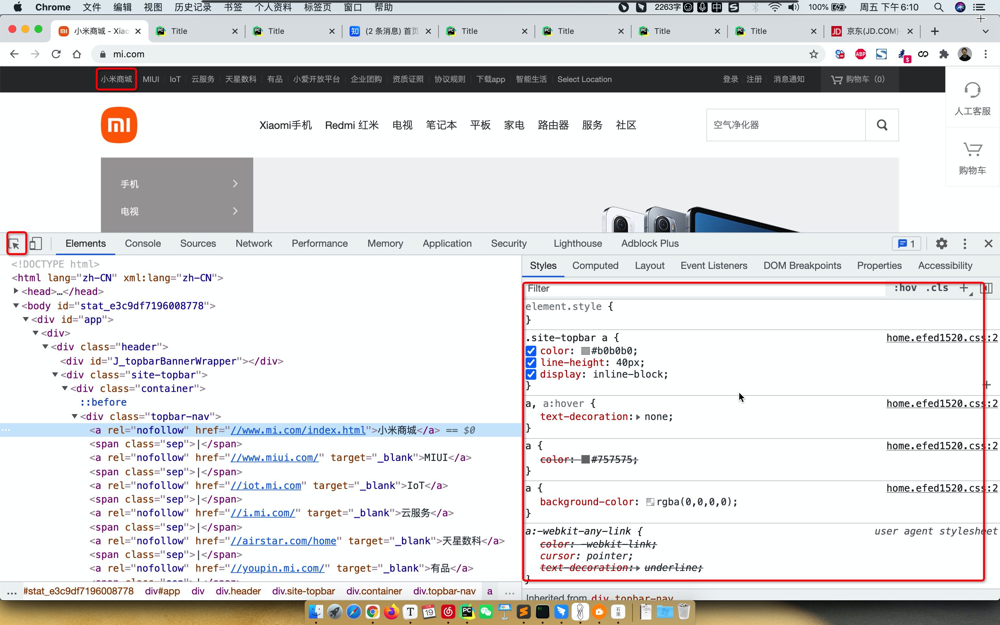
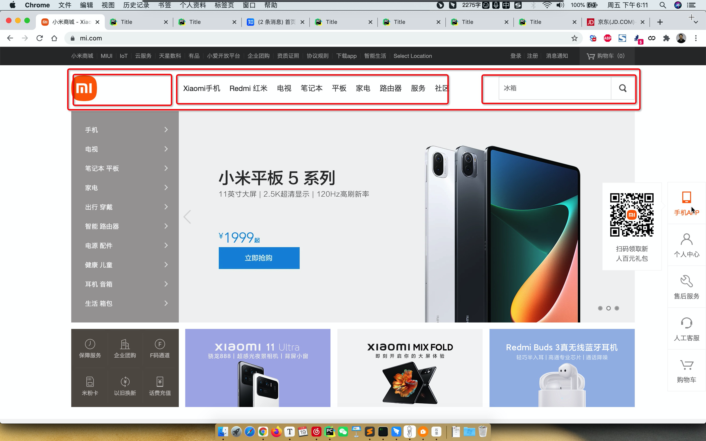

# day11 前端开发

```
目的：开发一个平台（网站）
	- 前端开发：HTML、CSS、JavaScript
	- Web框架：接收请求并处理
	- MySQL数据库：存储数据地方

快速上手：
	基于Flask Web框架让你快速搭建一个网站出来。
	
深入学习：
	基于Django框架（主要）
```


## 1.快速开发网站

```
pip install flask
```

```python
from flask import Flask

app = Flask(__name__)


# 创建了网址 /show/info 和 函数index 的对应关系
# 以后用户在浏览器上访问 /show/info，网站自动执行 index
@app.route("/show/info")
def index():
    return "中国联通"


if __name__ == '__main__':
    app.run()
```

咱们网站与别人的不一样：

- 别人的好看 vs 咱们的难堪。

  ```
  浏览器可以识别很多标签+数据，例如：
  	<h1>中国</h1>   						->  浏览器看见加大加粗
  	<span style='color:red;'>联通</span>  ->  浏览器看见字体变红色
  	
  如果我们能把浏览器能识别的所有的标签都学会，我们在网站就可以控制页面到底长什么样子。
  ```

- Flask框架为了让咱们写标签方便，支持将字符串写入到文件里。

- ```python
  from flask import Flask,render_template
  
  app = Flask(__name__)
  
  @app.route("/show/info")
  def index():
      # Flask内部会自动打开这个文件，并读取内容，将内容给用户返回。
      # 默认：去当前项目目录的templates文件夹中找。
      return render_template("index.html")
  
  if __name__ == '__main__':
      app.run()
  ```


## 2.浏览器能识别的标签


### 2.1 编码（head）

```html
<meta charset="UTF-8">
```


### 2.2 title（head）

```html
<head>
    <meta charset="UTF-8">
    <title>我的联通</title>
</head>
```




### 2.3 标题

```html
<!DOCTYPE html>
<html lang="en">
<head>
    <meta charset="UTF-8">
    <title>我的联通</title>
</head>
<body>
    <h1>1级标题</h1>
    <h2>2级标题</h2>
    <h3>3级标题</h3>
    <h4>4级标题</h4>
    <h5>5级标题</h5>
    <h6>6级标题</h6>
</body>
</html>
```


### 2.4 div和span

```html
<div>内容</div>

<span>asdfa</span>
```

- div，一个人占一整行。【块级标签】

  ```html
  <!DOCTYPE html>
  <html lang="en">
  <head>
      <meta charset="UTF-8">
      <title>我的联通</title>
  </head>
  <body>
      <div>山东蓝翔</div>
      <div>挖掘机哪家强</div>
  </body>
  </html>
  ```

- span，自己多大占多少。【行内标签、内联标签】

  ```html
  <!DOCTYPE html>
  <html lang="en">
  <head>
      <meta charset="UTF-8">
      <title>我的联通</title>
  </head>
  <body>
      <span>山东蓝翔</span>
      <span>挖掘机哪家强</span>
  </body>
  </html>
  
  ```

  

注意：这两个标签比较素 + CSS样式。


### 练习题




### 2.4.5 超链接

```html
跳转到其他网站
<a href="http://www.chinaunicom.com.cn/about/about.html">点击跳转</a>
```

```html
跳转到自己网站其他的地址

<a href="http://127.0.0.1:5000/get/news">点击跳转</a>
<a href="/get/news">点击跳转</a>
```


```html
# 当前页面打开
<a href="/get/news">点击跳转</a>

# 新的Tab页面打开
<a href="/get/news" target="_blank">点击跳转</a>
```


### 2.4.6 图片

```html

```

```html
直接显示别人的图片地址（防盗链）：

```

```html

显示自己的图片：
	- 自己项目中创建：static目录，图片要放在static
	- 在页面上引入图片
	    
```

关于设置图片的高度和宽度

```html


```


### 小结

- 学习的标签

  ```html
  <h1></h1>
  <div></div>
  <span></span>
  <a></a>
  
  ```

- 划分

  ```
  - 块级标签
  	<h1></h1>
  	<div></div>
  - 行内标签
  	<span></span>
      <a></a>
      
  ```

- 嵌套

  ```html
  <div>
      <span>xxx</span>
      
      <a></a>
  </div>
  ```

  

案例：商品列表

```html
<!DOCTYPE html>
<html lang="en">
<head>
    <meta charset="UTF-8">
    <title>Title</title>
</head>
<body>
<h1>商品列表</h1>

<a href="https://www.mi.com/redmiwatch2" target="_blank">
    
</a>

<a href="https://www.mi.com/shouhuan6/nfc" target="_blank">
    
</a>

<a href="https://www.mi.com/xiaomibuds3pro" target="_blank">
    
</a>

</body>
</html>
```


### 2.4.7 列表

```html
<ul>
    <li>中国移动</li>
    <li>中国联通</li>
    <li>中国电信</li>
</ul>
```

```html
<ol>
    <li>中国移动</li>
    <li>中国联通</li>
    <li>中国电信</li>
</ol>
```



### 2.4.8 表格

```html
<table>
    <thead>
    	<tr>  <th>ID</th>  <th>姓名</th>   <th>年龄</th>  </tr>
    </thead>
    <tbody>
    	<tr>  <td>10</td>  <td>武沛齐</td>  <td>19</td>   </tr>
        <tr>  <td>11</td>  <td>吴阳军</td>  <td>19</td>   </tr>
        <tr>  <td>12</td>  <td>刘东</td>  <td>19</td>    </tr>
        <tr>  <td>13</td>  <td>郭智</td>  <td>19</td>    </tr>
        <tr>  <td>14</td>  <td>电摩</td>  <td>19</td>    </tr>
    </tbody>
</table>
```


### 案例



```html
<!DOCTYPE html>
<html lang="en">
<head>
    <meta charset="UTF-8">
    <title>Title</title>
</head>
<body>
    <h1>用户列表</h1>
    <table border="1">
        <thead>
            <tr>
                <th>ID</th>
                <th>头像</th>
                <th>姓名</th>
                <th>邮箱</th>
                <th>更多信息</th>
                <th>操作</th>
            </tr>
        </thead>

        <tbody>
            <tr>
                <td>1</td>
                <td>
                    
                </td>
                <td>武沛齐</td>
                <td>休息@live.com</td>
                <td>
                    <a href="http://www.chinaunicom.com.cn/about/leaders.html" target="_blank">查看详细</a>
                </td>
                <td>
                    编辑
                    删除
                </td>
            </tr>

             <tr>
                <td>1</td>
                <td>
                    
                </td>
                <td>武沛齐</td>
                <td>休息@live.com</td>
                <td>
                    <a href="http://www.chinaunicom.com.cn/about/leaders.html" target="_blank">查看详细</a>
                </td>
                 <td>
                    编辑
                    删除
                </td>
            </tr>

             <tr>
                <td>1</td>
                <td>
                    
                </td>
                <td>武沛齐</td>
                <td>休息@live.com</td>
                <td>
                    <a href="http://www.chinaunicom.com.cn/about/leaders.html" target="_blank">查看详细</a>
                </td>
                 <td>
                    编辑
                    删除
                </td>
            </tr>

             <tr>
                <td>1</td>
                <td>
                    
                </td>
                <td>武沛齐</td>
                <td>休息@live.com</td>
                <td>
                    <a href="http://www.chinaunicom.com.cn/about/leaders.html" target="_blank">查看详细</a>
                </td>
                 <td>
                    编辑
                    删除
                </td>
            </tr>
        </tbody>
    </table>
</body>
</html>
```


### 2.4.9 input系列（7个）

```html
<input type="text" />
<input type="password">    
<input type="file"> 

<input type="radio" name="n1">男
<input type="radio" name="n1">女

<input type="checkbox">篮球
<input type="checkbox">足球
<input type="checkbox">乒乓球
<input type="checkbox">棒球

<input type="button" value="提交">  -->普通的按钮
<input type="submit" value="提交">  -->提交表单
```


### 2.4.10 下拉框

```html
<select>
    <option>北京</option>
    <option>上海</option>
    <option>深圳</option>
</select>

<select multiple>
    <option>北京</option>
    <option>上海</option>
    <option>深圳</option>
</select>
```


### 2.4.11 多行文本

```html
<textarea></textarea>
```


### 案例：用户注册

```html
<!DOCTYPE html>
<html lang="en">
<head>
    <meta charset="UTF-8">
    <title>Title</title>
</head>
<body>


<h1>用户注册</h1>
<div>
    用户名：<input type="text"/>
</div>
<div>
    密码：<input type="password"/>
</div>

<div>
    性别：
    <input type="radio">男
    <input type="radio">女
</div>

<div>
    爱好：
    <input type="checkbox">篮球
    <input type="checkbox">足球
    <input type="checkbox">乒乓球
</div>

<div>
    城市：
    <select>
        <option>北京</option>
        <option>上海</option>
        <option>深圳</option>
    </select>
</div>

<div>
    擅长领域：
    <select multiple>
        <option>打游戏</option>
        <option>睡觉</option>
        <option>吃饭</option>
        <option>刷抖音</option>
    </select>
</div>

<div>
    备注：<textarea></textarea>
</div>

<div>
    <input type="button" value="button按钮">
    <input type="submit" value="submit按钮">
</div>
</body>
</html>
```


### 知识点回顾和补充

1. 网站请求的流程
   

2. 一大堆的标签

   ```
   h/div/span/a/img/ul/li/table/input/textarea/select
   ```

3. 网络请求

   - 在浏览器的URL中写入地址，点击回车，访问。

     ```
     浏览器会发送数据过去，本质上发送的是字符串：
     "GET /explore http1.1\r\nhost:...\r\nuser-agent\r\n..\r\n\r\n"
     
     浏览器会发送数据过去，本质上发送的是字符串：
     "POST /explore http1.1\r\nhost:...\r\nuser-agent\r\n..\r\n\r\n数据库"
     ```

   - 浏览器向后端发送请求时

     - GET请求【URL方法 / 表单提交】

       - 现象：GET请求、跳转、向后台传入数据数据会拼接在URL上。

         ```
         https://www.sogou.com/web?query=安卓&age=19&name=xx
         ```

         注意：GET请求数据会在URL中体现。

     - POST请求【表单提交】

       - 现象：提交数据不在URL中而是在请求体中。


### 案例：用户注册

- 新创建项目

- 创建Flask代码

  ```python
  from flask import Flask, render_template, request
  
  app = Flask(__name__)
  
  
  @app.route('/register', methods=['GET', "POST"])
  def register():
      if request.method == "GET":
          return render_template('register.html')
  
      else:
          user = request.form.get("user")
          pwd = request.form.get("pwd")
          gender = request.form.get("gender")
          hobby_list = request.form.getlist("hobby")
          city = request.form.get("city")
          skill_list = request.form.getlist("skill")
          more = request.form.get("more")
          print(user, pwd, gender, hobby_list, city, skill_list, more)
          # 将用户信息写入文件中实现注册、写入到excel中实现注册、写入数据库中实现注册
  
          # 2.给用户再返回结果
          return "注册成功"
  
  
  if __name__ == '__main__':
      app.run()
  
  ```

- HTML代码

  ```html
  <!DOCTYPE html>
  <html lang="en">
  <head>
      <meta charset="UTF-8">
      <title>Title</title>
  </head>
  <body>
  <h1>用户注册</h1>
  
  <form method="post" action="/register">
      <div>
          用户名：<input type="text" name="user"/>
      </div>
      <div>
          密码：<input type="password" name="pwd"/>
      </div>
      <div>
          性别：
          <input type="radio" name="gender" value="1">男
          <input type="radio" name="gender" value="2">女
      </div>
      <div>
          爱好：
          <input type="checkbox" name="hobby" value="10">篮球
          <input type="checkbox" name="hobby" value="20">足球
          <input type="checkbox" name="hobby" value="30">乒乓球
          <input type="checkbox" name="hobby" value="40">棒球
      </div>
  
      <div>
          城市：
          <select name="city">
              <option value="bj">北京</option>
              <option value="sh">上海</option>
              <option value="sz">深圳</option>
          </select>
      </div>
  
      <div>
          擅长领域：
          <select name="skill" multiple>
              <option value="100">吃饭</option>
              <option value="101">睡觉</option>
              <option value="102">打球</option>
          </select>
      </div>
  
      <div>
          备注：<textarea name="more"></textarea>
      </div>
  
      <input type="submit" value="submit按钮">
  </form>
  
  </body>
  </html>
  
  ```

  


### 案例：登录()

见代码示例。


页面上的数据，想要提交到后台：

- form标签包裹要提交的数据的标签。
  - 提交方式：`method="get"`
  - 提交的地址：`action="/xxx/xxx/xx"`
  - 在form标签里面必须有一个submit标签。
- 在form里面的一些标签：input/select/textarea
  - 一定要写name属性 `<input type="text" name="uu"/>`


### 总结

1. 称呼

   ```
   - 浏览器能够识别的标签（不专业）
   - HTML标签。
   
   什么是是HTML？超文本传输语言（与浏览器搭配）。
   ```

2. HTML标签（默认格式样式、以后通过手段可以修改）

3. HTML标签与编程语言无关

   - java + HTML
   - c# + HTML
   - php + HTML
   - python + HTML

4. 提醒：HTML标签比较多，标签还有很多很多，不必逐一学会。


## 3.CSS样式

css，专门用来“美化”标签。

- 基础CSS，写简单页面 & 看懂 & 改。
- 模块，调整和修改。


### 3.1 快速了解

```html


<div style="color:red;">中国联通</div>
```


### 3.2 CSS应用方式


#### 1. 在标签上

```html


<div style="color:red;">中国联通</div>
```


#### 2. 在head标签中写style标签（*）

```html
<!DOCTYPE html>
<html lang="en">
<head>
    <meta charset="UTF-8">
    <title>Title</title>
    <style>
        .c1{
            color:red;
        }
    </style>
</head>
<body>

<h1 class='c1'>用户登录</h1>
<h1 class='c1'>用户登录</h1>
<h1 class='c1'>用户登录</h1>
<h1 class='c1'>用户登录</h1>
    
</body>
</html>

```


#### 3.写到文件中（*）

```css
.c1{
    height:100px;
}

.c2{
    color:red;
}
```

```html
<!DOCTYPE html>
<html lang="en">
<head>
    <meta charset="UTF-8">
    <title>Title</title>
    <link rel="stylesheet" href="common.css" />
</head>
<body>

<h1 class='c1'>用户登录</h1>
<h1 class='c2'>用户登录</h1>
<h1 class='c2'>用户登录</h1>
<h1 class='c1'>用户登录</h1>
    
</body>
</html>
```


#### 案例：flask中的应用（登录注册）

见示例：day11_account-1.zip


#### 问题：用Flask框架开发不方便

- 每次都需要重启
- 规定有些文件必须要放在特定的文件夹
- 新创建一个页面
  - 函数
  - HTML文件


有没有一种方式，可以让我快速的编写前端的代码并查看效果呢，最后再讲页面集成到Flask中。

Pycharm为我们提供了一种非常便捷开发前端页面的工具。




### 3.3 选择器

- ID选择器

  ```css
  #c1{
      
  }
  
  <div id='c1'></div>
  ```

- 类选择器（最多）

  ```css
  .c1{
      
  }
  
  <div clss='c1'></div>
  ```

- 标签选择器

  ```css
  div{
      
  }
  
  <div>xxx</div>
  ```

- 属性选择器

  ```css
  input[type='text']{
  	border: 1px solid red;
  }
  .v1[xx="456"]{
  	color: gold;
  }
  ```

  ```html
  <input type="text">
  <input type="password">
  
  <div class="v1" xx="123">s</div>
  <div class="v1" xx="456">f</div>
  <div class="v1" xx="999">a</div>
  ```

- 后代选择器

  ```css
  .yy li{
      color: pink;
  }
  .yy > a{
      color: dodgerblue;
  }
  ```

  ```html
  <div class="yy">
      <a>百度</a>
      <div>
          <a>谷歌</a>
      </div>
      <ul>
          <li>美国</li>
          <li>日本</li>
          <li>韩国</li>
      </ul>
  </div>
  ```


关于选择器：

```
多：类选择器、标签选择器、后代选择器
少：属性选择器、ID选择器
```


关于多个样式 & 覆盖的问题：

```html
<!DOCTYPE html>
<html lang="en">
<head>
    <meta charset="UTF-8">
    <title>Title</title>
    <style>
        .c1{
            color: red;
            border: 1px solid red;
        }
        .c2{
            font-size: 28px;
            color: green;
        }
    </style>
</head>
<body>
    <div class="c1 c2">中国联通</div>
</body>
</html>
```


补充：下面的不要覆盖我。

```html
<!DOCTYPE html>
<html lang="en">
<head>
    <meta charset="UTF-8">
    <title>Title</title>
    <style>
        .c1{
            color: red !important;
            border: 1px solid red;
        }
        .c2{
            font-size: 28px;
            color: green;
        }
    </style>
</head>
<body>
    <div class="c1 c2">中国联通</div>
</body>
</html>
```


### 3.4 样式

#### 1. 高度和宽度

```css
.c1{
    height: 300px;
    width: 500px;
}
```

注意事项：

- 宽度，支持百分比。
- 行内标签：默认无效
- 块级标签：默认有效（霸道，右侧区域空白，也不给你占用）


#### 2. 块级和行内标签

- 块级
- 行内
- css样式：标签 -> `display:inline-block`


示例：行内&块级特性

```html
<!DOCTYPE html>
<html lang="en">
<head>
    <meta charset="UTF-8">
    <title>Title</title>
    <style>
        .c1{
            display: inline-block;

            height: 100px;
            width: 300px;
            border: 1px solid red;
        }
    </style>
</head>
<body>
    <span class="c1">中国</span>

    <span class="c1">联通</span>

    <span class="c1">联通</span>

    <span class="c1">联通</span>
</body>
</html>
```


示例：块级和行内标签的设置

```html
<!DOCTYPE html>
<html lang="en">
<head>
    <meta charset="UTF-8">
    <title>Title</title>
    <style>

    </style>
</head>
<body>
    <div style="display: inline;">中国</div>
    <span style="display: block;">联通</span>
</body>
</html>
```


注意：块级 + 块级&行内。


#### 3.字体设置

- 颜色
- 大小
- 加粗
- 字体格式

```html
<!DOCTYPE html>
<html lang="en">
<head>
    <meta charset="UTF-8">
    <title>Title</title>
    <style>
        .c1{
            color: #00FF7F;
            font-size: 58px;
            font-weight: 600;
            font-family: Microsoft Yahei;
        }
    </style>
</head>
<body>
    <div class="c1">中国联通</div>
    <div>中国移动</div>
</body>
</html>
```


#### 4.文字对齐方式

```html
<!DOCTYPE html>
<html lang="en">
<head>
    <meta charset="UTF-8">
    <title>Title</title>
    <style>
        .c1{
            height: 59px;
            width: 300px;
            border: 1px solid red;

            text-align: center; /* 水平方向居中 */
            line-height: 59px; /* 垂直方向居中 */
        }
    </style>
</head>
<body>
    <div class="c1">郭智</div>
</body>
</html>
```


#### 5.浮动

```html
<!DOCTYPE html>
<html lang="en">
<head>
    <meta charset="UTF-8">
    <title>Title</title>
</head>
<body>
    <div>
        <span>左边</span>
        <span style="float: right">右边</span>
    </div>
</body>
</html>
```


div默认块级标签（霸道），如果浮动起来，就不一样了。

```html
<!DOCTYPE html>
<html lang="en">
<head>
    <meta charset="UTF-8">
    <title>Title</title>
    <style>
        .item{
            float: left;
            width: 280px;
            height: 170px;
            border: 1px solid red;
        }
    </style>
</head>
<body>
    <div>
        <div class="item"></div>
        <div class="item"></div>
        <div class="item"></div>
        <div class="item"></div>
        <div class="item"></div>
    </div>
</body>
</html>
```


如果你让标签浮动起来之后，就会脱离文档流。

```html
<!DOCTYPE html>
<html lang="en">
<head>
    <meta charset="UTF-8">
    <title>Title</title>
    <style>
        .item {
            float: left;
            width: 280px;
            height: 170px;
            border: 1px solid red;
        }
    </style>
</head>
<body>
    <div style="background-color: dodgerblue">
        <div class="item"></div>
        <div class="item"></div>
        <div class="item"></div>
        <div class="item"></div>
        <div class="item"></div>
        <div style="clear: both;"></div>
    </div>
    <div>你哦啊呀</div>
</body>
</html>
```


#### 6.内边距

内边距，我自己的内部设置一点距离。

```html
<!DOCTYPE html>
<html lang="en">
<head>
    <meta charset="UTF-8">
    <title>Title</title>
    <style>
        .outer{
            border: 1px solid red;
            height: 200px;
            width: 200px;

            padding-top: 20px;
            padding-left: 20px;
            padding-right: 20px;
            padding-bottom: 20px;
        }
    </style>
</head>
<body>
    <div class="outer">
        <div style="background-color: gold;">听妈妈的话</div>
        <div>
            小朋友你是否下水道发
        </div>
    </div>
</body>
</html>
```


```html
<!DOCTYPE html>
<html lang="en">
<head>
    <meta charset="UTF-8">
    <title>Title</title>
    <style>
        .outer{
            border: 1px solid red;
            height: 200px;
            width: 200px;
            
            padding: 20px;
        }
    </style>
</head>
<body>
    <div class="outer">
        <div style="background-color: gold;">听妈妈的话</div>
        <div>
            小朋友你是否下水道发
        </div>
    </div>
</body>
</html>
```


```html
<!DOCTYPE html>
<html lang="en">
<head>
    <meta charset="UTF-8">
    <title>Title</title>
    <style>
        .outer{
            border: 1px solid red;
            height: 200px;
            width: 200px;

            padding: 20px 10px 5px 20px;
        }
    </style>
</head>
<body>
    <div class="outer">
        <div style="background-color: gold;">听妈妈的话</div>
        <div>
            小朋友你是否下水道发
        </div>
    </div>
</body>
</html>
```


#### 7.外边距

外边距，我与别人加点距离。

```html
<!DOCTYPE html>
<html lang="en">
<head>
    <meta charset="UTF-8">
    <title>Title</title>
</head>
<body>
<div style="height: 200px;background-color: dodgerblue;"></div>
<div style="background-color: red;height: 100px;margin-top: 20px;"></div>
</body>
</html>
```


### 案例：小米商场



```html
<!DOCTYPE html>
<html lang="en">
<head>
    <meta charset="UTF-8">
    <title>Title</title>
    <style>
        body {
            margin: 0;
        }

        .header {
            background: #333;
        }

        .container {
            width: 1226px;
            margin: 0 auto;
        }

        .header .menu {
            float: left;
            color: white;
        }

        .header .account {
            float: right;
            color: white;
        }

        .header a {
            color: #b0b0b0;
            line-height: 40px;
            display: inline-block;
            font-size: 12px;
            margin-right: 10px;
        }
    </style>
</head>
<body>

<div class="header">
    <div class="container">
        <div class="menu">
            <a>小米商城</a>
            <a>MIUI</a>
            <a>云服务</a>
            <a>有品</a>
            <a>开放平台</a>
        </div>
        <div class="account">
            <a>登录</a>
            <a>注册</a>
            <a>消息通知</a>
        </div>
        <div style="clear: both"></div>
    </div>
</div>

</body>
</html>
```


## 总结

- body标签，默认有一个边距，造成页面四边都有白色间隙，如何去除呢？

  ```html
  body{
  	margin: 0;
  }
  ```

- 内容居中

  - 文本居中，文本会在这个区域中居中。

    ```html
    <div style="width: 200px; text-align: center;">武沛齐</div>
    ```

  - 区域居中，自己要有宽度 + `margin-left:auto;margin-right:auto`

    ```html
    .container{
        width: 980px;
        margin: 0 auto;
    }
    
    <div class="container">
    	adfasdf
    </div>
    ```

- 父亲没有高度或没有宽度，被孩子支撑起来。

- 如果存在浮动，一定记得加入 。
  

- 如果想要用别人的样式。
  

- 关于布局不知如何下手。

  


