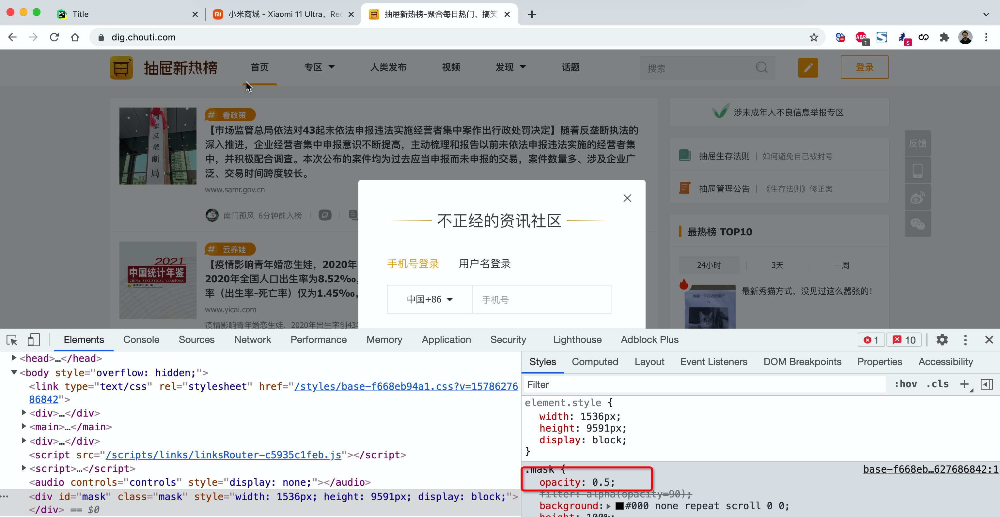
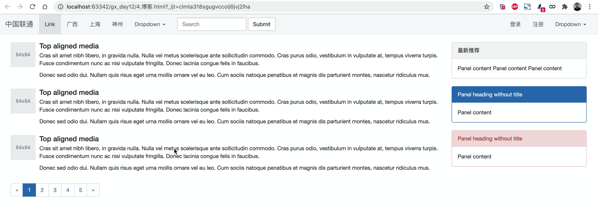

# day12 CSS

今日概要：

- 案例应用（利用之前所学知识）
- CSS知识点
- 模板 + CSS + 构建页面


## 1.CSS案例


### 1.1 内容回顾

- HTML标签

  ```
  固定格式，记住标签长什么样子，例如：
  h/div/span/a/img/ul/li/table/input/form
  ```

- CSS样式

  - 引用CSS：标签、头部、文件

    ```html
    .xx{
    	...
    }
    
    <div class='xx xx'></div>
    ```

  - CSS样式

    ```
    高度/宽度/块级or行内or块级行内/浮动/字体/文字对齐方式/内边距/外边距
    关于边距：
    	- body
    	- 区域居中
    ```

  - 页面布局

    ```
    根据你看到的页面把他们划分成很多的小区域，再去填充样式。
    ```

    

### 1.2 案例：二级菜单


#### 1.2.1 划分区域


#### 1.2.2 搭建骨架

```html
<!DOCTYPE html>
<html lang="en">
<head>
    <meta charset="UTF-8">
    <title>Title</title>
    <style>
        body{
            margin: 0;
        }
        .sub-header{
            height: 100px;
            background-color: #b0b0b0;
        }
        .container{
            width: 1128px;
            margin: 0 auto;
        }
        .sub-header .ht{
            height: 100px;
        }
        .sub-header .logo{
            width: 234px;
            float: left;
        }
        .sub-header .menu-list{
            float: left;
        }

        .sub-header .search{
            float: right;
        }
    </style>
</head>
<body>
<div class="sub-header">
    <div class="container">
        <div class="ht logo">1</div>
        <div class="ht menu-list">2</div>
        <div class="ht search">3</div>
        <div class="clear:both;"></div>
    </div>
</div>

</body>
</html>
```


#### 1.2.3 Logo区域

```html
<!DOCTYPE html>
<html lang="en">
<head>
    <meta charset="UTF-8">
    <title>Title</title>
    <style>
        body {
            margin: 0;
        }

        .sub-header {
            height: 100px;
            background-color: #b0b0b0;
        }

        .container {
            width: 1128px;
            margin: 0 auto;
        }

        .sub-header .ht {
            height: 100px;
        }

        .sub-header .logo {
            width: 234px;
            float: left;
            border: 1px solid red;
        }

        .sub-header .logo a {
            margin-top: 22px;
            display: inline-block
        }

        .sub-header .logo a img {
            height: 56px;
            width: 56px;
        }

        .sub-header .menu-list {
            float: left;
        }

        .sub-header .search {
            float: right;
        }
    </style>
</head>
<body>
<div class="sub-header">
    <div class="container">
        <div class="ht logo">
            <!-- a，行内标签；默认设置高度、边距无效。 -> 块级 & 行内+块级 -->
            <a href="https://www.mi.com/">
                
            </a>

        </div>
        <div class="ht menu-list">2</div>
        <div class="ht search">3</div>
        <div class="clear:both;"></div>
    </div>
</div>

</body>
</html>
```


#### 1.2.4 菜单部分

```html
<!DOCTYPE html>
<html lang="en">
<head>
    <meta charset="UTF-8">
    <title>Title</title>
    <style>
        body {
            margin: 0;
        }

        .sub-header {
            height: 100px;
        }

        .container {
            width: 1128px;
            margin: 0 auto;
        }

        .sub-header .ht {
            height: 100px;
        }

        .sub-header .logo {
            width: 234px;
            float: left;

        }

        .sub-header .logo a {
            margin-top: 22px;
            display: inline-block
        }

        .sub-header .logo a img {
            height: 56px;
            width: 56px;
        }

        .sub-header .menu-list {
            float: left;

            line-height: 100px;
        }

        .sub-header .menu-list a{
            display: inline-block;
            padding: 0 10px;
            color: #333;
            font-size: 16px;
            text-decoration: none;
        }

        .sub-header .menu-list a:hover{
            color: #ff6700;
        }

        .sub-header .search {
            float: right;
        }
    </style>
</head>
<body>
<div class="sub-header">
    <div class="container">
        <div class="ht logo">
            <!-- a，行内标签；默认设置高度、边距无效。 -> 块级 & 行内+块级 -->
            <a href="https://www.mi.com/">
                
            </a>

        </div>
        <div class="ht menu-list">
            <a href="https://www.mi.com/">Xiaomi手机</a>
            <a href="https://www.mi.com/">Redmi红米</a>
            <a href="https://www.mi.com/">电视</a>
            <a href="https://www.mi.com/">笔记本</a>
            <a href="https://www.mi.com/">平板</a>
        </div>
        <div class="ht search"></div>
        <div class="clear:both;"></div>
    </div>
</div>

</body>
</html>
```


### 1.3 案例：顶部菜单 + 二级菜单

```html
<!DOCTYPE html>
<html lang="en">
<head>
    <meta charset="UTF-8">
    <title>Title</title>
    <style>
        body {
            margin: 0;
        }

        .container {
            width: 1226px;
            margin: 0 auto;
        }


        .header {
            background: #333;
        }


        .header .menu {
            float: left;
            color: white;
        }

        .header .account {
            float: right;
            color: white;
        }

        .header a {
            color: #b0b0b0;
            line-height: 40px;
            display: inline-block;
            font-size: 12px;
            margin-right: 10px;

            text-decoration: none;
        }
        .header a:hover{
            color: white;
        }

        .sub-header {
            height: 100px;
        }

        .sub-header .ht {
            height: 100px;
        }

        .sub-header .logo {
            width: 234px;
            float: left;

        }

        .sub-header .logo a {
            margin-top: 22px;
            display: inline-block
        }

        .sub-header .logo a img {
            height: 56px;
            width: 56px;
        }

        .sub-header .menu-list {
            float: left;

            line-height: 100px;
        }

        .sub-header .menu-list a {
            display: inline-block;
            padding: 0 10px;
            color: #333;
            font-size: 16px;
            text-decoration: none;
        }

        .sub-header .menu-list a:hover {
            color: #ff6700;
        }

        .sub-header .search {
            float: right;
        }
    </style>
</head>
<body>

<div class="header">
    <div class="container">
        <div class="menu">
            <a href="https://www.mi.com/">小米商城</a>
            <a href="https://www.mi.com/">MIUI</a>
            <a href="https://www.mi.com/">云服务</a>
            <a href="https://www.mi.com/">有品</a>
            <a href="https://www.mi.com/">开放平台</a>
        </div>
        <div class="account">
            <a href="https://www.mi.com/">登录</a>
            <a href="https://www.mi.com/">注册</a>
            <a href="https://www.mi.com/">消息通知</a>
        </div>
        <div style="clear: both"></div>
    </div>
</div>

<div class="sub-header">
    <div class="container">
        <div class="ht logo">
            <!-- a，行内标签；默认设置高度、边距无效。 -> 块级 & 行内+块级 -->
            <a href="https://www.mi.com/">
                
            </a>

        </div>
        <div class="ht menu-list">
            <a href="https://www.mi.com/">Xiaomi手机</a>
            <a href="https://www.mi.com/">Redmi红米</a>
            <a href="https://www.mi.com/">电视</a>
            <a href="https://www.mi.com/">笔记本</a>
            <a href="https://www.mi.com/">平板</a>
        </div>
        <div class="ht search"></div>
        <div class="clear:both;"></div>
    </div>
</div>


</body>
</html>
```


#### 小结

- a标签是行内标签，行内标签的高度、内外边距，默认无效。

- 垂直方向居中

  - 本文 + line-height
  - 图片 + 边距

- a标签默认有下划线。

- 鼠标放上去之后hover

  ```css
  .c1:hover{
      ...
  }
  a:hover{
      
  }
  ```


### 1.4 案例：推荐区域


#### 1.4.1 划分区域


#### 1.4.2 搭建骨架

```html
<!DOCTYPE html>
<html lang="en">
<head>
    <meta charset="UTF-8">
    <title>Title</title>
    <style>
        body {
            margin: 0;
        }

        img {
            width: 100%;
            height: 100%;
        }

        .container {
            width: 1226px;
            margin: 0 auto;
        }


        .header {
            background: #333;
        }


        .header .menu {
            float: left;
            color: white;
        }

        .header .account {
            float: right;
            color: white;
        }

        .header a {
            color: #b0b0b0;
            line-height: 40px;
            display: inline-block;
            font-size: 12px;
            margin-right: 10px;

            text-decoration: none;
        }

        .header a:hover {
            color: white;
        }

        .sub-header {
            height: 100px;
        }

        .sub-header .ht {
            height: 100px;
        }

        .sub-header .logo {
            width: 234px;
            float: left;

        }

        .sub-header .logo a {
            margin-top: 22px;
            display: inline-block
        }

        .sub-header .logo a img {
            height: 56px;
            width: 56px;
        }

        .sub-header .menu-list {
            float: left;

            line-height: 100px;
        }

        .sub-header .menu-list a {
            display: inline-block;
            padding: 0 10px;
            color: #333;
            font-size: 16px;
            text-decoration: none;
        }

        .sub-header .menu-list a:hover {
            color: #ff6700;
        }

        .sub-header .search {
            float: right;
        }

        .slider .sd-img {
            width: 1226px;
            height: 460px;
        }

    </style>
</head>
<body>

<div class="header">
    <div class="container">
        <div class="menu">
            <a href="https://www.mi.com/">小米商城</a>
            <a href="https://www.mi.com/">MIUI</a>
            <a href="https://www.mi.com/">云服务</a>
            <a href="https://www.mi.com/">有品</a>
            <a href="https://www.mi.com/">开放平台</a>
        </div>
        <div class="account">
            <a href="https://www.mi.com/">登录</a>
            <a href="https://www.mi.com/">注册</a>
            <a href="https://www.mi.com/">消息通知</a>
        </div>
        <div style="clear: both"></div>
    </div>
</div>

<div class="sub-header">
    <div class="container">
        <div class="ht logo">
            <!-- a，行内标签；默认设置高度、边距无效。 -> 块级 & 行内+块级 -->
            <a href="https://www.mi.com/">
                
            </a>

        </div>
        <div class="ht menu-list">
            <a href="https://www.mi.com/">Xiaomi手机</a>
            <a href="https://www.mi.com/">Redmi红米</a>
            <a href="https://www.mi.com/">电视</a>
            <a href="https://www.mi.com/">笔记本</a>
            <a href="https://www.mi.com/">平板</a>
        </div>
        <div class="ht search"></div>
        <div class="clear:both;"></div>
    </div>
</div>

<div class="slider">
    <div class="container">
        <div class="sd-img">
            
        </div>
    </div>
</div>


<div class="news">
    <div class="container">
        <div class="channel"></div>
        <div class="list-item"></div>
        <div class="list-item"></div>
        <div class="list-item"></div>
    </div>
</div>


</body>
</html>
```


#### 1.4.3 案例的实现

```html
<!DOCTYPE html>
<html lang="en">
<head>
    <meta charset="UTF-8">
    <title>Title</title>
    <style>
        body {
            margin: 0;
        }

        img {
            width: 100%;
            height: 100%;
        }

        .left {
            float: left;
        }

        .container {
            width: 1226px;
            margin: 0 auto;
        }


        .header {
            background: #333;
        }


        .header .menu {
            float: left;
            color: white;
        }

        .header .account {
            float: right;
            color: white;
        }

        .header a {
            color: #b0b0b0;
            line-height: 40px;
            display: inline-block;
            font-size: 12px;
            margin-right: 10px;

            text-decoration: none;
        }

        .header a:hover {
            color: white;
        }

        .sub-header {
            height: 100px;
        }

        .sub-header .ht {
            height: 100px;
        }

        .sub-header .logo {
            width: 234px;
            float: left;

        }

        .sub-header .logo a {
            margin-top: 22px;
            display: inline-block
        }

        .sub-header .logo a img {
            height: 56px;
            width: 56px;
        }

        .sub-header .menu-list {
            float: left;

            line-height: 100px;
        }

        .sub-header .menu-list a {
            display: inline-block;
            padding: 0 10px;
            color: #333;
            font-size: 16px;
            text-decoration: none;
        }

        .sub-header .menu-list a:hover {
            color: #ff6700;
        }

        .sub-header .search {
            float: right;
        }

        .slider .sd-img {
            width: 1226px;
            height: 460px;
        }

        .news{
            margin-top: 14px;
        }

        .news .channel {
            width: 228px;
            height: 164px;
            background-color: #5f5750;
            padding: 3px;
        }

        .news .channel .item {
            height: 82px;
            width: 76px;
            float: left;
            text-align: center;
        }
        .news .channel .item a{
            display: inline-block;
            font-size: 12px;
            padding-top: 18px;
            color: #fff;
            text-decoration: none;

            opacity: 0.7;
        }
        .news .channel .item a:hover{
            opacity: 1;
        }
        .news .channel .item  img{
            height: 24px;
            width: 24px;
            display: block;
            margin: 0 auto 4px;

        }

        .news .list-item {
            width: 316px;
            height: 170px;
        }

    </style>
</head>
<body>

<div class="header">
    <div class="container">
        <div class="menu">
            <a href="https://www.mi.com/">小米商城</a>
            <a href="https://www.mi.com/">MIUI</a>
            <a href="https://www.mi.com/">云服务</a>
            <a href="https://www.mi.com/">有品</a>
            <a href="https://www.mi.com/">开放平台</a>
        </div>
        <div class="account">
            <a href="https://www.mi.com/">登录</a>
            <a href="https://www.mi.com/">注册</a>
            <a href="https://www.mi.com/">消息通知</a>
        </div>
        <div style="clear: both"></div>
    </div>
</div>

<div class="sub-header">
    <div class="container">
        <div class="ht logo">
            <!-- a，行内标签；默认设置高度、边距无效。 -> 块级 & 行内+块级 -->
            <a href="https://www.mi.com/">
                
            </a>

        </div>
        <div class="ht menu-list">
            <a href="https://www.mi.com/">Xiaomi手机</a>
            <a href="https://www.mi.com/">Redmi红米</a>
            <a href="https://www.mi.com/">电视</a>
            <a href="https://www.mi.com/">笔记本</a>
            <a href="https://www.mi.com/">平板</a>
        </div>
        <div class="ht search"></div>
        <div class="clear:both;"></div>
    </div>
</div>

<div class="slider">
    <div class="container">
        <div class="sd-img">
            
        </div>
    </div>
</div>


<div class="news">
    <div class="container">
        <div class="channel left">
            <div class="item">
                <a href="https://www.mi.com/">
                    
                    <span>保障服务</span>
                </a>
            </div>
           <div class="item">
                <a href="https://www.mi.com/">
                    
                    <span>保障服务</span>
                </a>
            </div>
            <div class="item">
                <a href="https://www.mi.com/">
                    
                    <span>保障服务</span>
                </a>
            </div>
            <div class="item">
                <a href="https://www.mi.com/">
                    
                    <span>保障服务</span>
                </a>
            </div>
            <div class="item">
                <a href="https://www.mi.com/">
                    
                    <span>保障服务</span>
                </a>
            </div>
            <div class="item">
                <a href="https://www.mi.com/">
                    
                    <span>保障服务</span>
                </a>
            </div>
            <div class="clear:both"></div>
        </div>
        <div class="list-item left" style="margin-left: 14px">
            
        </div>
        <div class="list-item left" style="margin-left: 15px">
            
        </div>
        <div class="list-item left" style="margin-left: 15px">
            
        </div>
        <div class="clear:both"></div>
    </div>
</div>


</body>
</html>
```


#### 小结

- 设置透明度

  ```
  opacity:0.5;    /* 0 ~ 1 */
  ```

  


## 2. CSS知识点


### 2.1 hover（伪类）

```html
<!DOCTYPE html>
<html lang="en">
<head>
    <meta charset="UTF-8">
    <title>Title</title>
    <style>
        .c1 {
            color: red;
            font-size: 18px;
        }

        .c1:hover {
            color: green;
            font-size: 50px;
        }

        .c2 {
            height: 300px;
            width: 500px;
            border: 3px solid red;
        }

        .c2:hover {
            border: 3px solid green;
        }

        .download {
            display: none;
        }

        .app:hover .download {
            display: block;
        }
        .app:hover .title{
            color: red;
        }
    </style>
</head>
<body>
<div class="c1">联通</div>
<div class="c2">广西</div>

<div class="app">
    <div class="title">下载APP</div>
    <div class="download">
        
    </div>
</div>

</body>
</html>
```


### 2.2 after（伪类）

```html
<!DOCTYPE html>
<html lang="en">
<head>
    <meta charset="UTF-8">
    <title>Title</title>
    <style>
        .c1:after{
            content: "大帅哥";
        }
    </style>
</head>
<body>
    <div class="c1">吴阳军</div>
    <div class="c1">梁吉宁</div>
</body>
</html>
```


很重要的应用：

```html
<!DOCTYPE html>
<html lang="en">
<head>
    <meta charset="UTF-8">
    <title>Title</title>
    <style>
        .clearfix:after{
            content: "";
            display: block;
            clear: both;
        }
        .item{
            float: left;
        }

    </style>
</head>
<body>
    <div class="clearfix">
        <div class="item">1</div>
        <div class="item">2</div>
        <div class="item">3</div>
    </div>
</body>
</html>
```


### 2.3 position

- fixed
- relative
- absolute


#### 1. fixed

固定在窗口的某个位置。


##### 案例：返回顶部

```html
<!DOCTYPE html>
<html lang="en">
<head>
    <meta charset="UTF-8">
    <title>Title</title>
    <style>

        .back{
            position: fixed;
            width: 60px;
            height: 60px;
            border: 1px solid red;

            right: 10px;
            bottom: 50px;
        }
    </style>
</head>
<body>

<div style="height: 1000px;background-color: #5f5750"></div>

<div class="back"></div>


</body>
</html>
```


##### 案例：对话框

```html
<!DOCTYPE html>
<html lang="en">
<head>
    <meta charset="UTF-8">
    <title>Title</title>
    <style>
        body {
            margin: 0;
        }

        .dialog {
            position: fixed;
            height: 300px;
            width: 500px;
            background-color: white;

            left: 0;
            right: 0;
            margin: 0 auto;

            top: 200px;

            z-index: 1000;
        }

        .mask {
            background-color: black;
            position: fixed;
            left: 0;
            right: 0;
            top: 0;
            bottom: 0;
            opacity: 0.7;
            z-index: 999;
        }
    </style>
</head>
<body>


<div style="height: 1000px">asdfasdfasd</div>


<div class="mask"></div>
<div class="dialog"></div>


</body>
</html>
```


#### 2. relative和absolute

```html
<!DOCTYPE html>
<html lang="en">
<head>
    <meta charset="UTF-8">
    <title>Title</title>
    <style>

        .c1{
            height: 300px;
            width: 500px;
            border: 1px solid red;
            margin: 100px;

            position: relative;
        }
        .c1 .c2{
            height: 59px;
            width: 59px;
            background-color: #00FF7F;

            position: absolute;
            right: 20px;
            bottom: 10px;
        }
    </style>
</head>
<body>
    <div class="c1">

        <div class="c2"></div>

    </div>
</body>
</html>
```


#### 案例：小米商城下载app

```html
<!DOCTYPE html>
<html lang="en">
<head>
    <meta charset="UTF-8">
    <title>Title</title>
    <style>
        body {
            margin: 0;
        }

        img {
            width: 100%;
            height: 100%;
        }

        .left {
            float: left;
        }

        .container {
            width: 1226px;
            margin: 0 auto;
        }


        .header {
            background: #333;
        }


        .header .menu {
            float: left;
            color: white;
        }

        .header .account {
            float: right;
            color: white;
        }

        .header a {
            color: #b0b0b0;
            line-height: 40px;
            display: inline-block;
            font-size: 12px;
            margin-right: 10px;

            text-decoration: none;
        }

        .header a:hover {
            color: white;
        }

        .sub-header {
            height: 100px;
        }

        .sub-header .ht {
            height: 100px;
        }

        .sub-header .logo {
            width: 234px;
            float: left;

        }

        .sub-header .logo a {
            margin-top: 22px;
            display: inline-block
        }

        .sub-header .logo a img {
            height: 56px;
            width: 56px;
        }

        .sub-header .menu-list {
            float: left;

            line-height: 100px;
        }

        .sub-header .menu-list a {
            display: inline-block;
            padding: 0 10px;
            color: #333;
            font-size: 16px;
            text-decoration: none;
        }

        .sub-header .menu-list a:hover {
            color: #ff6700;
        }

        .sub-header .search {
            float: right;
        }

        .slider .sd-img {
            width: 1226px;
            height: 460px;
        }

        .news {
            margin-top: 14px;
        }

        .news .channel {
            width: 228px;
            height: 164px;
            background-color: #5f5750;
            padding: 3px;
        }

        .news .channel .item {
            height: 82px;
            width: 76px;
            float: left;
            text-align: center;
        }

        .news .channel .item a {
            display: inline-block;
            font-size: 12px;
            padding-top: 18px;
            color: #fff;
            text-decoration: none;

            opacity: 0.7;
        }

        .news .channel .item a:hover {
            opacity: 1;
        }

        .news .channel .item img {
            height: 24px;
            width: 24px;
            display: block;
            margin: 0 auto 4px;

        }

        .news .list-item {
            width: 316px;
            height: 170px;
        }

        .app {
            position: relative
        }

        .app .download {
            position: absolute;
            height: 100px;
            width: 100px;
            display: none;
        }
        .app:hover .download{
            display: block;
        }
    </style>
</head>
<body>

<div class="header">
    <div class="container">
        <div class="menu">
            <a href="https://www.mi.com/">小米商城</a>
            <a href="https://www.mi.com/">MIUI</a>
            <a href="https://www.mi.com/">云服务</a>
            <a href="https://www.mi.com/">云服务</a>
            <a href="https://www.mi.com/" class="app">下载app
                <div class="download">
                    
                </div>
            </a>
            <a href="https://www.mi.com/">云服务</a>
            <a href="https://www.mi.com/">云服务</a>
            <a href="https://www.mi.com/">有品</a>
            <a href="https://www.mi.com/">开放平台</a>
        </div>
        <div class="account">
            <a href="https://www.mi.com/">登录</a>
            <a href="https://www.mi.com/">注册</a>
            <a href="https://www.mi.com/">消息通知</a>
        </div>
        <div style="clear: both"></div>
    </div>
</div>

<div class="sub-header">
    <div class="container">
        <div class="ht logo">
            <!-- a，行内标签；默认设置高度、边距无效。 -> 块级 & 行内+块级 -->
            <a href="https://www.mi.com/">
                
            </a>

        </div>
        <div class="ht menu-list">
            <a href="https://www.mi.com/">Xiaomi手机</a>
            <a href="https://www.mi.com/">Redmi红米</a>
            <a href="https://www.mi.com/">电视</a>
            <a href="https://www.mi.com/">笔记本</a>
            <a href="https://www.mi.com/">平板</a>
        </div>
        <div class="ht search"></div>
        <div class="clear:both;"></div>
    </div>
</div>

<div class="slider">
    <div class="container">
        <div class="sd-img">
            
        </div>
    </div>
</div>


<div class="news">
    <div class="container">
        <div class="channel left">
            <div class="item">
                <a href="https://www.mi.com/">
                    
                    <span>保障服务</span>
                </a>
            </div>
            <div class="item">
                <a href="https://www.mi.com/">
                    
                    <span>保障服务</span>
                </a>
            </div>
            <div class="item">
                <a href="https://www.mi.com/">
                    
                    <span>保障服务</span>
                </a>
            </div>
            <div class="item">
                <a href="https://www.mi.com/">
                    
                    <span>保障服务</span>
                </a>
            </div>
            <div class="item">
                <a href="https://www.mi.com/">
                    
                    <span>保障服务</span>
                </a>
            </div>
            <div class="item">
                <a href="https://www.mi.com/">
                    
                    <span>保障服务</span>
                </a>
            </div>
            <div class="clear:both"></div>
        </div>
        <div class="list-item left" style="margin-left: 14px">
            
        </div>
        <div class="list-item left" style="margin-left: 15px">
            
        </div>
        <div class="list-item left" style="margin-left: 15px">
            
        </div>
        <div class="clear:both"></div>
    </div>
</div>


</body>
</html>
```


### 2.4 border

```html
<!DOCTYPE html>
<html lang="en">
<head>
    <meta charset="UTF-8">
    <title>Title</title>
    <style>

        .c1{
            height: 300px;
            width: 500px;
            border: 1px solid red;
            border-left: 3px solid #00FF7F;
            margin: 100px;
        }

    </style>
</head>
<body>
    <div class="c1"></div>
</body>
</html>
```

透明色：

```html
<!DOCTYPE html>
<html lang="en">
<head>
    <meta charset="UTF-8">
    <title>Title</title>
    <style>

        .c1{
            height: 50px;
            width: 500px;
            margin: 100px;
            background-color: #5f5750;
            border-left: 2px solid transparent;
        }

        .c1:hover{
            border-left: 2px solid red;
        }

    </style>
</head>
<body>
    <div class="c1">菜单</div>
</body>
</html>
```

### 2.5 背景色

```html
<!DOCTYPE html>
<html lang="en">
<head>
    <meta charset="UTF-8">
    <title>Title</title>
    <style>

        .c1{
            height: 50px;
            width: 500px;
            margin: 100px;
            background-color: #5f5750;
        }


    </style>
</head>
<body>
    <div class="c1">菜单</div>
</body>
</html>
```


注意：以上不是所有的CSS样式。


## 总结

至此，CSS部分的知识全部讲完。

- 大家：大致了解了页面的样式和标签。
- 模板：
  - 模板的基本使用逻辑。
  - 模板 + 自己CSS知识点（开发页面）


## 3.BootStrap

是别人帮我们已写好的CSS样式，我们如果想要使用这个BootStrap：

- 下载BootStrap
- 使用
  - 在页面上引入BootStrap
  - 编写HTML时，按照BootStrap的规定来编写 + 自定制。


### 3.1 初识

https://v3.bootcss.com/


```html
<!DOCTYPE html>
<html lang="en">
<head>
    <meta charset="UTF-8">
    <title>Title</title>
    <!-- HTML注释：开发版本 -->
    <link rel="stylesheet" href="static/plugins/bootstrap-3.4.1/css/bootstrap.css">

    <!-- 生产版本 -->
    <!-- <link rel="stylesheet" href="static/plugins/bootstrap-3.4.1/css/bootstrap.min.css"> -->
</head>
<body>

    <input type="button" value="提交" />

    <input type="button" value="提交" class="btn btn-primary" />
    <input type="button" value="提交" class="btn btn-success" />
    <input type="button" value="提交" class="btn btn-danger" />
    <input type="button" value="提交" class="btn btn-danger btn-xs" />

</body>
</html>
```


### 3.2 导航

```html
<!DOCTYPE html>
<html lang="en">
<head>
    <meta charset="UTF-8">
    <title>Title</title>
    <link rel="stylesheet" href="static/plugins/bootstrap-3.4.1/css/bootstrap.css">
    <style>
        .navbar {
            border-radius: 0;
        }
    </style>
</head>
<body>

<div class="navbar navbar-default">
    <div class="container-fluid">
        <!-- Brand and toggle get grouped for better mobile display -->
        <div class="navbar-header">
            <button type="button" class="navbar-toggle collapsed" data-toggle="collapse"
                    data-target="#bs-example-navbar-collapse-1" aria-expanded="false">
                <span class="sr-only">Toggle navigation</span>
                <span class="icon-bar"></span>
                <span class="icon-bar"></span>
                <span class="icon-bar"></span>
            </button>
            <a class="navbar-brand" href="#">中国联通</a>
        </div>

        <!-- Collect the nav links, forms, and other content for toggling -->
        <div class="collapse navbar-collapse" id="bs-example-navbar-collapse-1">
            <ul class="nav navbar-nav">
                <li class="active"><a href="#">Link <span class="sr-only">(current)</span></a></li>
                <li><a href="#">广西</a></li>
                <li><a href="#">上海</a></li>
                <li><a href="#">神州</a></li>
                <li class="dropdown">
                    <a href="#" class="dropdown-toggle" data-toggle="dropdown" role="button" aria-haspopup="true"
                       aria-expanded="false">Dropdown <span class="caret"></span></a>
                    <ul class="dropdown-menu">
                        <li><a href="#">四川</a></li>
                        <li><a href="#">上海</a></li>
                        <li><a href="#">Something else here</a></li>
                        <li role="separator" class="divider"></li>
                        <li><a href="#">Separated link</a></li>
                        <li role="separator" class="divider"></li>
                        <li><a href="#">One more separated link</a></li>
                    </ul>
                </li>
            </ul>
            <form class="navbar-form navbar-left">
                <div class="form-group">
                    <input type="text" class="form-control" placeholder="Search">
                </div>
                <button type="submit" class="btn btn-default">Submit</button>
            </form>
            <ul class="nav navbar-nav navbar-right">
                <li><a href="#">登录</a></li>
                <li><a href="#">注册</a></li>
                <li class="dropdown">
                    <a href="#" class="dropdown-toggle" data-toggle="dropdown" role="button" aria-haspopup="true"
                       aria-expanded="false">Dropdown <span class="caret"></span></a>
                    <ul class="dropdown-menu">
                        <li><a href="#">Action</a></li>
                        <li><a href="#">Another action</a></li>
                        <li><a href="#">Something else here</a></li>
                        <li role="separator" class="divider"></li>
                        <li><a href="#">Separated link</a></li>
                    </ul>
                </li>
            </ul>
        </div><!-- /.navbar-collapse -->
    </div><!-- /.container-fluid -->
</div>


</body>
</html>

```


### 3.3 栅格系统

https://v3.bootcss.com/css/#grid

- 把整体划分为了12格

- 分类

  - 响应式，根据屏幕宽度不同

    ```
    .col-lg-   1170px
    .col-md-   970px
    .col-sm-   750px
    ```

  - 非响应式

    ```
    <div class="col-xs-6" style="background-color: red">1</div>
    <div class="col-xs-6" style="background-color: green">2</div>
    ```

  -  列偏移

    ```html
    <!DOCTYPE html>
    <html lang="en">
    <head>
        <meta charset="UTF-8">
        <title>Title</title>
        <link rel="stylesheet" href="static/plugins/bootstrap-3.4.1/css/bootstrap.css">
    </head>
    <body>
        <div>
            <div class="col-sm-offset-2 col-sm-6" style="background-color: green">2</div>
        </div>
    </body>
    </html>
    ```


### 3.4 container

```html
<div class="container-fluid">
    <div class="col-sm-9">左边</div>
    <div class="col-sm-3">右边</div>
</div>
```


```html
<div class="container">
    <div class="col-sm-9">左边</div>
    <div class="col-sm-3">右边</div>
</div>
```


### 3.5 面板

```html
<div class="panel panel-default">
  <div class="panel-heading">Panel heading without title</div>
  <div class="panel-body">
    Panel content
  </div>
</div>
```

### 案例：博客




### 案例：登录


- 宽度 + 居中（区域居中）
- 内边距
- 表单
  


```html
<!DOCTYPE html>
<html lang="en">
<head>
    <meta charset="UTF-8">
    <title>Title</title>
    <link rel="stylesheet" href="static/plugins/bootstrap-3.4.1/css/bootstrap.css">
    <style>
        .account {
            width: 400px;
            border: 1px solid #dddddd;
            border-radius: 5px;
            box-shadow: 5px 5px 20px #aaa;

            margin-left: auto;
            margin-right: auto;
            margin-top: 100px;
            padding: 20px 40px;
        }

        .account h2 {
            margin-top: 10px;
            text-align: center;
        }
    </style>
</head>
<body>
<div class="account">
    <h2>用户登录</h2>
    <form>
        <div class="form-group">
            <label for="exampleInputEmail1">用户名</label>
            <input type="email" class="form-control" id="exampleInputEmail1" placeholder="用户名">
        </div>
        <div class="form-group">
            <label for="exampleInputPassword1">密码</label>
            <input type="password" class="form-control" id="exampleInputPassword1" placeholder="密码">
        </div>

        <input type="submit" value="登 录" class="btn btn-primary">
    </form>
</div>
</body>
</html>
```


### 案例：后台管理


- 导航
- 新建，按钮。
- 表格，
  


```html
<!DOCTYPE html>
<html lang="en">
<head>
    <meta charset="UTF-8">
    <title>Title</title>
    <link rel="stylesheet" href="static/plugins/bootstrap-3.4.1/css/bootstrap.css">
    <style>
        .navbar {
            border-radius: 0;
        }
    </style>
</head>
<body>
<div class="navbar navbar-default">
    <div class="container">

        <div class="navbar-header">
            <button type="button" class="navbar-toggle collapsed" data-toggle="collapse"
                    data-target="#bs-example-navbar-collapse-1" aria-expanded="false">
                <span class="sr-only">Toggle navigation</span>
                <span class="icon-bar"></span>
                <span class="icon-bar"></span>
                <span class="icon-bar"></span>
            </button>

            <a class="navbar-brand" href="#">中国联通xx系统</a>
        </div>

        <div class="collapse navbar-collapse" id="bs-example-navbar-collapse-1">
            <ul class="nav navbar-nav">
                <li><a href="#">广西</a></li>
                <li><a href="#">上海</a></li>
            </ul>
            <ul class="nav navbar-nav navbar-right">
                <li><a href="#">登录</a></li>
                <li><a href="#">注册</a></li>
            </ul>
        </div>

    </div>
</div>

<div class="container">
    <div>
        <input type="button" value="新 建" class="btn btn-primary"/>
    </div>

    <div style="margin-top: 20px">
        <table class="table table-bordered table-hover">
            <thead>
            <tr>
                <th>#</th>
                <th>First Name</th>
                <th>Last Name</th>
                <th>Username</th>
            </tr>
            </thead>
            <tbody>
            <tr>
                <th scope="row">1</th>
                <td>Mark</td>
                <td>Otto</td>
                <td>@mdo</td>
            </tr>
            <tr>
                <th scope="row">2</th>
                <td>Jacob</td>
                <td>Thornton</td>
                <td>@fat</td>
            </tr>
            <tr>
                <th scope="row">3</th>
                <td>Larry</td>
                <td>the Bird</td>
                <td>@twitter</td>
            </tr>
            </tbody>
        </table>
    </div>

</div>


</body>
</html>
```


### 案例：后台管理+面板


```html
<!DOCTYPE html>
<html lang="en">
<head>
    <meta charset="UTF-8">
    <title>Title</title>
    <link rel="stylesheet" href="static/plugins/bootstrap-3.4.1/css/bootstrap.css">
    <style>
        .navbar {
            border-radius: 0;
        }
    </style>
</head>
<body>
<div class="navbar navbar-default">
    <div class="container">

        <div class="navbar-header">
            <button type="button" class="navbar-toggle collapsed" data-toggle="collapse"
                    data-target="#bs-example-navbar-collapse-1" aria-expanded="false">
                <span class="sr-only">Toggle navigation</span>
                <span class="icon-bar"></span>
                <span class="icon-bar"></span>
                <span class="icon-bar"></span>
            </button>

            <a class="navbar-brand" href="#">中国联通xx系统</a>
        </div>

        <div class="collapse navbar-collapse" id="bs-example-navbar-collapse-1">
            <ul class="nav navbar-nav">
                <li><a href="#">广西</a></li>
                <li><a href="#">上海</a></li>
            </ul>
            <ul class="nav navbar-nav navbar-right">
                <li><a href="#">登录</a></li>
                <li><a href="#">注册</a></li>
            </ul>
        </div>

    </div>
</div>

<div class="container">
    <div class="panel panel-default">
        <div class="panel-heading">表单区域</div>
        <div class="panel-body">
            <form class="form-inline">
                <div class="form-group">
                    <label class="sr-only" for="exampleInputEmail3">Email address</label>
                    <input type="email" class="form-control" id="exampleInputEmail3" placeholder="Email">
                </div>
                <div class="form-group">
                    <label class="sr-only" for="exampleInputPassword3">Password</label>
                    <input type="password" class="form-control" id="exampleInputPassword3" placeholder="Password">
                </div>
                <button type="submit" class="btn btn-success">保 存</button>
            </form>
        </div>
    </div>

    <div class="panel panel-default">
        <div class="panel-heading">数据列表</div>
        <!--
        <div class="panel-body">
            注意：以下我们经过筛选出来的重要数据。
        </div>
        -->

        <table class="table table-bordered table-hover">
            <thead>
            <tr>
                <th>#</th>
                <th>First Name</th>
                <th>Last Name</th>
                <th>操作</th>
            </tr>
            </thead>
            <tbody>
            <tr>
                <th scope="row">1</th>
                <td>Mark</td>
                <td>Otto</td>
                <td>
                    <a class="btn btn-primary btn-xs">编辑</a>
                    <a class="btn btn-danger btn-xs">删除</a>
                </td>
            </tr>
            <tr>
                <th scope="row">2</th>
                <td>Jacob</td>
                <td>Thornton</td>
                <td>
                    <a class="btn btn-primary btn-xs">编辑</a>
                    <a class="btn btn-danger btn-xs">删除</a>
                </td>
            </tr>
            <tr>
                <th scope="row">3</th>
                <td>Larry</td>
                <td>the Bird</td>
                <td>
                    <a class="btn btn-primary btn-xs">编辑</a>
                    <a class="btn btn-danger btn-xs">删除</a>
                </td>
            </tr>
            </tbody>
        </table>

    </div>
    <ul class="pagination">
        <li class="disabled"><a href="#" aria-label="Previous"><span aria-hidden="true">«</span></a></li>
        <li class="active"><a href="#">1 <span class="sr-only">(current)</span></a></li>
        <li><a href="#">2</a></li>
        <li><a href="#">3</a></li>
        <li><a href="#">4</a></li>
        <li><a href="#">5</a></li>
        <li><a href="#" aria-label="Next"><span aria-hidden="true">»</span></a></li>
    </ul>

</div>


</body>
</html>
```


### 3.6 图标

- bootstrap提供，不多。

- fontawesome组件

  ```
  https://fontawesome.dashgame.com/
  ```

  - 下载

  - 引入

    ```
    <link rel="stylesheet" href="static/plugins/font-awesome-4.7.0/css/font-awesome.css">
    ```

  - 使用
    


示例见：

- 博客
- 后台管理 + 面板


### 3.7 BootStrap依赖

BootStrap依赖JavaScript的类库，jQuery。

- 下载 jQuery，在页面上应用上jQuery。
- 在页面上应用BootStrap的JavaScript类库。


## 4.提前聊JavaScript

- HTML，裸体
- CSS，好看
- JavaScript，动态。
  - 编程语言
  - 类库（模块）【jQuery是javaScript的类库】


