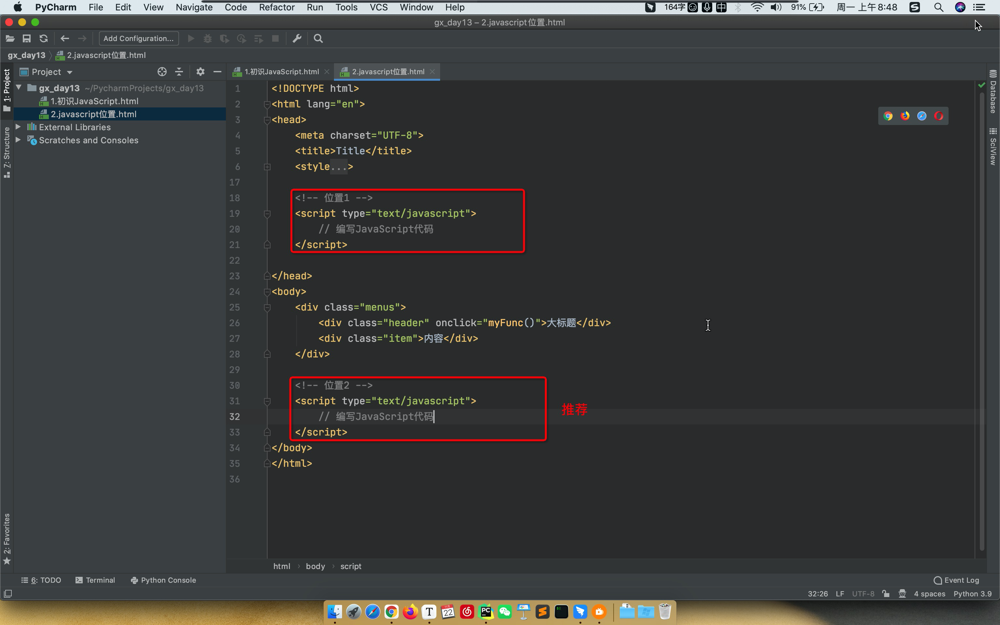
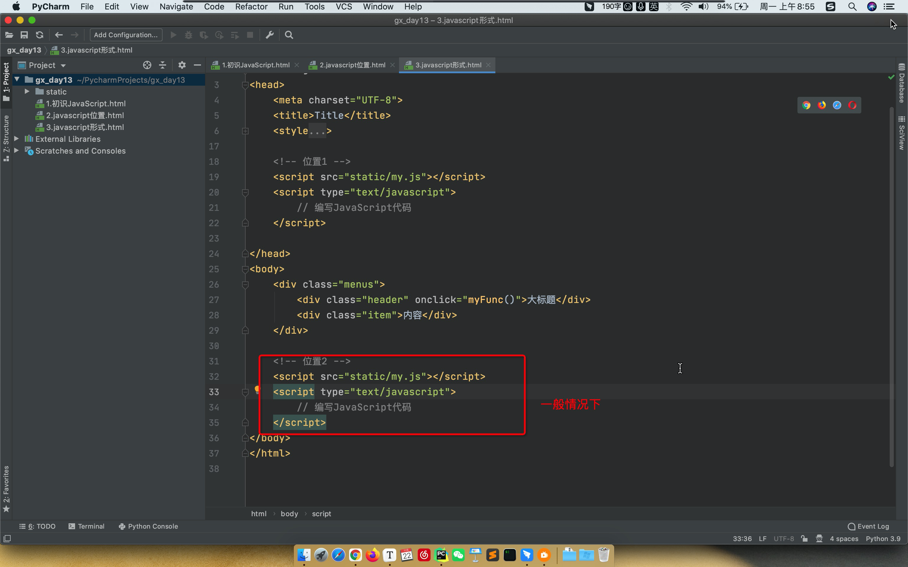

# day13 前端JavaScript

今日概要：

- JavaScript，是一门编程语言。浏览器就是JavaScript语言的解释器。

- DOM和BOM

  ```python
  相当于编程语言内置的模块。
  例如：Python中的re、random、time、json模块等。
  ```

- jQuery

  ```
  相当于是编程语言的第三方模块。
  例如：requests、openpyxl
  ```


注意：知识点回顾。


## 1. JavaScript

JavaScript是一门编程语言。

JavaScript的意义是什么？

```
让程序实现一些动态的效果。
```

```html
<!DOCTYPE html>
<html lang="en">
<head>
    <meta charset="UTF-8">
    <title>Title</title>
    <style>
        .menus{
            width: 200px;
            border: 1px solid red;
        }
        .menus .header{
            background-color: gold;
            padding: 20px 10px;
        }
    </style>
</head>
<body>
    <div class="menus">
        <div class="header" onclick="myFunc()">大标题</div>
        <div class="item">内容</div>
    </div>

    <script type="text/javascript">
        function myFunc() {
            //alert("你好呀");
            confirm("是否要继续？")
        }
    </script>
</body>
</html>
```

前端三大组件：

- HTML，裸体。
- CSS，好看的衣服。
- JavaScript，动态。


### 1.1 代码位置




JS代码的存在形式：

- 当前HTML中。

  ```
  <script type="text/javascript">
  	// 编写JavaScript代码
  </script>
  ```

- 在其他js文件中，导入使用。




### 1.2 注释

- HTML的注释

  ```html
  <!-- 注释内容 -->
  ```

- CSS的注释，`style代码块`

  ```css
  /* 注释内容 */
  ```

- JavaScript的注释，`script代码块`

  ```javascript
  // 注释内容
  
  /* 注释内容 */
  ```


### 1.3 变量

- Python，编程语言。

  ```python
  name = "高倩"
  print(name)
  ```

- JavaScript，编程语言。

  ```html
  <!DOCTYPE html>
  <html lang="en">
  <head>
      <meta charset="UTF-8">
      <title>Title</title>
  </head>
  <body>
      <script type="text/javascript">
          var name = "高倩";
          
          console.log(name);
      </script>
  </body>
  </html>
  ```

  

### 1.4 字符串类型

```javascript
// 声明
var name = "高倩";
var name = String("高倩");
```

```javascript
// 常见功能
var name = "中国联通";

var v1 = name.length; 
var v2 = name[0];   // name.charAt(3)
var v3 = name.trim();
var v4 = name.substring(0,2); // 前取后不取
```


#### 案例：跑马灯

```html
<!DOCTYPE html>
<html lang="en">
<head>
    <meta charset="UTF-8">
    <title>Title</title>
</head>
<body>

<span id="txt">欢迎中国联通领导高倩莅临指导</span>

<script type="text/javascript">
    function show() {
        // 1.去HTML中找到某个标签并获取他的内容（DOM）
        var tag = document.getElementById("txt");
        var dataString = tag.innerText;

        // 2.动态起来，把文本中的第一个字符放在字符串的最后面。
        var firstChar = dataString[0];
        var otherString = dataString.substring(1, dataString.length);
        var newText = otherString + firstChar;

        // 3.在HTML标签中更新内容
        tag.innerText = newText;
    }

    // JavaScript中的定时器，如：每1s执行一次show函数。
    setInterval(show, 1000);
</script>
</body>
</html>
```


### 1.5 数组

```javascript
// 定义
var v1 = [11,22,33,44];
var v2 = Array([11,22,33,44]);
```

```javascript
// 操作

var v1 = [11,22,33,44];

v1[1]
v1[0] = "高倩";

v1.push("联通");        // 尾部追加 [11,22,33,44,"联通"]
v1.unshift("联通");     // 尾部追加 ["联通", 11,22,33,44]
v1.splice(索引位置,0,元素);
v1.splice(1,0,"中国");  // 尾部追加 [11,"中国",22,33,44]

v1.pop()     //尾部删除
v1.shift()   //头部删除
v1.splice(索引位置,1)
v1.splice(2,1);  // 索引为2的元素删除 [11,22,44];
```

```javascript
var v1 = [11,22,33,44];
for(var idx in v1){
    // idx=0/1/2/3/    data=v1[idx]
}
```

```javascript
var v1 = [11,22,33,44];
for(var i=0; i<v1.length; i++){
    // i=0/1/2/3   data=v1[idx]
}
```

注意：break和continue


#### 案例：动态数据

```html
<!DOCTYPE html>
<html lang="en">
<head>
    <meta charset="UTF-8">
    <title>Title</title>
</head>
<body>
    <ul id="city">
        <!-- <li>北京</li> -->
    </ul>

    <script type="text/javascript">

        // 发送网络请求，获取数据
        var cityList = ["北京","上海","深圳"];
        for(var idx in cityList){
            var text = cityList[idx];

            // 创建 <li></li>
            var tag = document.createElement("li");
            // 在li标签中写入内容
            tag.innerText = text;

            // 添加到id=city那个标签的里面。DOM
            var parentTag = document.getElementById("city");
            parentTag.appendChild(tag);
        }
    </script>
</body>
</html>
```


### 1.6 对象（字典）

```javascript
info = {
    "name":"高倩",
    "age":18
}

info = {
    name:"高倩",
    age:18
}
```

```javascript
info.age
info.name = "郭智"

info["age"]
info["name"] = "郭智"

delete info["age"]
```

```javascript
info = {
    name:"高倩",
    age:18
}

for(var key in info){
    // key=name/age      data=info[key]
}
```


#### 案例：动态表格

```html
<!DOCTYPE html>
<html lang="en">
<head>
    <meta charset="UTF-8">
    <title>Title</title>
</head>
<body>
<table border="1">
    <thead>
    <tr>
        <th>ID</th>
        <th>姓名</th>
        <th>年龄</th>
    </tr>
    </thead>
    <tbody id="body">

    </tbody>
</table>

<script type="text/javascript">
    var info = {id: 1, name: "郭智", age: 19};

    var tr = document.createElement("tr");
    for (var key in info) {
        var text = info[key];
        var td = document.createElement('td');
        td.innerText = text;
        tr.appendChild(td);
    }
    var bodyTag = document.getElementById("body");
    bodyTag.appendChild(tr);

</script>
</body>
</html>
```


```html
<!DOCTYPE html>
<html lang="en">
<head>
    <meta charset="UTF-8">
    <title>Title</title>
</head>
<body>
<table border="1">
    <thead>
    <tr>
        <th>ID</th>
        <th>姓名</th>
        <th>年龄</th>
    </tr>
    </thead>
    <tbody id="body">

    </tbody>
</table>

<script type="text/javascript">

    // 网络请求获取，写入到页面上。
    var dataList = [
        {id: 1, name: "郭智1", age: 19},
        {id: 2, name: "郭智2", age: 19},
        {id: 3, name: "郭智3", age: 19},
        {id: 4, name: "郭智4", age: 19},
        {id: 5, name: "郭智5", age: 19},
    ];
    for (var idx in dataList) {
        var info = dataList[idx];

        var tr = document.createElement("tr");
        for (var key in info) {
            var text = info[key];
            var td = document.createElement('td');
            td.innerText = text;
            tr.appendChild(td);
        }

        var bodyTag = document.getElementById("body");
        bodyTag.appendChild(tr);
    }

</script>
</body>
</html>
```


### 1.7 条件语句

```javascript
if ( 条件 )  {
    
}else{
    
}

if (1==1){
    
}else{
    
}
```

```javascript
if ( 条件 ){
    
}else if ( 条件 ){
    
}else if ( 条件 ){
    
}else{
    
}
```


### 1.8 函数

```python
def func():
    函数的内容...
    
func()
```

```javascript
function func(){
    ...
}
    
func()
```


## 2.DOM

DOM，就是一个模块，模块可以对HTML页面中的标签进行操作。

```javascript
// 根据ID获取标签
var tag = document.getElementById("xx");

// 获取标签中的文本
tag.innerText

// 修改标签中的文本
tag.innerText = "哈哈哈哈哈";
```

```javascript
// 创建标签 <div>哈哈哈哈哈</div>
var tag = document.createElement("div");

// 标签写内容
tag.innerText = "哈哈哈哈哈";
```


```html
<ul id="city">
	<li>北京</li>
</ul>

<script type="text/javascript">
	var tag = document.getElementById("city");
    
    // <li>北京</li>
	var newTag = document.createElement("li");
    newTag.innerText = "北京";
    
    tag.appendChild(newTag);
</script>
```


### 2.1 事件的绑定

```html
<!DOCTYPE html>
<html lang="en">
<head>
    <meta charset="UTF-8">
    <title>Title</title>
</head>
<body>
<input type="button" value="点击添加" onclick="addCityInfo()">
<ul id="city">

</ul>

<script type="text/javascript">
    function addCityInfo() {

        var newTag = document.createElement("li");
        newTag.innerText = "联通";

        var parentTag = document.getElementById("city");
        parentTag.appendChild(newTag);
    }

</script>
</body>
</html>
```


```html
<!DOCTYPE html>
<html lang="en">
<head>
    <meta charset="UTF-8">
    <title>Title</title>
</head>
<body>
<input type="text" placeholder="请输入内容" id="txtUser"/>
<input type="button" value="点击添加" onclick="addCityInfo()">
<ul id="city">

</ul>

<script type="text/javascript">
    function addCityInfo() {
        // 1.找到输入标签
        var txtTag = document.getElementById("txtUser");

        // 2.获取input框中用户输入的内容
        var newString = txtTag.value;

        // 判断用户输入是否为空，只有不为空才能继续。
        if (newString.length > 0) {
            // 3.创建标签 <li></li> 中间的文本信息就是用户输入的内容
            var newTag = document.createElement("li");
            newTag.innerText = newString;

            // 4.标签添加到ul中
            var parentTag = document.getElementById("city");
            parentTag.appendChild(newTag);

            // 3.将input框内容清空
            txtTag.value = "";
        }else{
            alert("输入不能为空");
        }

    }

</script>
</body>
</html>
```


注意：DOM中还有很多操作。

```
DOM可以实现很多功能，但是比较繁琐。
页面上的效果：jQuery来实现 / vue.js / react.js
```


## 3.知识点的回顾

- 编码相关

  ```
  文件存储时，使用某种编码，打开时就需要使用相同的编码，否则就会乱码。
  字符底层存储时本质上都是0101010101010101。
  字符和二进制的对应关系（编码）：
  	- ascii编码，256中对应关系。
  	- gb2312，gbk，中文和亚洲的一些国家【中文是2个字节】
  	- unicode，ucs2/ucs4，包括现在发现的所有文明。
  	- utf-8编码，【中文是用几个字节？3字节】
  	
  Python默认解释器编码(utf-8)
  	python.exe  代码文件
  	
  	如果你将代码文件保存成了gbk编码，将Python模式解释器编码修改成gbk
  ```

  ```python
  data = "中"
  res = data.encode('utf-8')
  print(res)  # b'\xe4\xb8\xad'
  
  
  data = "国"
  res = data.encode('gbk')
  print(res)  # b'\xb9\xfa'
  ```

- 计算机中的单位

  ```
  位/字节/KB/M/G/T...
  
  办流量/硬盘/内存
  ```

- 字符串格式化（三种）

  ```python
  v1 = "我是{}，锦娘{}".format("武沛齐",77)   # 推荐
  
  v2 = "我是%s，今年%d岁" %("武沛齐",77, ) 
  
  name = "武沛齐"
  age = 19
  v3 = f"我是{name}，今年{age}岁"
  ```

- 数据类型

  ```
  常见数据类型：int、bool、str、list、tuple、dict、set、float、None
  	- 哪些转化弄成布尔值为False：空、None、0
  	- 可变和不可变划分，可变的有哪些：list、set、dict
  	- 可哈希和不可哈希，不可哈希的有哪些：list、set、dict
  	- 字典的键/集合的元素，必须是可哈希的类型（list、set、dict不能做字典的键和集合元素）
  	
  主要数据类型：
  	- str
  		- 独有功能：upper/lower/startswith/split/strip/join
  		  注意：str不可变，不会对原字符串进行修改，新的内容。
  		- 公共功能：len/索引/切片/for循环/判断是否包含
  	- list
  		- 独有功能：append、insert、remove、pop...
  		  注意：list可变，功能很多都是对原数据操作。
  	    - 公共功能：len/索引/切片/for循环/判断是否包含
  	- dict
  		- 独有功能：get/keys/items/values
  		- 公共功能：len/索引for循环/判断是否包含（判断键效率很高）
  ```

- 运算符

  ```
  基本运算符：加减乘除、...
  
  
  一般：
  	1>2 and 3<10
  特殊的逻辑运算(整体结果取决于谁？)
  	v1 = 99 and 88    # 88
  	v2 = [] or 10	  # 10
  	v3 = "联通" or []  # "联通"
  ```

- 推导式（简化生成数据）

  ```python
  data = []
  for i in range(10):
      data.append(i)
      
  v1 = [ i for i in range(10) ]
  v2 = [ i for i in range(10) if i<5 ]   # [0,1,2,3,4]
  ```

- 函数编程

  ```
  函数的基础知识
  	- 定义
  	- 参数，概念：位置传参/关键字传参/参数默认值/动态参数*args,**kwargs
  	- 返回值
  		- 函数中一旦遇到return就立即返回，后续代码不再执行。
  		- 函数么有返回值默认返回None
  函数的进阶：
  	- Python中是为函数为作用域。
  	- 全局变量和局部变量，规范：全局变量（大写）、局部变量（小写）。
  	- 在局部变量中可以使用global关键字，global的作用？引用全局的那个变量（不是在局部新建）。
  	
  内置函数（python内部提供的函数）：
  	- bin/hex/odc/max/min/divmod/sorted/open文件操作
  	
  	
  文件操作：
  	- 基本操作：打开、操作、关闭，为了防止忘记关闭文件，可以怎么做？with
  	- 打开文件时有模式：
  		- r/rb，读        【文件不存在，报错】       【文件夹不存在，报错】
  		- w/wb，写（清空） 【文件不存在，自动新建】    【文件夹不存在，报错】
  		- a/ab，追加      【文件不存在，自动新建】    【文件夹不存在，报错】
  	  注意：os.makedirs/os.path.exsits、是否存在，不存在新建目录。
  ```

- 模块

  ```
  模块的分类：
  	- 自定义模块：
  		- os.path，导入模块时python内部都回去那个目录找。
  		- 自己写py文件时，不要与python内置模块同名。
  		- import/from xx import xx
  	- 内置模块：time/datetime/json/re/random/os..
  	- 第三方模块：requests、openpyxl、python-docx、flask、bs4
  	
  查看当前目录下所有的文件：os.listdir / os.walk
  关于时间模块：时间戳 / datetime格式 / 字符串 ，三种时间格式可以互相转化。
  关于JSON模块：
  	- JSON本质是字符串，有一些自己格式的要求，例如：无元组/无单引号。
  	- json.dumps序列化时，只能序列化Python常用数据类型：
              +-------------------+---------------+
              | Python            | JSON          |
              +===================+===============+
              | dict              | object        |
              +-------------------+---------------+
              | list, tuple       | array         |
              +-------------------+---------------+
              | str               | string        |
              +-------------------+---------------+
              | int, float        | number        |
              +-------------------+---------------+
              | True              | true          |
              +-------------------+---------------+
              | False             | false         |
              +-------------------+---------------+
              | None              | null          |
              +-------------------+---------------+
  关于re正则模块：
  	- 正则：\d  \w 
  	- 贪婪匹配和非贪婪匹配（默认），想让他不贪婪个数后面 ? 。
  	- re.search/re.match/re.findall
  
  第三方模块，都有哪些方式可以让我们安装第三方模块。
  	- pip管理工具
  	- 源码
  	- wheel包
  ```

- 面向对象

  ```
  目标：不是为了用面向对编程（推荐使用函数编程，面向对象要看的懂）。
  
  面向对象三大特性：封装、继承、多态。
  ```

- 前端开发

  ```
  - 前端知识点分为三部分：
  	- HTML，标签具有模式特点。
  	- CSS，修改标签的特点。
  	- JavaScript，动态。
  	
  - HTML标签
  	- div/span/a/img/input/form/table/ul...
  	- 块级和行内标签，例如：div span 默认谁是块级标签？div
  	  注意：css样式，发现行内标签设置高端、宽度、内边距、外边距都是无效。
  	- form表单 + input/select/textarea 数据框
  		- action，提交地址
  		- method，提交方式
  		- form标签中有一个submit
  		- 内部标签都需要设置name属性
  		
  - CSS样式
  	- 局部一定会用到的样式：div + float（脱离文档流，clear:both; clearfix）
  	- 高度和宽度
  	- 边距
  		- 内边距，padding
  		- 外边距，margin
  	- 字体大小/颜色
  	- 边框
  	- 背景颜色
  	- hover，鼠标放上去就会触发的CSS样式。
  ```

  

## 4. jQuery

jQuery是一个JavaScript第三方模块（第三方类库）。

- 基于jQuery，自己开发一个功能。
- 现成的工具 依赖jQuery，例如：BootStrap动态效果。


### 4.1 快速上手

- 下载jQuery

  ```
  https://jquery.com/
  ```

- 应用jQuery

- ```html
  <!DOCTYPE html>
  <html lang="en">
  <head>
      <meta charset="UTF-8">
      <title>Title</title>
  </head>
  <body>
  
  <h1 id="txt">中国联通</h1>
  
  
  <script src="static/jquery-3.6.0.min.js"></script>
  <script type="text/javascript">
      // 利用jQuery中的功能实现某些效果
      
      $("#txt").text("广西移动");
  
  </script>
  
  </body>
  </html>
  ```


### 4.2 寻找标签（直接寻找）

- ID选择器

  ```html
  <h1 id="txt">中国联通</h1>
  <h1>中国联通</h1>
  <h1>中国联通</h1>
  ```

  ```javascript
  $("#txt")
  ```

- 样式选择器

  ```html
  <h1 class="c1">中国联通1</h1>
  <h1 class="c1">中国联通2</h1>
  <h1 class="c2">中国联通3</h1>
  ```

  ```javascript
  $(".c1")
  ```

- 标签选择器

  ```html
  <h1 class="c1">中国联通1</h1>
  <div class="c1">中国联通2</h1>
  <h1 class="c2">中国联通3</h1>
  ```

  ```javascript
  $("h1")
  ```

- 层级选择器

  ```html
  <h1 class="c1">中国联通1</h1>
  <h1 class="c1">
  	<div class="c2">
          <span></span>
          <a></a>
      </div>
  </h1>
  <h1 class="c2">中国联通3</h1>
  ```

  ```javascript
  $(".c1 .c2 a")
  ```

- 多选择器

  ```html
  <h1 class="c1">中国联通1</h1>
  <h1 class="c1">
  	<div class="c3">
          <span></span>
          <a></a>
      </div>
  </h1>
  <h1 class="c2">中国联通3</h1>
  <ul>
      <li>xx</li>
      <li>xx</li>
  </ul>
  ```

  ```javascript
  $("#c3,#c2,li")
  ```

- 属性选择器

  ```html
  <input type='text' name="n1" />
  <input type='text' name="n1" />
  <input type='text' name="n2" />
  ```

  ```java
  $("input[name='n1']")


### 4.3 间接寻找

- 找到兄弟

  ```html
  <div>
      <div>北京</div>
      <div id='c1'>上海</div>
      <div>深圳</div>
      <div>广州</div>
  </div>
  ```

  ```javascript
  $("#c1").prev()        // 上一个
  $("#c1")
  $("#c1").next()        // 下一个
  $("#c1").next().next() // 下一个、下一个
  
  $("#c1").siblings()    // 所有的系统
  ```

- 找父子

  ```html
  <div>
      <div>
          <div>北京</div>
          <div id='c1'>
          	<div>青浦区</div>
          	<div class="p10">宝山区</div>
          	<div>浦东新区</div>
          </div>
          <div>深圳</div>
          <div>广州</div>
      </div>
      <div>
          <div>陕西</div>
          <div>山西</div>
          <div>河北</div>
          <div>河南</div>
      </div>
  </div>
  ```

  ```javascript
  $("#c1").parent()            // 父亲
  $("#c1").parent().parent()   // 父亲、父亲
  
  $("#c1").children()                // 所有的儿子
  $("#c1").children(".p10")          // 所有的儿子中寻找class=p10
  
  $("#c1").find(".p10")              // 去所有子孙中寻找class=p10
  $("#c1").find("div")              // 去所有子孙中寻找class=p10
  ```

  

### 案例：菜单的切换

```html
<!DOCTYPE html>
<html lang="en">
<head>
    <meta charset="UTF-8">
    <title>Title</title>
    <style>
        .menus{
            width: 200px;
            height: 800px;
            border: 1px solid red;
        }
        .menus .header{
            background-color: gold;
            padding: 10px 5px;
            border-bottom: 1px dotted #dddddd;
        }
        .menus .content a{
            display: block;
            padding: 5px 5px;
            border-bottom: 1px dotted #dddddd;
        }

        .hide{
            display: none;
        }
    </style>
</head>
<body>
    <div class="menus">
        <div class="item">
            <div class="header" onclick="clickMe(this);">上海</div>
            <div class="content hide">
                <a>宝山区</a>
                <a>青浦区</a>
                <a>浦东新区</a>
                <a>普陀区</a>
            </div>
        </div>

        <div class="item">
            <div class="header" onclick="clickMe(this);">北京</div>
            <div class="content hide">
                <a>海淀区</a>
                <a>朝阳区</a>
                <a>大兴区</a>
                <a>昌平区</a>
            </div>
        </div>
    </div>

    <script src="static/jquery-3.6.0.min.js"></script>
    <script>
        function clickMe(self) {
            // $(self)  -> 表示当前点击的那个标签。
            // $(self).next() 下一个标签
            // $(self).next().removeClass("hide");   删除样式
            $(self).next().removeClass("hide");
        }
    </script>
</body>
</html>
```


```html
<!DOCTYPE html>
<html lang="en">
<head>
    <meta charset="UTF-8">
    <title>Title</title>
    <style>
        .menus{
            width: 200px;
            height: 800px;
            border: 1px solid red;
        }
        .menus .header{
            background-color: gold;
            padding: 10px 5px;
            border-bottom: 1px dotted #dddddd;

            cursor: pointer;
        }
        .menus .content a{
            display: block;
            padding: 5px 5px;
            border-bottom: 1px dotted #dddddd;
        }

        .hide{
            display: none;
        }
    </style>
</head>
<body>
    <div class="menus">
        <div class="item">
            <div class="header" onclick="clickMe(this);">上海</div>
            <div class="content hide">
                <a>宝山区</a>
                <a>青浦区</a>
                <a>浦东新区</a>
                <a>普陀区</a>
            </div>
        </div>

        <div class="item">
            <div class="header" onclick="clickMe(this);">北京</div>
            <div class="content hide">
                <a>海淀区</a>
                <a>朝阳区</a>
                <a>大兴区</a>
                <a>昌平区</a>
            </div>
        </div>
    </div>

    <script src="static/jquery-3.6.0.min.js"></script>
    <script>
        function clickMe(self) {
            var hasHide = $(self).next().hasClass("hide");
            if(hasHide){
                $(self).next().removeClass("hide");
            }else{
                $(self).next().addClass("hide");
            }
        }
    </script>
</body>
</html>
```


```html
<!DOCTYPE html>
<html lang="en">
<head>
    <meta charset="UTF-8">
    <title>Title</title>
    <style>
        .menus {
            width: 200px;
            height: 800px;
            border: 1px solid red;
        }

        .menus .header {
            background-color: gold;
            padding: 10px 5px;
            border-bottom: 1px dotted #dddddd;

            cursor: pointer;
        }

        .menus .content a {
            display: block;
            padding: 5px 5px;
            border-bottom: 1px dotted #dddddd;
        }

        .hide {
            display: none;
        }
    </style>
</head>
<body>
<div class="menus">
    <div class="item">
        <div class="header" onclick="clickMe(this);">上海</div>
        <div class="content">
            <a>宝山区</a>
            <a>青浦区</a>
            <a>浦东新区</a>
            <a>普陀区</a>
        </div>
    </div>

    <div class="item">
        <div class="header" onclick="clickMe(this);">北京</div>
        <div class="content hide">
            <a>海淀区</a>
            <a>朝阳区</a>
            <a>大兴区</a>
            <a>昌平区</a>
        </div>
    </div>

    <div class="item">
        <div class="header" onclick="clickMe(this);">上海2</div>
        <div class="content hide">
            <a>宝山区</a>
            <a>青浦区</a>
            <a>浦东新区</a>
            <a>普陀区</a>
        </div>
    </div>

    <div class="item">
        <div class="header" onclick="clickMe(this);">北京2</div>
        <div class="content hide">
            <a>海淀区</a>
            <a>朝阳区</a>
            <a>大兴区</a>
            <a>昌平区</a>
        </div>
    </div>
</div>

<script src="static/jquery-3.6.0.min.js"></script>
<script>
    function clickMe(self) {
        // 让自己下面的功能展示出来
        $(self).next().removeClass("hide");

        // 找父亲，父亲的所有兄弟，再去每个兄弟的子孙中寻找 class=content，添加hide样式
        $(self).parent().siblings().find(".content").addClass("hide");
    }
</script>
</body>
</html>
```


### 4.4 操作样式

- addClass
- removeClass
- hasClass


### 4.5 值的操作

```html
<div id='c1'>内容</div>
```

```javascript
$("#c1").text()        // 获取文本内容
$("#c1").text("休息")   // 设置文本内容
```


```html
<input type='text' id='c2' />
```

```javascript
$("#c2").val()            // 获取用户输入的值
$("#c2").val("哈哈哈")     // 设置值
```


### 案例：动态创建数据

```html
<!DOCTYPE html>
<html lang="en">
<head>
    <meta charset="UTF-8">
    <title>Title</title>
</head>
<body>
<input type="text" id="txtUser" placeholder="用户名">
<input type="text" id="txtEmail" placeholder="邮箱">
<input type="button" value="提交" onclick="getInfo()"/>

<ul id="view">
</ul>

<script src="static/jquery-3.6.0.min.js"></script>
<script>
    function getInfo() {
        // 1.获取用户输入的用户名和密码
        var username = $("#txtUser").val();
        var email = $("#txtEmail").val();
        var dataString = username + " - " + email;

        // 2.创建li标签，在li的内部写入内容。 $("<li>")
        var newLi = $("<li>").text(dataString);

        // 3.把新创建的li标签添加到ul里面。
        $("#view").append(newLi);
    }

</script>
</body>
</html>
```


### 4.6 事件

```html
<input type="button" value="提交" onclick="getInfo()"/>

<script>
    function getInfo() {
        
    }
</script>
```

```html
<ul>
    <li>百度</li>
    <li>谷歌</li>
    <li>搜狗</li>
</ul>

<script>
    $("li").click(function(){
        // 点击li标签时，自动执行这个函数；
        // $(this)  当前你点击的是那个标签。
    });
</script>
```

```html
<!DOCTYPE html>
<html lang="en">
<head>
    <meta charset="UTF-8">
    <title>Title</title>
</head>
<body>
<ul>
    <li>百度</li>
    <li>谷歌</li>
    <li>搜狗</li>
</ul>

<script src="static/jquery-3.6.0.min.js"></script>
<script>
    $("li").click(function () {
        var text = $(this).text();
        console.log(text);
    });

</script>
</body>
</html>
```


在jQuery中可以删除某个标签。

```html
<div id='c1'>内容</div>

$("#c1").remove();
```


案例：删除元素

```html
<!DOCTYPE html>
<html lang="en">
<head>
    <meta charset="UTF-8">
    <title>Title</title>
</head>
<body>
<ul>
    <li>百度</li>
    <li>谷歌</li>
    <li>搜狗</li>
</ul>

<script src="static/jquery-3.6.0.min.js"></script>
<script>
    $("li").click(function () {
        $(this).remove();
    });

</script>
</body>
</html>
```


当页面框架加载完成之后执行代码：

```html
<!DOCTYPE html>
<html lang="en">
<head>
    <meta charset="UTF-8">
    <title>Title</title>
</head>
<body>
<ul>
    <li>百度</li>
    <li>谷歌</li>
    <li>搜狗</li>
</ul>

<script src="static/jquery-3.6.0.min.js"></script>
<script>
    $(function () {
        
        // 当页面的框架加载完成之后，自动就执行。
        $("li").click(function () {
            $(this).remove();
        });

    });
</script>
</body>
</html>
```


### 案例：表格操作

```html
<!DOCTYPE html>
<html lang="en">
<head>
    <meta charset="UTF-8">
    <title>Title</title>
</head>
<body>
<table border="1">
    <thead>
    <tr>
        <th>ID</th>
        <th>姓名</th>
        <th>操作</th>
    </tr>
    </thead>
    <tbody>
    <tr>
        <td>1</td>
        <td>武沛齐</td>
        <td>
            <input type="button" value="删除" class="delete"/>
        </td>
    </tr>

    <tr>
        <td>1</td>
        <td>武沛齐</td>
        <td>
            <input type="button" value="删除" class="delete"/>
        </td>
    </tr>

    <tr>
        <td>1</td>
        <td>武沛齐</td>
        <td>
            <input type="button" value="删除" class="delete"/>
        </td>
    </tr>

    <tr>
        <td>1</td>
        <td>武沛齐</td>
        <td>
            <input type="button" value="删除" class="delete"/>
        </td>
    </tr>

    </tbody>
</table>

<script src="static/jquery-3.6.0.min.js"></script>
<script>
    $(function () {
        //找到所有class=delete的标签，绑定事件
        $(".delete").click(function () {
            // 删除当前行的数据
            $(this).parent().parent().remove();
        });
    })
</script>
</body>
</html>
```


## 5. 前端整合

- HTML
- CSS
- JavaScript、jQuery
- BootStrap（动态效果依赖jQuery）。


### 案例：添加数据页面

> 人员信息录入功能，需要提供用户信息：
>
> 用户名、年龄、薪资、部门、入职时间（*）
>
> 对于时间的选择：不能输入；选择；（插件） datetimepicker
>
> - 下载插件
> - 应用插件


```html
<!DOCTYPE html>
<html lang="en">
<head>
    <meta charset="UTF-8">
    <title>Title</title>
    <link rel="stylesheet" href="static/plugins/bootstrap-3.4.1/css/bootstrap.css">
    <link rel="stylesheet" href="static/plugins/font-awesome-4.7.0/css/font-awesome.css">
    <link rel="stylesheet" href="static/plugins/bootstrap-datepicker/css/bootstrap-datepicker.css">
</head>
<body>
<div class="container">
    <form class="form-horizontal" style="margin-top: 20px">
        <div class="row clearfix">
            <div class="col-xs-6">
                <div class="form-group">
                    <label class="col-sm-2 control-label">姓名</label>
                    <div class="col-sm-10">
                        <input type="text" class="form-control" placeholder="姓名">
                    </div>
                </div>
            </div>

            <div class="col-xs-6">
                <div class="form-group">
                    <label class="col-sm-2 control-label">年龄</label>
                    <div class="col-sm-10">
                        <input type="text" class="form-control" placeholder="年龄">
                    </div>
                </div>
            </div>

        </div>

        <div class="row clearfix">
            <div class="col-xs-6">
                <div class="form-group">
                    <label class="col-sm-2 control-label">薪资</label>
                    <div class="col-sm-10">
                        <input type="text" class="form-control" placeholder="薪资">
                    </div>
                </div>
            </div>
            <div class="col-xs-6">
                <div class="form-group">
                    <label class="col-sm-2 control-label">部门</label>
                    <div class="col-sm-10">
                        <select class="form-control">
                            <option>IT部门</option>
                            <option>销售部门</option>
                            <option>运营部</option>
                        </select>
                    </div>
                </div>
            </div>
        </div>

        <div class="row clearfix">
            <div class="col-xs-6">
                <div class="form-group">
                    <label class="col-sm-2 control-label">入职日期</label>
                    <div class="col-sm-10">
                        <input type="text" id="dt" class="form-control" placeholder="入职日期">
                    </div>
                </div>
            </div>
        </div>

        <div class="row clearfix">
            <div class="col-xs-6">
                <div class="form-group">
                    <div class="col-sm-offset-2 col-sm-10">
                        <button type="submit" class="btn btn-primary">提 交</button>
                    </div>
                </div>
            </div>
        </div>

    </form>

</div>


<script src="static/js/jquery-3.6.0.min.js"></script>
<script src="static/plugins/bootstrap-3.4.1/js/bootstrap.js"></script>
<script src="static/plugins/bootstrap-datepicker/js/bootstrap-datepicker.js"></script>
<script src="static/plugins/bootstrap-datepicker/locales/bootstrap-datepicker.zh-CN.min.js"></script>

<script>
    $(function () {

        $('#dt').datepicker({
            format: 'yyyy-mm-dd',
            startDate: '0',
            language: "zh-CN",
            autoclose: true
        });

    })
</script>
</body>
</html>
```


源码：见【gx_day13_demo】


## 总结

1. 了解HTML标签、标签结构，基于他可以实现简单的页面。
2. CSS，了解基本样式；  在别人模板的基础改就可以。
3. JavaScript、jQuery，了解基本使用
   - 事件绑定/寻找标签/操作标签。
   - 导入现成插件。

后续开发过程中，对于前端就是在BootStrap的基础整改。


## 提前做

各小组做讨论做什么项目？

- 项目名称
- 功能

注意：周三晚上确定。


