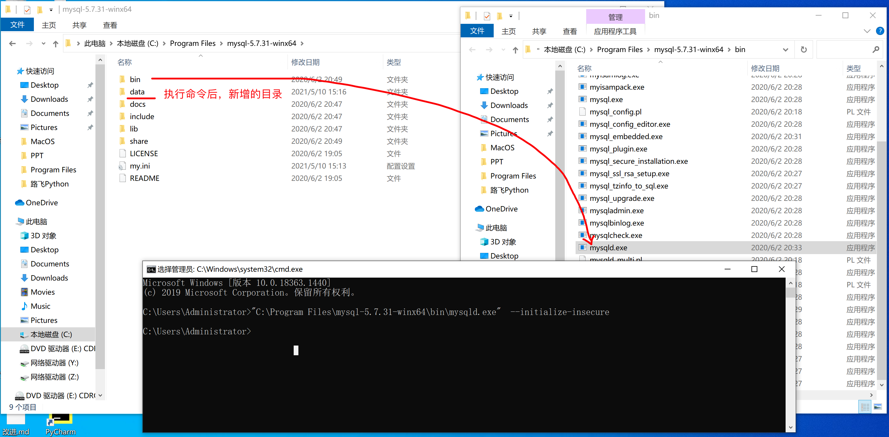
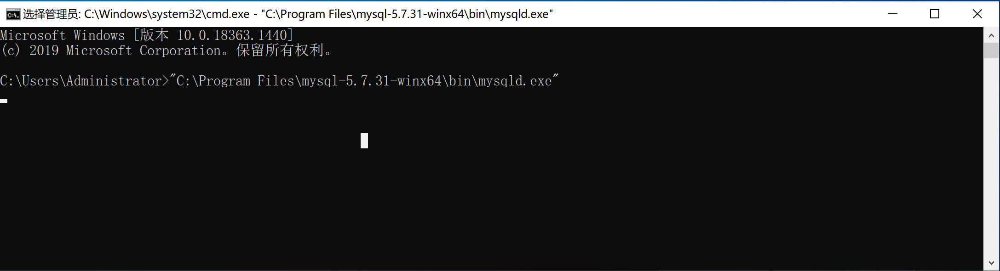
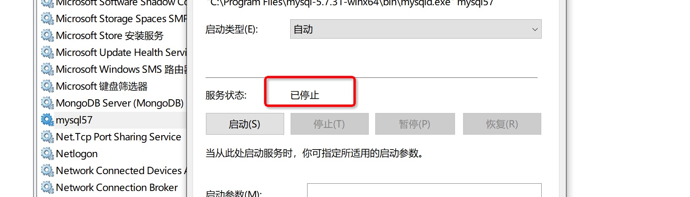

# day14 MySQL

- Python相关：基础、函数、数据类型、面向、模块。

- 前端开发：HTML、CSS、JavaScript、jQuery。【静态页面】

  ```
  Java+前端； Python+前端； Go+前端  -> 【动态页面】
  ```

直观：

- 静态，写死了，页面永远长一个样子。
- 动态页面，页面上的数据可以实时的修改和展示。


## 1. 初识网站

- 默认编写的静态的效果
- 动态：需要用到Web框架的功能。


对于目前的我们来看，都什么可以做数据的存储：

- txt文件

- excel文件

- 专业的软件：数据库管理系统。

  ```
  MySQL(*)免费
  Oracle/SQLServer/DB2/Access...
  ```

  


今日概要：

- MySQL安装 & 配置
- MySQL的启动和关闭
- 指令（*）
- Python第三方模块，发送指令并获取MySQL返回的结果。


## 2.安装MySQL

MySQL，本质上就是一个软件。

- 8.x
- 5.x ，课堂上 5.7.31版本。


### 2.1 下载

https://downloads.mysql.com/archives/community/


- windows补丁
- MySQL压缩包


### 2.2 安装补丁


### 2.3 安装

mysql-5.7.31-winx64.zip 是免安装的版本。

- 解压zip文件
- 将解压后的文件夹放入路径（不要有中文路径）


### 2.4 创建配置文件


### 2.5 初始化

- 打开终端 & 以管理员的权限去运行

  

- 输入初始化的命令

  ```
  "C:\Program Files\mysql-5.7.31-winx64\bin\mysqld.exe"  --initialize-insecure
  ```





至此，MySQL的安装已完成。


## 3.启动MySQL

启动MySQL一般有两种方式：

- 临时启动（不建议）

  ```
  >>> "C:\Program Files\mysql-5.7.31-winx64\bin\mysqld.exe"
  ```

  

- 制作成Windows服务，服务来进行关闭和开启。

  - 制作服务

    ```
    "C:\Program Files\mysql-5.7.31-winx64\bin\mysqld.exe" --install mysql57
    ```

    

    ```
    >>> net start mysql57
    >>> net stop mysql57
    ```

  - 启动和关闭服务

  - 也可以在window的服务管理中点击按钮启动和关闭服务。例如：

    

    

    

    

## 4.连接测试


```
>>>"C:\Program Files\mysql-5.7.31-winx64\bin\mysql.exe" -h 127.0.0.1 -P 3306 -u root -p 
```

```
>>>"C:\Program Files\mysql-5.7.31-winx64\bin\mysql.exe" -u root -p 
```


如果你将 `C:\Program Files\mysql-5.7.31-winx64\bin\`添加到了系统环境变量。

```
>>> mysql -u root -p
```


### 4.1 设置密码

```
set password = password('root123');
```


### 4.2 查看已有的文件夹（数据库）

```
show databases;
```


### 4.3 退出（关闭连接）

```
exit;
```


### 4.4. 再连接MySQL


汇总命令：

```
C:\Users\Administrator>mysql -u root -p
```

```
mysql> set password = password('root123');
mysql> show databases;
mysql> exit;
```

```
C:\Users\Administrator>mysql -u root -p
输入密码
mysql>exit;
```


### 疑问

1. 张杰斌
   - 添加环境变量【错】
     
   - 重新打开终端
   - 输入指令（首次不需要设置密码）
     

2. 张点墨
   

   ```
   以前自己安装过其他的MySQL，在终端运行mysql是用以前的那个工具。
   ```

   - 确保MySQL服务已经开启

   - 直接过路径来编写

     ```
     "C:\Program Files\mysql-5.7.31-winx64\bin\mysql.exe" -u root -p 
     ```

   - 检查自己的环境变量

     ```
     自己环境变量里，是不是有以前的那个MySQL的路径，全部删除。
     ```

   - 记下来你要做如下事：

     - window服务，里面有没有以前安装的MySQL？

3. gongxingyun

   ```
   - 路径没问题
   - 添加环境变量
   - 关闭终端，重新打开终端。
   ```

4. 郭智

   ```
   - 确保，你是32位还是64位？
   - 如果是64位，换成用管理员权限运行。
   - 如果是32位，需要安装32位的MySQL（同曹成鑫）
   ```

   

## 5.忘记密码

```
默认情况下，启动MySQL时，需要用户输入账户名、密码。

修改MySQL配置，重新启动MySQL（无账号模式）
	mysql -u root -p 
	重新设置密码
	退出
	
再重新修MySQL配置文件，重新启动MySQL（需要账号的模式）
	mysql -u root -p 
	新密码
```

- 停止现在MySQL服务
  

- 修改MySQL配置文件（以无账号模式）
  

- 重新启动MySQL
  

- 再次登录MySQL（无需密码）
  

- 执行命令设置密码

  ```
  use mysql;
  ```

  ```
  update user set authentication_string = password('新密码'),password_last_changed=now() where user='root';
  
  update user set authentication_string = password('root123'),password_last_changed=now() where user='root';
  ```

- 重新修改配置文件（需要账号的模式登录）【服务停掉】

  

- 重新启动MySQL

- 登录时候输入新的密码即可。


## 小结

支持，MySQL的环境搭建相关的事全部搞定了。

- 安装
- 配置
- 启动
- 连接（密码、忘记密码）


以后我们再操作MySQL时：

- 关闭和开启MySQL服务

- 用MySQL自动工具连接MySQL并发送指令

  ```
  myql -u root -p 
  ```

  

接下来，我们的重点：


## 6.MySQL指令


在MySQL和我们平时认知不同的概念。

| MySQL  | 认知              |
| ------ | ----------------- |
| 数据库 | 文件夹            |
| 数据表 | 文件（Excel文件） |


### 6.1 数据库管理（文件夹）

- 查看已有的数据库（文件夹）

  ```
  show databases;
  ```

- 创建数据库（文件夹）

  ```
  create database 数据库名字 DEFAULT CHARSET utf8 COLLATE utf8_general_ci;
  ```

  ```
  create database gx_day14 DEFAULT CHARSET utf8 COLLATE utf8_general_ci;
  ```

- 删除数据库（文件夹）

  ```
  drop database gx_day14;
  ```

- 进入数据库（进入文件夹）

  ```
  use gx_day14;
  ```

- 查看文件夹下所有的数据表（文件）

  ```
  show tables;
  ```


### 6.2 数据表的管理（文件）

- 进入数据库（进入文件夹）

  ```
  use 数据库;
  use gx_day14;
  ```

- 查看当前数据库下的所有 表（文件）

  ```
  show tables;
  ```

- 创建表（文件文件）

  ```sql
  create table 表名称(
  	列名称 类型,
      列名称 类型,
      列名称 类型
  )default charset=utf8;
  ```

  

  ```sql
  create table tb1(id int, name varchar(16),age int) default charset=utf8;
  ```

  ```python
  create table tb1(
      id int, 
      name varchar(16),
      age int
  ) default charset=utf8;
  ```

  ```sql
  create table tb1(
      id int, 
      name varchar(16) not null,   -- 不允许为空
      age int null,                -- 允许为空（默认）
  ) default charset=utf8;
  ```

  ```sql
  create table tb1(
      id int, 
      name varchar(16),
      age int default 3        -- 插入数据时，age列的值默认3
  ) default charset=utf8;
  ```

  ```sql
  create table tb1(
      id int primary key,     -- 主键（不允许为空，不允许重复）
      name varchar(16),
      age int
  ) default charset=utf8;
  ```

  主键一般用于表示当前行的数据的编号（类似于人的身份证）。

  ```sql
  create table tb1(
      id int auto_increment primary key, -- 内部维护，自增
      name varchar(16),
      age int
  ) default charset=utf8;
  ```

  一般情况下，我们再创建表时都会这样来写：【标准】

  ```sql
  create table tb1(
      id int not null auto_increment primary key,
      name varchar(16),
      age int
  ) default charset=utf8;
  ```

  ```
  mysql> desc tb1;
  +-------+-------------+------+-----+---------+----------------+
  | Field | Type        | Null | Key | Default | Extra          |
  +-------+-------------+------+-----+---------+----------------+
  | id    | int(11)     | NO   | PRI | NULL    | auto_increment |
  | name  | varchar(16) | YES  |     | NULL    |                |
  | age   | int(11)     | YES  |     | NULL    |                |
  +-------+-------------+------+-----+---------+----------------+
  3 rows in set (0.00 sec)
  ```

- 删除表

  ```sql
  drop table 表名称;
  ```

  

常用数据类型：

- tinyint

  ```
  有符号，取值范围：-128 ～ 127 (有正有负)【默认】
  无符号，取值范围：0 ～ 255（只有正）
  ```

  ```sql
  create table tb2(
      id int not null auto_increment primary key,
      age tinyint   -- 有符号：取值范围：-128 ～ 127
  ) default charset=utf8;
  ```

  ```sql
  create table tb3(
      id int not null auto_increment primary key,
      age tinyint unsigned -- 无符号：取值范围：0 ～ 255
  ) default charset=utf8;
  ```

- int

  ```
  int				表示有符号，取值范围：-2147483648 ～ 2147483647
  int unsigned	表示无符号，取值范围：0 ～ 4294967295
  ```

- bigint

  ```
  有符号，取值范围：-9223372036854775808 ～ 9223372036854775807
  无符号，取值范围：0  ～  18446744073709551615
  ```

  练习题：

  ```sql
  # 创建表
  create table tb2(
      id bigint not null auto_increment primary key,
      salary int,
      age tinyint
  ) default charset=utf8;
  
  # 插入数据
  insert into tb2(salary,age) values(10000,18);
  insert into tb2(salary,age) values(20000,28);
  insert into tb2(salary,age) values(30000,38),(40000,40);
  
  # 查看表中的数据
  select * from tb2;
  ```

  ```sql
  mysql> show tables;
  +--------------------+
  | Tables_in_gx_day14 |
  +--------------------+
  | tb1                |
  +--------------------+
  1 row in set (0.00 sec)
  
  mysql> create table tb2(
      ->     id bigint not null auto_increment primary key,
      ->     salary int,
      ->     age tinyint
      -> ) default charset=utf8;
  Query OK, 0 rows affected (0.03 sec)
  
  mysql> show tables;
  +--------------------+
  | Tables_in_gx_day14 |
  +--------------------+
  | tb1                |
  | tb2                |
  +--------------------+
  2 rows in set (0.00 sec)
  
  mysql> insert into tb2(salary,age) values(10000,18);
  Query OK, 1 row affected (0.00 sec)
  
  mysql> insert into tb2(salary,age) values(20000,28);
  Query OK, 1 row affected (0.00 sec)
  
  mysql> insert into tb2(salary,age) values(30000,38),(40000,40);
  Query OK, 2 rows affected (0.01 sec)
  Records: 2  Duplicates: 0  Warnings: 0
  
  mysql> select * from tb2;
  +----+--------+------+
  | id | salary | age  |
  +----+--------+------+
  |  1 |  10000 |   18 |
  |  2 |  20000 |   28 |
  |  3 |  30000 |   38 |
  |  4 |  40000 |   40 |
  +----+--------+------+
  4 rows in set (0.00 sec)
  ```

- float

- double

- decimal

  ```
  准确的小数值，m是数字总个数（负号不算），d是小数点后个数。 m最大值为65，d最大值为30。
  
  例如：
  create table tb3(
  	id int not null primary key auto_increment,
  	salary decimal(8,2)
  )default charset=utf8;
  
  insert into tb3(salary) values(1.28);
  insert into tb3(salary) values(5.289);
  insert into tb3(salary) values(5.282);
  insert into tb3(salary) values(122115.11);
  
  select * from tb3;
  ```

- char(m)，速度快。

  ```sql
  定长字符串，m代表字符串的长度，最多可容纳255个字符。
  
  char(11)，固定用11个字符串进行存储，哪怕真是没有11个字符，也会按照11存储。
  
  create table tb4(
  	id int not null primary key auto_increment,
  	mobile char(11)
  )default charset=utf8;
  
  insert into tb4(mobile) values("151");
  insert into tb4(mobile) values("15131255555");
  ```

- varchar(m)，节省空间。

  ```sql
  变长字符串，m代表字符的长度。   最大65535字节/3 = 最大的m
  
  varchar(11)，真实数据有多少长久按照多长存储。
  
  create table tb5(
  	id int not null primary key auto_increment,
  	mobile varchar(11)
  )default charset=utf8;
  
  insert into tb5(mobile) values("151");
  insert into tb5(mobile) values("15131255555");
  ```

- text

  ```sql
  text数据类型用于保存变长的大字符串，可以组多到65535 (2**16 − 1)个字符。
  
  一般情况下，长文本会用text类型。例如：文章、新闻等。
  
  create table tb6(
  	id int not null primary key auto_increment,
      title varchar(128),
  	content text
  )default charset=utf8;
  ```

- mediumtext

  ```
  A TEXT column with a maximum length of 16,777,215 (2**24 − 1) characters.
  ```

- longtext

  ```
  A TEXT column with a maximum length of 4,294,967,295 or 4GB (2**32 − 1)
  ```

  

- datetime

  ```
  YYYY-MM-DD HH:MM:SS（1000-01-01 00:00:00/9999-12-31 23:59:59）
  ```

- date

  ```
  YYYY-MM-DD（1000-01-01/9999-12-31）
  ```


练习题：用户表

```sql
create table tb7(
	id int not null primary key auto_increment,
    name varchar(64) not null,
    password char(64) not null,
    email varchar(64) not null,
    age tinyint,
    salary decimal(10,2),
    ctime datetime
)default charset=utf8;


insert into tb7(name,password,email,age,salary,ctime) values("武沛齐","123","xx@live.com",19,1000.20,"2011-11-11 11:11:10");

insert into tb7(name,password,email,age,salary,ctime) values("张电摩","123","xx@live.com",19,1000.20,"2011-11-11 11:11:10");

insert into tb7(name,password,email,age,salary,ctime) values("庞小青","123","xx@live.com",19,1000.20,"2011-11-11 11:11:10");

insert into tb7(name,password,email,age,salary,ctime) values("谢涛","123","xx@live.com",19,1000.20,"2011-11-11 11:11:10");

insert into tb7(name,password,email,age,salary,ctime) values("谢鹏","123","xx@live.com",19,1000.20,"2011-11-11 11:11:10");

select * from tb7;


+----+-----------+----------+-------------+------+---------+---------------------+
| id | name      | password | email       | age  | salary  | ctime               |
+----+-----------+----------+-------------+------+---------+---------------------+
|  1 | 武沛齐    | 123      | xx@live.com |   19 | 1000.20 | 2011-11-11 11:11:10 |
+----+-----------+----------+-------------+------+---------+---------------------+
1 row in set (0.00 sec)
```


MySQL还有很多其他的数据类型，例如：*set、enum、TinyBlob、Blob、MediumBlob、LongBlob 等*，详细见官方文档：https://dev.mysql.com/doc/refman/5.7/en/data-types.html


我们平时开发系统时，一般情况下：

- 创建数据库
- 创建表结构

都是需要提前通过上述命令创建。


### 6.3 数据行操作

#### 1. 新增数据

```sql
insert into 表名(列名,列名) values(值,值);
insert into 表名(列名,列名) values(值,值),(值,值),(值,值),(值,值);
```


#### 2.删除数据

```sql
delete from 表名;
delete from 表名 where 条件;
```

```sql
delete from tb7;
delete from tb7 where id = 3;
delete from tb7 where id = 4 and name="谢涛";
delete from tb7 where id = 4 or name="谢涛";
delete from tb7 where id > 4;
delete from tb7 where id >= 4;
delete from tb7 where id != 4;
delete from tb7 where id in (1,5);
```


#### 3.修改数据

```sql
update 表名 set 列=值;
update 表名 set 列=值,列=值;
update 表名 set 列=值 where 条件;
```

```sql
update tb7 set password="哈哈哈";
update tb7 set email="哈哈哈" where id > 5;

update tb7 set age=age+10 where id > 5;
```


#### 4.查询数据

```sql
select * from 表名称;
select 列名称,列名称 from 表名称;

select 列名称,列名称 from 表名称 where 条件;
```

```sql
select * from tb7;
select id,name from tb7;
select id,name from tb7 where id > 10;
select id,name from tb7 where name="xx" and password="xx";
```


### 小结

我们平时开发系统时，一般情况下：

- 创建数据库
- 创建表结构

都是需要提前通过工具+命令创建。


但是，表中的数据一般情况下都是通过程序来实现增删改查。


## 7.案例：员工管理

- 使用MySQL内置工具（命令）

  - 创建数据库：unicom

  - 数据一张表：admin

    ```
    表名：admin
    列：
    	id，整型，自增，主键。
    	username 字符串 不为空,
    	password 字符串 不为空,
    	mobile 字符串 不为空
    ```

- Python代码实现：

  - 添加用户
  - 删除用户
  - 查看用户
  - 更新用户信息


### 7.1 创建表结构

```sql
create database unicom DEFAULT CHARSET utf8 COLLATE utf8_general_ci;
```

```sql
use unicom;
```

```sql
create table admin(
    id int not null auto_increment primary key,
    username varchar(16) not null,
    password varchar(64) not null,
    mobile char(11) not null
) default charset=utf8;
```


### 7.2 Python操作MySQL

> 用Python代码连接MySQL并发送指令。

```
pip install pymysql
```


#### 1.创建数据

```python
import pymysql

# 1.连接MySQL
conn = pymysql.connect(host="127.0.0.1", port=3306, user='root', passwd="root123", charset='utf8', db='unicom')
cursor = conn.cursor(cursor=pymysql.cursors.DictCursor)

# 2.发送指令
cursor.execute("insert into admin(username,password,mobile) values('wupeiqi','qwe123','15155555555')")
conn.commit()

# 3.关闭
cursor.close()
conn.close()
```

```python
import pymysql

# 1.连接MySQL
conn = pymysql.connect(host="127.0.0.1", port=3306, user='root', passwd="root123", charset='utf8', db='unicom')
cursor = conn.cursor(cursor=pymysql.cursors.DictCursor)

# 2.发送指令（千万不要用字符串格式化去做SQL的拼接，安全隐患SQL注入）
# sql = "insert into admin(username,password,mobile) values(%s,%s,%s)"
# cursor.execute(sql, ["韩超", "qwe123", "1999999999"])

# sql = "insert into admin(username,password,mobile) values( %(n1)s, %(n2)s, %(n3)s)"
# cursor.execute(sql, {"n1": "集宁", "n2": "qwe123", "n3": "1999999999"})


conn.commit()

# 3.关闭
cursor.close()
conn.close()
```


```python
import pymysql

while True:
    user = input("用户名：")
    if user.upper() == 'Q':
        break
    pwd = input("密码：")
    mobile = input("手机号：")

    # 1.连接MySQL
    conn = pymysql.connect(host="127.0.0.1", port=3306, user='root', passwd="root123", charset='utf8', db='unicom')
    cursor = conn.cursor(cursor=pymysql.cursors.DictCursor)

    # 2.发送指令（千万不要用字符串格式化去做SQL的拼接，安全隐患SQL注入）
    sql = "insert into admin(username,password,mobile) values(%s,%s,%s)"
    cursor.execute(sql, [user, pwd, mobile])
    conn.commit()

    # 3.关闭
    cursor.close()
    conn.close()
```


#### 2.查询数据

```python
import pymysql

# 1.连接MySQL
conn = pymysql.connect(host="127.0.0.1", port=3306, user='root', passwd="root123", charset='utf8', db='unicom')
cursor = conn.cursor(cursor=pymysql.cursors.DictCursor)

# 2.发送指令（ *** 千万不要用字符串格式化去做SQL的拼接，安全隐患SQL注入***）
cursor.execute("select * from admin where id > %s", [2, ])

# 获取符合条件的所有数据，得到的是 [ 字典,字典, ]    空列表
data_list = cursor.fetchall()
for row_dict in data_list:
    print(row_dict)

# 3.关闭连接
cursor.close()
conn.close()
```

```python
import pymysql

# 1.连接MySQL
conn = pymysql.connect(host="127.0.0.1", port=3306, user='root', passwd="root123", charset='utf8', db='unicom')
cursor = conn.cursor(cursor=pymysql.cursors.DictCursor)

# 2.发送指令（ *** 千万不要用字符串格式化去做SQL的拼接，安全隐患SQL注入***）
cursor.execute("select * from admin where id > %s", [2, ])

# 获取符合条件的第一条数据，字典    None
res = cursor.fetchone()
print(res)  # {'id': 3, 'username': '集宁', 'password': 'qwe123', 'mobile': '1999999999'}

# 3.关闭连接
cursor.close()
conn.close()
```


#### 3.删除数据

```python
import pymysql

# 1.连接MySQL
conn = pymysql.connect(host="127.0.0.1", port=3306, user='root', passwd="root123", charset='utf8', db='unicom')
cursor = conn.cursor(cursor=pymysql.cursors.DictCursor)

# 2.发送指令（ *** 千万不要用字符串格式化去做SQL的拼接，安全隐患SQL注入***）
cursor.execute("delete from admin where id=%s", [3, ])
conn.commit()

# 3.关闭
cursor.close()
conn.close()
```


#### 4.修改数据

```python
import pymysql

# 1.连接MySQL
conn = pymysql.connect(host="127.0.0.1", port=3306, user='root', passwd="root123", charset='utf8', db='unicom')
cursor = conn.cursor(cursor=pymysql.cursors.DictCursor)

# 2.发送指令（ *** 千万不要用字符串格式化去做SQL的拼接，安全隐患SQL注入***）
cursor.execute("update admin set mobile=%s where id=%s", ["1888888888", 4, ])
conn.commit()

# 3.关闭
cursor.close()
conn.close()
```


强调：

- 在进行 新增、删除、修改时，一定要记得commit，不然数据库么有数据。

  ```
  cursor.execute("..")
  conn.commit()
  ```

- 在查询时，不需要commit，执行fetchall / fetchone

  ```
  cursor.execute("...")
  
  # 第一条数据，字典，无数据时是空列表
  v1 = cursor.fetchone()
  
  # 所有数据，列表套字典，无数据时是None
  v1 = cursor.fetchall()
  ```

- 对于SQL语句不要用Python的字符串格式化进行拼接（会被SQL注入），一定要用execute+参数

  ```python
  cursor.execute(".%s..... %s", ["xx","xx"])
  ```

  

## 8.案例：Flask+MySQL

### 8.1 新增用户

补充代码实现


- 农远隽
  - add_user.py 文件，修改成  app.py
  - add_user.html 文件，放在 templates目录下。
  - 把你的pycharm中运行所有的代码全都停下来。
  - 重新运行app.py


### 8.2 查询所有用户


