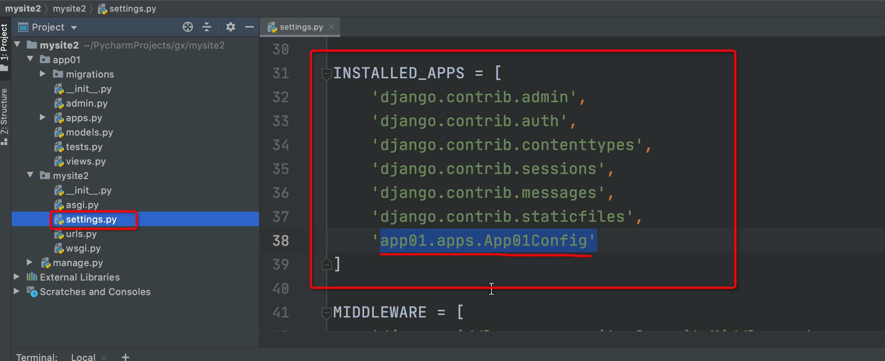
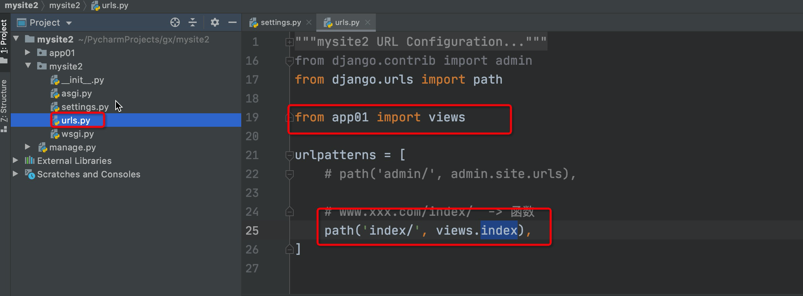
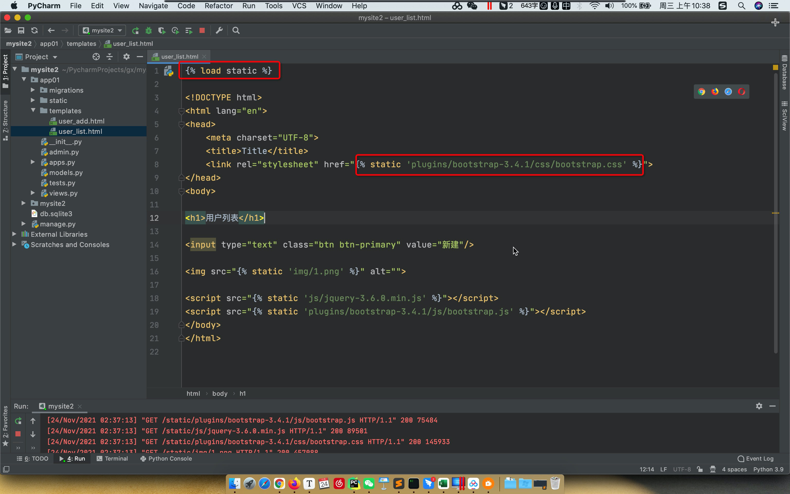
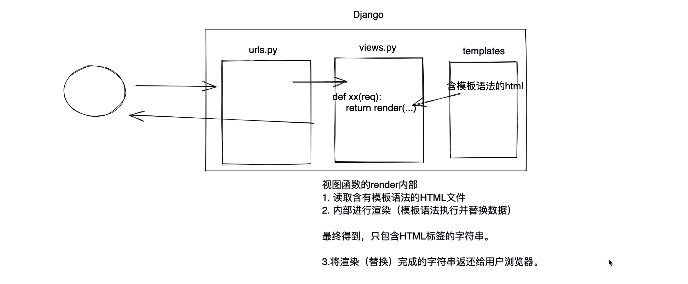

# day15 初识Django

- Python知识点：函数、面向对象。
- 前端开发：HTML、CSS、JavaScript、jQuery、BootStrap。
- MySQL数据库。
- Python的Web框架：
  - Flask，自身短小精悍 + 第三方组件。
  - Django，内部已集成了很多组件 +  第三方组件。【主要】


## 1.安装django

```
pip install django
```

```
c:\python39
	- python.exe
	- Scripts
		- pip.exe
		- django-admin.exe   【工具，创建django项目中的文件和文件夹】
	- Lib
		- 内置模块
		- site-packages
			- openpyxl
			- python-docx
			- flask
			- django         【框架的源码】
```


## 2.创建项目

> django中项目会有一些默认的文件和默认的文件夹。


### 2.1 在终端

- 打开终端。

- 进入某个目录（项目放在哪里）。

  ```
  /Users/wupeiqi/PycharmProjects/gx
  ```

- 执行命令创建项目

  ```
  "c:\python39\Scripts\django-admin.exe" startproject 项目名称
  ```

  ```
  # 如果 c:\python39\Scripts 已加入环境系统环境变量。
  
  django-admin startproject 项目名称
  ```

  ```
  # 我自己的电脑
  /Library/Frameworks/Python.framework/Versions/3.9/bin/django-admin startproject mysite
  ```


### 2.2 Pycharm

注意：

```
- Python解释器安装目录：C:\python39\python.exe lib....
	/Library/Frameworks/Python.framework/Versions/3.9/
	
- F:\pycode\ (基于Django创建的项目)
	/Users/wupeiqi/PycharmProjects
```


特殊说明：

- 命令行，创建的项目是标准的。

- pycharm，在标准的基础上默认给咱们加了点东西。

  - 创建了一个templates目录【删除】

  - settings.py中【删除】
    

    


默认项目的文件介绍：

```
mysite
├── manage.py         【项目的管理，启动项目、创建app、数据管理】【不要动】【***常常用***】
└── mysite
    ├── __init__.py
    ├── settings.py    【项目配置】          【***常常修改***】
    ├── urls.py        【URL和函数的对应关系】【***常常修改***】
    ├── asgi.py        【接收网络请求】【不要动】
    └── wsgi.py        【接收网络请求】【不要动】
```


## 3. 创建app

```
- 项目
	- app，用户管理【表结构、函数、HTML模板、CSS】
	- app，订单管理【表结构、函数、HTML模板、CSS】
	- app，后台管理【表结构、函数、HTML模板、CSS】
	- app，网站   【表结构、函数、HTML模板、CSS】
	- app，API    【表结构、函数、HTML模板、CSS】
	..
	
注意：我们开发比较简洁，用不到多app，一般情况下，项目下创建1个app即可。
```


```
├── app01
│   ├── __init__.py
│   ├── admin.py         【固定，不用动】django默认提供了admin后台管理。
│   ├── apps.py          【固定，不用动】app启动类
│   ├── migrations       【固定，不用动】数据库变更记录
│   │   └── __init__.py
│   ├── models.py        【**重要**】，对数据库操作。
│   ├── tests.py         【固定，不用动】单元测试
│   └── views.py         【**重要**】，函数。
├── manage.py
└── mysite2
    ├── __init__.py
    ├── asgi.py
    ├── settings.py
    ├── urls.py          【URL->函数】
    └── wsgi.py
```


## 4.快速上手

- 确保app已注册 【settings.py】
  

- 编写URL和视图函数对应关系 【urls.py】
  

- 编写视图函数 【views.py】
  

- 启动django项目

  - 命令行启动

    ```
    python manage.py runserver 
    ```

  - Pycharm启动
    


### 4.1 再写一个页面

```
- url -> 函数
- 函数
```


### 4.2 templates模板


### 4.3 静态文件

在开发过程中一般将：

- 图片
- CSS
- js

都会当做静态文件处理。


#### 4.3.1 static目录

在app目录下创建static文件夹。


#### 4.3.2 引用静态文件




## 5.模板语法

本质上：在HTML中写一些占位符，由数据对这些占位符进行替换和处理。




## 案例：伪联通新闻中心


## 6.请求和响应


关于重定向：


## 案例：用户登录


## 7.数据库操作

- MySQL数据库 + pymysql

  ```python
  import pymysql
  
  # 1.连接MySQL
  conn = pymysql.connect(host="127.0.0.1", port=3306, user='root', passwd="root123", charset='utf8', db='unicom')
  cursor = conn.cursor(cursor=pymysql.cursors.DictCursor)
  
  # 2.发送指令
  cursor.execute("insert into admin(username,password,mobile) values('wupeiqi','qwe123','15155555555')")
  conn.commit()
  
  # 3.关闭
  cursor.close()
  conn.close()
  ```

- Django开发操作数据库更简单，内部提供了ORM框架。
  


### 7.1 安装第三方模块

```
pip install mysqlclient
```


### 7.2 ORM

ORM可以帮助我们做两件事：

- 创建、修改、删除数据库中的表（不用你写SQL语句）。 【无法创建数据库】

- 操作表中的数据（不用写SQL语句）。

  

#### 1. 自己创建数据库

- 启动MySQL服务

- 自带工具创建数据库

  ```
  create database gx_day15 DEFAULT CHARSET utf8 COLLATE utf8_general_ci;
  ```


#### 2. django连接数据库

在settings.py文件中进行配置和修改。

```python
DATABASES = {
    'default': {
        'ENGINE': 'django.db.backends.mysql',
        'NAME': 'gx_day15',  # 数据库名字
        'USER': 'root',
        'PASSWORD': 'root123',
        'HOST': '127.0.0.1',  # 那台机器安装了MySQL
        'PORT': 3306,
    }
}
```


#### 3.django操作表

- 创建表
- 删除表
- 修改表

创建表：在models.py文件中


```sql
create table app01_userinfo(
    id bigint auto_increment primary key,
    name varchar(32),
    password varchar(64),
    age int
)
```


执行命令：

```
python3.9 manage.py makemigrations
python3.9 manage.py migrate
```

注意：app需要提前注册。


在表中新增列时，由于已存在列中可能已有数据，所以新增列必须要指定新增列对应的数据：

- 1，手动输入一个值。

- 设置默认值

  ```
  age = models.IntegerField(default=2)
  ```

- 允许为空

  ```
  data = models.IntegerField(null=True, blank=True)
  ```


以后在开发中如果想要对表结构进行调整：

- 在models.py文件中操作类即可。

- 命令

  ```
  python3.9 manage.py makemigrations
  python3.9 manage.py migrate
  ```

  

#### 4.表中的数据

```python

# #### 1.新建 ####
# Department.objects.create(title="销售部")
# Department.objects.create(title="IT部")
# Department.objects.create(title="运营部")
# UserInfo.objects.create(name="武沛齐", password="123", age=19)
# UserInfo.objects.create(name="朱虎飞", password="666", age=29)
# UserInfo.objects.create(name="吴阳军", password="666")

# #### 2.删除 ####
# UserInfo.objects.filter(id=3).delete()
# Department.objects.all().delete()

# #### 3.获取数据 ####
# 3.1 获取符合条件的所有数据
# data_list = [对象,对象,对象]  QuerySet类型
# data_list = UserInfo.objects.all()
# for obj in data_list:
#     print(obj.id, obj.name, obj.password, obj.age)

# data_list = [对象,]
# data_list = UserInfo.objects.filter(id=1)
# print(data_list)
# 3.1 获取第一条数据【对象】
# row_obj = UserInfo.objects.filter(id=1).first()
# print(row_obj.id, row_obj.name, row_obj.password, row_obj.age)


# #### 4.更新数据 ####
# UserInfo.objects.all().update(password=999)
# UserInfo.objects.filter(id=2).update(age=999)
# UserInfo.objects.filter(name="朱虎飞").update(age=999)
```


## 案例：用户管理

### 1. 展示用户列表

- url
- 函数
  - 获取所有用户信息
  - HTML渲染

### 2.添加用户

- url
- 函数
  - GET，看到页面，输入内容。
  - POST，提交 -> 写入到数据库。


### 3.删除用户

- url
- 函数


````
http://127.0.0.1:8000/info/delete/?nid=1
http://127.0.0.1:8000/info/delete/?nid=2
http://127.0.0.1:8000/info/delete/?nid=3

def 函数(request):
	nid = reuqest.GET.get("nid")
	UserInfo.objects.filter(id=nid).delete()
	return HttpResponse("删除成功")
````


