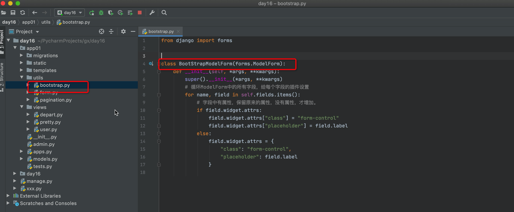
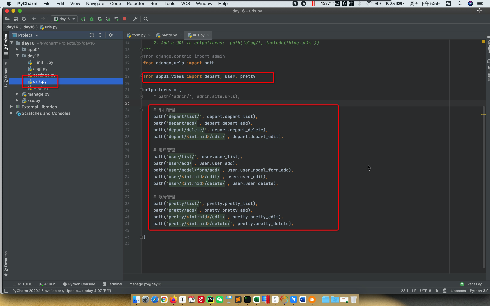

# day16 Django开发

主题：员工管理系统


## 1.新建项目


## 2.创建app

```
python manage.py startapp app01
```


注册app：


## 3.设计表结构（django）


```python
from django.db import models


class Department(models.Model):
    """ 部门表 """
    title = models.CharField(verbose_name='标题', max_length=32)


class UserInfo(models.Model):
    """ 员工表 """
    name = models.CharField(verbose_name="姓名", max_length=16)
    password = models.CharField(verbose_name="密码", max_length=64)
    age = models.IntegerField(verbose_name="年龄")
    account = models.DecimalField(verbose_name="账户余额", max_digits=10, decimal_places=2, default=0)
    create_time = models.DateTimeField(verbose_name="入职时间")

    # 无约束
    # depart_id = models.BigIntegerField(verbose_name="部门ID")
    # 1.有约束
    #   - to，与那张表关联
    #   - to_field，表中的那一列关联
    # 2.django自动
    #   - 写的depart
    #   - 生成数据列 depart_id
    # 3.部门表被删除
    # ### 3.1 级联删除
    depart = models.ForeignKey(to="Department", to_field="id", on_delete=models.CASCADE)
    # ### 3.2 置空
    # depart = models.ForeignKey(to="Department", to_field="id", null=True, blank=True, on_delete=models.SET_NULL)

    # 在django中做的约束
    gender_choices = (
        (1, "男"),
        (2, "女"),
    )
    gender = models.SmallIntegerField(verbose_name="性别", choices=gender_choices)
```


## 4.在MySQL中生成表

- 工具连接MySQL生成数据库。

  ```
  create database gx_day16 DEFAULT CHARSET utf8 COLLATE utf8_general_ci;
  ```

- 修改配置文件，连接MySQL

  ```
  DATABASES = {
      'default': {
          'ENGINE': 'django.db.backends.mysql',
          'NAME': 'gx_day16',  # 数据库名字
          'USER': 'root',
          'PASSWORD': 'root123',
          'HOST': '127.0.0.1',  # 那台机器安装了MySQL
          'PORT': 3306,
      }
  }
  ```

  

- django命令生成数据库表

  ```
  python manage.py makemigrations
  python manage.py migrate
  ```

  


表结构创建成功：


## 5.静态文件管理

static目录


## 6.部门管理

> 体验，最原始方法来做。
>
> Django中提供Form和ModelForm组件（方便）


## 7.模板的继承

- 部门列表
- 添加部门
- 编辑部门


定义目版：`layout.html`

```html
<!DOCTYPE html>
<html lang="en">
<head>
    <meta charset="UTF-8">
    <title>Title</title>
    <link rel="stylesheet" href="">
    
</head>
<body>
    <h1>标题</h1>
    <div>
        
    </div>
    <h1>底部</h1>
    
    <script src=""></script>
    
</body>
</html>

```

继承母版：

```html



	<link rel="stylesheet" href="">
	<style>
		...
	</style>




    <h1>首页</h1>




	<script src=""></script>

```


## 8.用户管理

```sql
insert into app01_userinfo(name,password,age,account,create_time,gender,depart_id) values("韩超","666",23,100.68,"2020-01-11",2,1);

insert into app01_userinfo(name,password,age,account,create_time,gender,depart_id) values("刘东","123",23,100.68,"2010-11-11",1,4);

insert into app01_userinfo(name,password,age,account,create_time,gender,depart_id) values("朱虎飞","999",33,9900.68,"2021-05-11",1,1);
```

```
+-------------+---------------+------+-----+---------+----------------+
| Field       | Type          | Null | Key | Default | Extra          |
+-------------+---------------+------+-----+---------+----------------+
| id          | bigint(20)    | NO   | PRI | NULL    | auto_increment |
| name        | varchar(16)   | NO   |     | NULL    |                |
| password    | varchar(64)   | NO   |     | NULL    |                |
| age         | int(11)       | NO   |     | NULL    |                |
| account     | decimal(10,2) | NO   |     | NULL    |                |
| create_time | datetime(6)   | NO   |     | NULL    |                |
| gender      | smallint(6)   | NO   |     | NULL    |                |
| depart_id   | bigint(20)    | NO   | MUL | NULL    |                |
+-------------+---------------+------+-----+---------+----------------+
```


新建用户：

- 原始方式理思路：不会采用（本质）【麻烦】

  ```
  - 用户提交数据没有校验。
  - 错误，页面上应该有错误提示。
  - 页面上，没一个字段都需要我们重新写一遍。     [OK]
  - 关联的数据，手动去获取并展示循环展示在页面。  [OK]
  ```

- Django组件

  - Form组件（小简便）
  - ModelForm组件（最简便）


### 8.1 初识Form

#### 1. views.py

```python
class MyForm(Form):
    user = forms.CharField(widget=forms.Input)
    pwd = form.CharFiled(widget=forms.Input)
    email = form.CharFiled(widget=forms.Input)
    account = form.CharFiled(widget=forms.Input)
    create_time = form.CharFiled(widget=forms.Input)
    depart = form.CharFiled(widget=forms.Input)
    gender = form.CharFiled(widget=forms.Input)


def user_add(request):
    if request.method == "GET":
        form = MyForm()
        return render(request, 'user_add.html',{"form":form})
```

#### 2.user_add.html

```html
<form method="post">
    
    	{{ field }}
    
    <!-- <input type="text"  placeholder="姓名" name="user" /> -->
</form>
```

```html
<form method="post">
    {{ form.user }}
    {{ form.pwd }}
    {{ form.email }}
    <!-- <input type="text"  placeholder="姓名" name="user" /> -->
</form>
```


### 8.3 ModelForm（推荐）

#### 0. models.py

```python
class UserInfo(models.Model):
    """ 员工表 """
    name = models.CharField(verbose_name="姓名", max_length=16)
    password = models.CharField(verbose_name="密码", max_length=64)
    age = models.IntegerField(verbose_name="年龄")
    account = models.DecimalField(verbose_name="账户余额", max_digits=10, decimal_places=2, default=0)
    create_time = models.DateTimeField(verbose_name="入职时间")
    depart = models.ForeignKey(to="Department", to_field="id", on_delete=models.CASCADE)
    gender_choices = (
        (1, "男"),
        (2, "女"),
    )
    gender = models.SmallIntegerField(verbose_name="性别", choices=gender_choices)
```


#### 1. views.py

```python
class MyForm(ModelForm):
    xx = form.CharField*("...")
    class Meta:
        model = UserInfo
        fields = ["name","password","age","xx"]


def user_add(request):
    if request.method == "GET":
        form = MyForm()
        return render(request, 'user_add.html',{"form":form})
```

#### 2.user_add.html

```html
<form method="post">
    
    	{{ field }}
    
    <!-- <input type="text"  placeholder="姓名" name="user" /> -->
</form>
```

```html
<form method="post">
    {{ form.user }}
    {{ form.pwd }}
    {{ form.email }}
    <!-- <input type="text"  placeholder="姓名" name="user" /> -->
</form>
```


# day17 Django开发

- 部门管理

- 用户管理

  - 用户列表

  - 新建用户

    ```
    - ModelForm，针对数据库中的某个表。
    - Form。
    ```

    

### 8.4 编辑用户

- 点击编辑，跳转到编辑页面（将编辑行的ID携带过去）。

- 编辑页面（默认数据，根据ID获取并设置到页面中）

- 提交：

  - 错误提示

  - 数据校验

  - 在数据库更新

    ```
    models.UserInfo.filter(id=4).update(...)
    ```

    

### 8.5 删除

见代码。


## 9.靓号管理

### 9.1 表结构


根据表结构的需求，在models.py中创建类（由类生成数据库中的表）。

```python
class PrettyNum(models.Model):
    """ 靓号表 """
    mobile = models.CharField(verbose_name="手机号", max_length=11)
    # 想要允许为空 null=True, blank=True
    price = models.IntegerField(verbose_name="价格", default=0)

    level_choices = (
        (1, "1级"),
        (2, "2级"),
        (3, "3级"),
        (4, "4级"),
    )
    level = models.SmallIntegerField(verbose_name="级别", choices=level_choices, default=1)

    status_choices = (
        (1, "已占用"),
        (2, "未使用")
    )
    status = models.SmallIntegerField(verbose_name="状态", choices=status_choices, default=2)
```


自己在数据模拟创建一些数据：

```sql
insert into app01_prettynum(mobile,price,level,status)values("111111111",19,1,1);
```

```
mysql> select * from app01_prettynum;
+----+-----------+-------+-------+--------+
| id | mobile    | price | level | status |
+----+-----------+-------+-------+--------+
|  1 | 111111111 |    19 |     1 |      1 |
|  2 | 111111111 |    19 |     1 |      1 |
|  3 | 111111111 |    19 |     1 |      1 |
|  4 | 111111111 |    19 |     1 |      1 |
+----+-----------+-------+-------+--------+
4 rows in set (0.01 sec)
```


### 9.2 靓号列表

- URL

- 函数

  - 获取所有的靓号

  - 结合html+render将靓号罗列出来

    ```
    id	号码	价格	级别（中文）	状态（中文）
    ```

    


### 9.3 新建靓号

- 列表点击跳转：`/pretty/add/`

- URL

- ModelForm类

  ```
  from django import forms
  
  class PrettyModelForm(forms.ModelForm):
  	...
  ```

- 函数

  - 实例化类的对象
  - 通过render将对象传入到HTML中。
  - 模板的循环展示所有的字段。

- 点击提交
  - 数据校验
  - 保存到数据库
  - 跳转回靓号列表


### 9.4 编辑靓号

- 列表页面：`/pretty/数字/edit/`
- URL
- 函数
  - 根据ID获取当前编辑的对象
  - ModelForm配合，默认显示数据。
  - 提交修改。


不允许手机号重复。

- 添加：【正则表达式】【手机号不能存在】

  ```python
  # [obj,obj,obj]
  queryset = models.PrettyNum.objects.filter(mobile="1888888888")
  
  obj = models.PrettyNum.objects.filter(mobile="1888888888").first()
  
  # True/False
  exists = models.PrettyNum.objects.filter(mobile="1888888888").exists()
  ```

- 编辑：【正则表达式】【手机号不能存在】

  ```python
  排除自己以外，其他的数据是否手机号是否重复？
  
  # id!=2 and mobile='1888888888'
  models.PrettyNum.objects.filter(mobile="1888888888").exclude(id=2)
  ```

  

### 9.5 搜索手机号

```python
models.PrettyNum.objects.filter(mobile="19999999991",id=12)

data_dict = {"mobile":"19999999991","id":123}
models.PrettyNum.objects.filter(**data_dict)
```


```python
models.PrettyNum.objects.filter(id=12)       # 等于12
models.PrettyNum.objects.filter(id__gt=12)   # 大于12
models.PrettyNum.objects.filter(id__gte=12)  # 大于等于12
models.PrettyNum.objects.filter(id__lt=12)   # 小于12
models.PrettyNum.objects.filter(id__lte=12)  # 小于等于12

data_dict = {"id__lte":12}
models.PrettyNum.objects.filter(**data_dict)
```

```python
models.PrettyNum.objects.filter(mobile="999")               # 等于
models.PrettyNum.objects.filter(mobile__startswith="1999")  # 筛选出以1999开头
models.PrettyNum.objects.filter(mobile__endswith="999")     # 筛选出以999结尾
models.PrettyNum.objects.filter(mobile__contains="999")     # 筛选出包含999

data_dict = {"mobile__contains":"999"}
models.PrettyNum.objects.filter(**data_dict)
```


### 9.6 分页

```python
queryset = models.PrettyNum.objects.all()

queryset = models.PrettyNum.objects.filter(id=1)[0:10]


# 第1页
queryset = models.PrettyNum.objects.all()[0:10]

# 第2页
queryset = models.PrettyNum.objects.all()[10:20]

# 第3页
queryset = models.PrettyNum.objects.all()[20:30]
```

```python
data = models.PrettyNum.objects.all().count()
data = models.PrettyNum.objects.filter(id=1).count()
```

- 分页的逻辑和处理规则
- 封装分页类
  - 从头到尾开发
  - 写项目用【pagination.py】公共组件。


- 小Bug，搜索 + 分页情况下。

  ```
  分页时候，保留原来的搜索条件
  
  http://127.0.0.1:8000/pretty/list/?q=888
  http://127.0.0.1:8000/pretty/list/?page=1
  
  http://127.0.0.1:8000/pretty/list/?q=888&page=23
  ```

  

## 10.时间插件

```
<link rel="stylesheet" href="static/plugins/bootstrap-3.4.1/css/bootstrap.css">
<link rel="stylesheet" href="static/plugins/bootstrap-datepicker/css/bootstrap-datepicker.css">


<input type="text" id="dt" class="form-control" placeholder="入职日期">


<script src="static/js/jquery-3.6.0.min.js"></script>
<script src="static/plugins/bootstrap-3.4.1/js/bootstrap.js"></script>
<script src="static/plugins/bootstrap-datepicker/js/bootstrap-datepicker.js"></script>
<script src="static/plugins/bootstrap-datepicker/locales/bootstrap-datepicker.zh-CN.min.js"></script>


<script>
    $(function () {
        $('#dt').datepicker({
            format: 'yyyy-mm-dd',
            startDate: '0',
            language: "zh-CN",
            autoclose: true
        });

    })
</script>
```


## 11.ModelForm和BootStrap

- ModelForm可以帮助我们生成HTML标签。

  ```python
  class UserModelForm(forms.ModelForm):
      class Meta:
          model = models.UserInfo
          fields = ["name", "password",]
  
  form = UserModelForm()
  ```

  ```html
  {{form.name}}      普通的input框
  {{form.password}}  普通的input框
  ```

- 定义插件

  ```python
  class UserModelForm(forms.ModelForm):
      class Meta:
          model = models.UserInfo
          fields = ["name", "password",]
          widgets = {
              "name": forms.TextInput(attrs={"class": "form-control"}),
              "password": forms.PasswordInput(attrs={"class": "form-control"}),
              "age": forms.TextInput(attrs={"class": "form-control"}),
          }
  ```

  ```python
  
  class UserModelForm(forms.ModelForm):
      name = forms.CharField(
          min_length=3,
          label="用户名",
          widget=forms.TextInput(attrs={"class": "form-control"})
      )
  
      class Meta:
          model = models.UserInfo
          fields = ["name", "password", "age"]
  ```

  ```html
  {{form.name}}      BootStrap的input框
  {{form.password}}  BootStrap的input框
  ```

- 重新定义的init方法，批量设置

  ```python
  class UserModelForm(forms.ModelForm):
      class Meta:
          model = models.UserInfo
          fields = ["name", "password", "age",]
  
      def __init__(self, *args, **kwargs):
          super().__init__(*args, **kwargs)
          
          # 循环ModelForm中的所有字段，给每个字段的插件设置
          for name, field in self.fields.items():
  			field.widget.attrs = {
                  "class": "form-control", 
                  "placeholder": field.label
              }
  ```

  ```python
  class UserModelForm(forms.ModelForm):
      class Meta:
          model = models.UserInfo
          fields = ["name", "password", "age",]
  
      def __init__(self, *args, **kwargs):
          super().__init__(*args, **kwargs)
          
          # 循环ModelForm中的所有字段，给每个字段的插件设置
          for name, field in self.fields.items():
              # 字段中有属性，保留原来的属性，没有属性，才增加。
              if field.widget.attrs:
  				field.widget.attrs["class"] = "form-control"
  				field.widget.attrs["placeholder"] = field.label
              else:
                  field.widget.attrs = {
                      "class": "form-control", 
                      "placeholder": field.label
                  }
  ```

  ```python
  class UserEditModelForm(forms.ModelForm):
      class Meta:
          model = models.UserInfo
          fields = ["name", "password", "age",]
  
      def __init__(self, *args, **kwargs):
          super().__init__(*args, **kwargs)
          
          # 循环ModelForm中的所有字段，给每个字段的插件设置
          for name, field in self.fields.items():
              # 字段中有属性，保留原来的属性，没有属性，才增加。
              if field.widget.attrs:
  				field.widget.attrs["class"] = "form-control"
  				field.widget.attrs["placeholder"] = field.label
              else:
                  field.widget.attrs = {
                      "class": "form-control", 
                      "placeholder": field.label
                  }
  ```

  

- 自定义类

  ```python
  class BootStrapModelForm(forms.ModelForm):
      def __init__(self, *args, **kwargs):
          super().__init__(*args, **kwargs)
          # 循环ModelForm中的所有字段，给每个字段的插件设置
          for name, field in self.fields.items():
              # 字段中有属性，保留原来的属性，没有属性，才增加。
              if field.widget.attrs:
  				field.widget.attrs["class"] = "form-control"
  				field.widget.attrs["placeholder"] = field.label
              else:
                  field.widget.attrs = {
                      "class": "form-control", 
                      "placeholder": field.label
                  }
  ```

  ```python
  class UserEditModelForm(BootStrapModelForm):
      class Meta:
          model = models.UserInfo
          fields = ["name", "password", "age",]
  ```

  


### 操作

- 提取公共的类

  
  

  

- ModelForm拆分出来
  

- 视图函数的归类
  

  

  

  

  


