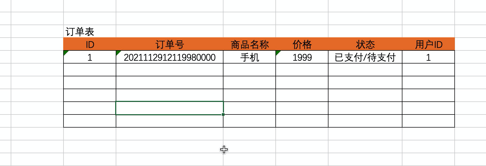

# day19 Django开发

知识点的回顾：

- 安装Django

  ```
  pip install django
  ```

- 创建Django项目

  ```
  >>> django-admin startproject mysite
  ```

  注意：Pycharm可以创建。如果用Pycharm创建，记得settings.py中的DIR templates 删除。

- 创建app & 注册

  ```
  >>>python manage.py startapp app01
  >>>python manage.py startapp app02
  >>>python manage.py startapp app03
  ```

  ```
  INSTALLED_APPS = [
      ...
      'app01.apps.App01Config'
  ]
  ```

  注意：否则app下的models.py写类时，无法在数据库中创建表。

- 配置 静态文件路径 & 模板的路径（放在app目录下）。

- 配置数据库相关操作（MySQL）

  - 第三方模块（django3版本）

    ```
    pip install mysqlclient
    ```

  - 自己先去MySQL创建一个数据库。

  - 配置数据库连接settings.py

    ```python
    DATABASES = {
        'default': {
            'ENGINE': 'django.db.backends.mysql',
            'NAME': 'gx_day16',  # 数据库名字
            'USER': 'root',
            'PASSWORD': 'root123',
            'HOST': '127.0.0.1',  # 那台机器安装了MySQL
            'PORT': 3306,
        }
    }
    ```

  - 在app下的models.py中编写

    ```python
    from django.db import models
    
    
    class Admin(models.Model):
        """ 管理员 """
        username = models.CharField(verbose_name="用户名", max_length=32)
        password = models.CharField(verbose_name="密码", max_length=64)
    
        def __str__(self):
            return self.username
    
        
    class Department(models.Model):
        """ 部门表 """
        title = models.CharField(verbose_name='标题', max_length=32)
    
        def __str__(self):
            return self.title
    ```

  - 执行两个命令：

    ```python
    >>>python manange.py makemigrations
    >>>python manange.py migrate
    ```

- 在 urls.py ，路由 （ URL 和 函数的对应关系）。

- 在views.py，视图函数，编写业务逻辑。

- templates目录，编写HTML模板（含有模板语法、继承、``）

- ModelForm & Form组件，在我们开发增删改查功能。
  - 生成HTML标签（生成默认值）
  - 请求数据进行校验。
  - 保存到数据库（ModelForm）
  - 获取错误信息。

- Cookie和Session，用户登录信息保存起来。

- 中间件，基于中间件实现用户认证 ，基于：`process_request`。

- ORM操作

  ```
  models.User.objects.filter(id="xxx")
  models.User.objects.filter(id="xxx").order_by("-id")
  ```

- 分页组件。


## 1.Ajax请求


## 2.订单



```python
class Order(models.Model):
    """ 订单 """
    oid = models.CharField(verbose_name="订单号", max_length=64)
    title = models.CharField(verbose_name="名称", max_length=32)
    price = models.IntegerField(verbose_name="价格")

    status_choices = (
        (1, "待支付"),
        (2, "已支付"),
    )
    status = models.SmallIntegerField(verbose_name="状态", choices=status_choices, default=1)
    admin = models.ForeignKey(verbose_name="管理员", to="Admin", on_delete=models.CASCADE)
```


想要去数据库中获取数据时：对象/字典

```python
# 对象，当前行的所有数据。
row_object = models.Order.objects.filter(id=uid).first()
row_object.id
row_object.title
```

```python
# 字典，{"id":1,"title":"xx"}
row_dict = models.Order.objects.filter(id=uid).values("id","title").first()
```


```python
# queryset = [obj,obj,obj,]
queryset = models.Order.objects.all()
```

```python
# queryset = [ {'id':1,'title':"xx"},{'id':2,'title':"xx"}, ]
queryset = models.Order.objects.all().values("id","title")
```

```python
# queryset = [ (1,"xx"),(2,"xxx"), ]
queryset = models.Order.objects.all().values_list("id","title")
```


## 小结

至此，基于Ajax + 对话框的形式实现的页面的增删改查。

- 表单，实现增删改查。
- Ajax，实现增删改查。


## 3.图表

- highchart，国外。
- echarts，国内。


更多参考文档：https://echarts.apache.org/handbook/zh/get-started


