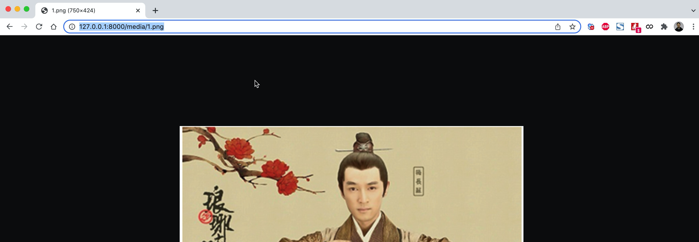

# day20 Django开发

关于考试：

- 期中考试 50道题

- 期末考试 100道题

  ```
  以前：下午2:00（助教老师细说）
  ```

  

## 1.知识点复习


### 1.1 基础入门

- 编码

  ```
  编码基础知识点：utf-8、unicode、gbk、ascii
  默认解释器编码：
  	- Python2：ascii（ # -*- coding:utf-8 -*- )
  	- Python3：utf-8（重要）
  ```

- 输入和输出

  ```
  print
  input，用户输入的永远是字符串类型。
  
  data = input("请输入序号：") # 1
  print(data) # "1"
  ```

- 变量

  ```python
  规范：字母、数字、下划线；数字不能开头；不能是py内置关键字。
  建议：
  	- 见名知意
      - 多个单词，用下划线连接。
      - 全局变量用大写（ DATA_LIST、USER_INFO  ）；局部变量小写（user_age）。
      
  注意：
  	全局变量    GET_INFO
      局部变量    get_info
  	函数名      get_info
      类名        GetInfo
      文件名      get_info
      包名称      get_info
  ```

- 异常处理【补充】

  ```python
  data = input("请输入：")  # 你好
  res = int(data)
  print(res)
  
  # 这个代码是有风险，可能会报错。
  ```

  ```python
  print("开始")
  try:
      data = input("请输入：")  # 123  / 你好
      res = int(data)
      print(res)
  except Exception as e:
      print("出错了")
  
  print("结束")
  ```

- 循环中for/while内部都可以用 break、continue

- 字符串格式化

  ```
  data = "我是{}，姓名是{}，年龄是{}".format("xx",123,999)
  
  data = "我是{0}，姓名是{1}，年龄是{2}".format("xx",123,999)
  
  data = "我是{0}，姓名是{0}，年龄是{2}".format("xx",123)
  ```

- 运算符

  ```
  - 传统的运算符
  - 逻辑运算符
  	- 常见操作，最终的到的结果：True/False
  		if 1>10 and 9<8:
  			pass
  		else:
  			pass
  	- 非传统，最终的结果是：第一个或第二个值。
  		data = 值1 and 值2
  		v1 = 5 and 9  # 9
  		v2 = 0 and 10 # 0
  ```


### 1.2 数据类型

- 字符串类型

  ```
  - 不可变类型；
  - 常见方法：strip/split/replace/join
  	v1 = "root"
  	data = v1.upper()
  	print(v1)   # root
  	print(data) # ROOT
  	
  - 公共：索引、切片、循环
  	v1 = "root"
  	v1[1] = "X"  # 报错，不可变
  ```

- 列表类型

  ```
  - 可变类型
  - 常见方法：append/insert/pop/remove
  - 公共：索引、切片、循环
  	v1 = [11,22,33,44,55]
  	
  	v1[0]
  	v1[1:3]      - 前取后不取
  	v1[1:-1]
  - 列表的推导式
  	data = [ i for i in range(10)]
  	data = [ i for i in range(10) if i<5]
  ```

- 字典类型

  ```
  - 可变类型
  - 字典的键是有要求：可哈希类型，目前不可哈希：list/dict/set。
  - 扩展：python3.6+字典有序。
  - 常见的功能：keys、values、items、get
  	data = {}
  	v1 = data.get("k1")
  ```

- 关于元组

  ```
  v1 = (11,)
  v2 = (11)   # 11
  v3 = 11
  ```

- 其他数据类型

  ```
  其他类型转布尔类型时，哪些为False： 空、0、None
  其他类型转自己类型时，自己的类名()
  	int("123")
  ```

  

### 1.3 函数

- 定义

  ```python
  def func():
      pass
  
  func()
  ```

- 参数

  ```python
  def func(v1,v2):
      pass
  
  def func(v1, v2=None):
      pass
  
  def func(*args,**kwargs):
      pass
  ```

- 返回值

  ```python
  - 没有返回值，默认返回None
      def func(v1,v2):
          print(999)
  - 一个返回值
      def func(v1,v2):
          return 123
      
      res = func(1,2)
      print(res) # 123
      
  - 多个返回值
      def func(v1,v2):
          return 123,999,123
      
      res = func(1,2)
      print(res) # (123,999,123)
      
      
  	def func(v1,v2):
          return 123,999,123
      
      d1,d2,c3 = func(1,2)
  ```

  ```python
  v1,v2 = [11,22]
  v1,v2,v3 = (11,22,999)
  ```

- lambda表达式（匿名函数）

  ```python
  def func(arg):
      return arg + 100
  
  func = lambda arg:arg+100
  v1 = func(100)
  print(v1) # 200
  ```

- 内置函数

  ```
  max/min/all/any/help/hex/oct/bin..
  
  open，文件操作。
      f = open("xx.log",mode='r')
      data = f.read()
      f.close()
  ```

- 文件操作

  ```
  - 模式：r/w/a ； rb/wb/ab
  - 打开 & 关闭
  	with open("xx.log",mode='r') as f:
  		f.read()
  ```


### 1.4 模块

- 分类

  ```
  - 自定义模块：自己写文件/文件夹
  - 内置模块：time/datetime/json/hashlib/random/re等
  - 第三方模块：openpyxl/requests/bs4/flask/django等
  ```

- 自定义模块

  ```
  - sys.path，Python内部导入模块时，根据目录去寻找。
  - 一定不要让自己写的模块名和内置的模块名重复（***）
  - 导入模块：
  	import xxx
  	from xxx import xxx
  ```

- 内置模块

  ```
  - 时间部分：time/datetime/字符串类型。
  - random：随机生成数字。
  - hashlib：加密（md5加密、md5加密+加盐） 防止被撞库。
  - json：
  	- JSON格式的字符串： 内部字符串双引号、内部[] 
  	- json.dumps
  	- json.loads
  - re和正则
  	- 正则：\d \w ; 贪婪匹配。
  	- re.search/re.match/      re.findall
  ```

- 第三方模块

  ```
  - 安装第三方模块：pip、源码、wheel
  - 常见第三方模块：
  	- requests
  	- bs4
  	- openpyxl
  	- python-docx
  	- flask/django （flask简洁（轻量级）；django功能强大）
  ```

### 1.5 面向对象

```
- 面向对象的三大特性：封装、继承、多态。
- 理解，读懂源码和代码。
```


### 1.6 MySQL数据库

```
- 数据库
- 表
- 数据行
更多知识：https://www.bilibili.com/video/BV15R4y1b7y9
```

```
show databases;
use 数据库;

show tables;
desc 表名;

select * from 表;
insert into 表(列,列,列)values(...)
update  表 set 列=值;
delete from 表 where 条件;
```

Python连接并操作MySQL：

- pymysql     【自己原生写】

  ```
  pip install pymysql
  ```

- mysqlclient  【django内部】

  ```
  pip install mysqlclient
  ```

- MySQLdb （默认不支持python3）

  ```
  pip intall MySQLdb
  ```

  

当使用Python代码去操作MySQL时，一定要防止SQL注入的问题。

```python
# SQL语句不要用字符串格式化去拼接。

import pymysql
# 1.连接MySQL
conn = pymysql.connect(host="127.0.0.1", port=3306, user='root', passwd="root123", charset='utf8', db='unicom')
cursor = conn.cursor(cursor=pymysql.cursors.DictCursor)

# 【错误】不要这么写
sql = "select * from admin where id > %s".format(2)
cursor.execute(sql)
# 【正确】这么写
cursor.execute("select * from admin where id > %s", [2, ])

# 获取符合条件的第一条数据，字典    None
res = cursor.fetchone()
print(res)  # {'id': 3, 'username': '集宁', 'password': 'qwe123', 'mobile': '1999999999'}

# 3.关闭连接
cursor.close()
conn.close()
```


### 1.7 前端开发

- HTML

  ```
  - 块级和行内标签（div、span）
  	块级：div/h系列
  	行内：span/a （设置高度、宽度、边距无效）
  - Form表单
  	<form method="post" action="地址"> 
  		<input ....
  		
  		<input type='submit' ... />
  	</form>
  	
  - 关于a标签
  	<a href="www.baidu.com">百度</a>   超链接去跳转。
  	做锚点
          <a href="#m1">第一章</a>
          <a href="#m2">第二章</a>
          <div id="m1" style="height: 1000px;">第一章 谢新雪</div>
          <div id="m2" style="height: 1000px;">第二章 单独的</div>
  ```

- CSS

  ```
  - 位置
  	- 标签 <div style="xxx">
  	- style代码块
  		<style>
  			div { }
  			#v1 { }
  			.v2 {}
  		</style>
  	- 文件中
  	
  - 选择器
  	div { }
  	#v1 { }
  	.v2 { }
  	div[xx='11'] { }
  	
  - 样式
  	color;fonts-ize; background-color; padding; margin;
  	float:left; ,脱离文档流。 clear:both; :after
  ```

- JavaScript & jQuery

  ```
  - 本质上：找到标签；操作标签。
  
  - 找标签
  	$("#x1")
  	$(".x1")
  	$("div")
  	
  	$("input[type='text']")   找到 input 标签且 type='text'
  - 操作标签
  	$("#x1").text()            <div id='x1'>dd</div>
  	$("#x1").text("xxx")       <div id='x1'>xxx</div>
  	
  	$("#x1").val()             <input id='x1' />
  	$("#x1").val("xxx")        <input id='x1' />
  	
  	$("#x1").attr("uu")           <div id='x1' uu="123">dd</div>
  	$("#x1").attr("uu","999")     <div id='x1' uu="999">dd</div>
  	
  	$("#x1").empty()          <div id='x1'>dd</div>  - 清空内容
  	$("#x1").remove()         <div id='x1'>dd</div>  - 整个标签删除
  ```

- BootStrap

  ```
  - 支持响应式布局，根据屏幕的宽度调整布局。
  - 栅格，12份。
  - 常见的样式：
  	- container  / container-fluid
  	- 面板
  	- 按钮
  	- 表单
  	- 表格
  	- 对话框
  ```

- 第三方插件

  ```
  - 插件一般都包含：CSS、JavaScript，开发使用时候
  	- 引入css、js（依赖jQuery）
  	- 使用
  ```

- 关于注释

  ```
  - Python语言
  	# 注释
      """ 注释 """
  - HTML
  	<!-- -->
      
  - CSS注释
  	/* 注释 */
      
  - JavaScript
  	// 注释
      /* 注释 */
  ```

  

### 1.8 Django

- 安装

  ```
  pip install django
  ```

  ```
  python安装目录下：
  	- lib/site-packages/django源码包
  	- Scripts/django-admin.exe  文件
  ```

- 创建Django项目

  ```
  >>>django-admin  startproject  项目名
  ```

- 创建APP

  ```
  >>>cd 项目目录
  >>>python manange.py startapp app名称
  ```

- 注册app

  ```
  - 不注册，models.py生成数据库表行为不执行。
  - 不注册，模板文件、静态文件，不回去app目录下找。
  ```

- static目录，静态文件目录

- templates目录，模板文件目录（HTML）

- 表结构设计 app01/modes.py下执行

  ```python
  from django.db import models
  
  class UserInfo(models.Model):
      v1 = models.CharField(max_length=32)
      ...
      ..
  ```

  ```
  >>>python manage.py makemigrations
  >>>python manage.py migrate
  ```

- urls.py 中编写路由。

  ```python
  from django.urls import path,re_path
  from app01 import admin
  
  
  urlpatterns = [
      path('admin/list/', admin.admin_list),
      path('admin/<int:nid>/delete/', admin.admin_delete),
      re_path('admin/(?P<nid>\d+)/delete/', admin.admin_delete)
  ]
  ```

- 视图函数

  ```python
  def admin_list(request):
      k1 = request.POST.get("k1")
      
      ... 业务处理
      
      return 数据
  
  - 默认参数request，包含请求相关的所有数据。
  	request.method
      request.GET
      request.POST
      request.FILES，上传文件。
      request.path_info，获取当前请求的URL
      	http://127.0.0.1:8000/depart/add/  ->    /depart/add/
                  
  - 返回值
  	return HttpResponse("字符串")
  	return JSONResponse( {"status":123,"data":[456,55,66,22,]} )
  		return JSONResponse( [11,22,33,44] ,safe=False)
  	return render(request,"xxx.html",{值})
  	return redirect("http://127.0.0.1:8000/depart/add/")
  			return redirect("/depart/add/")
  ```

- 数据库的ORM操作

  ```python
  # 增加
  models.类.objects.create(name="武沛齐",age=19)
  models.类.objects.create(**{"name":"武沛齐","age":19})
  
  obj = models.类(name="武沛齐",age=19)
  obj.save()
  
  obj_list = [
      models.类(name="武沛齐",age=19),
      models.类(name="武沛齐",age=19),
      models.类(name="武沛齐",age=19),
      models.类(name="武沛齐",age=19),
      models.类(name="武沛齐",age=19)
      。。。
  ]
  models.类.objects.bulk_create(obj_list,batch_size=10)
  ```

  ```python
  # 查询
  queyrset = models.类.objects.filter(name="武沛齐",age=19)         # [obj,obj,]
  queyrset = models.类.objects.filter(**{"name":"武沛齐","age":19}) # []
  obj = models.类.objects.filter(name="武沛齐",age=19).first()      # obj / None
  
  queyrset = models.类.objects.filter(age=19)
  queyrset = models.类.objects.filter(age__gt=19)
  queyrset = models.类.objects.filter(age__gte=19)
  queyrset = models.类.objects.filter(age__lt=19)
  queyrset = models.类.objects.filter(age__lte=19)
  queyrset = models.类.objects.filter(age__gt=19, name="武沛齐")
  queyrset = models.类.objects.filter(name__contains="中国")
  queyrset = models.类.objects.exclude(id=9)  # id !=9
  
  queyrset = models.类.objects.filter(age=19).order_by("id")
  queyrset = models.类.objects.filter(age=19).order_by("-id")
  queyrset = models.类.objects.filter(age=19).order_by("-id","name")
  
  queyrset = models.类.objects.filter(age=19)[0:10]
  ```

  ```python
  # 更新
  queyrset = models.类.objects.filter(id=2).update(age=19,name="武沛齐")
  queyrset = models.类.objects.filter(id=2).update(**{"name":"武沛齐","age":19})
  
  
  obj = models.类.objects.filter(id=2).first()
  obj.name = "武沛齐"
  obj.age = 19
  obj.save()
  ```

  ```python
  # 删除
  models.类.objects.filter(id=2).delete()
  ```

  ```
  整理的所有ORM操作：
  	https://www.cnblogs.com/wupeiqi/articles/6216618.html
  ```

- Form和ModelForm组件

  ```
  - 自动生成HTML标签
  - 对用户请求的数据进行校验
  	- 自动保存到数据库（ModelForm）
  - 错误信息
  ```

  ```python
  from django import forms
  
  class UserForm(forms.Form):
      xx = forms.CharField(...)
      
      
  class UserModelForm(forms.ModelForm):
      class Meta:
          model = models.类
          fields = "__all__"    
  ```

  ```python
  form = UserModelForm(data=request.POST,instance=对象)
  if form.is_valid():
      form.cleaned_data
  else:
      form.errors
  ```

- 关于POST提交CSRF认证

  ```html
  <form method='post'>
      
      ...
  </form>
  ```

  如果想要免除csrf认证。

  ```python
  from django.views.decorators.csrf import csrf_exempt
  
  @csrf_exempt
  def order_add(request):
      pass
  ```

- Cookie和Session

  ```
  cookie，本质上保存在浏览器端的键值对。 
  session，保存服务器端（django是将session默认存储在数据库中）
  
  def order_add(request):
      request.session['xx'] = 123
      
  def logout(request):
  	request.session.clear()
  ```

- 中间件

  ```
  - 类 process_request / process_response
  - 注册中间件类
      MIDDLEWARE = [
          'django.middleware.security.SecurityMiddleware',
          'django.contrib.sessions.middleware.SessionMiddleware',
          'django.middleware.common.CommonMiddleware',
          'django.middleware.csrf.CsrfViewMiddleware',
          'django.contrib.auth.middleware.AuthenticationMiddleware',
          'django.contrib.messages.middleware.MessageMiddleware',
          'django.middleware.clickjacking.XFrameOptionsMiddleware',
          'app01.middleware.auth.AuthMiddleware',
      ]
  - django请求到达之后，自动会执行相应的方法。
  
  - process_request
  	- 没有返回值或返回None，继续向后执行。
  	- 返回redirect/render/HttpResponse/JsonReponse，拦截请求不再继续向后之后。
  ```

- 图片验证码

  ```
  pip install pillow
  ```

  ```
  - 创建图片并在图片上写文字
  - 字体文件
  - 自定义模块 check_code
  ```

- 分页组件

  ```
  开发时候会用。
  ```

  

## 2.关于文件上传


### 2.1 基本操作

```html
<form method="post" enctype="multipart/form-data">
    
    <input type="text" name="username">
    <input type="file" name="avatar">
    <input type="submit" value="提交">
</form>
```

```python
from django.shortcuts import render, HttpResponse


def upload_list(request):
    if request.method == "GET":
        return render(request, 'upload_list.html')

    # # 'username': ['big666']
    # print(request.POST)  # 请求体中数据
    # # {'avatar': [<InMemoryUploadedFile: 图片 1.png (image/png)>]}>
    # print(request.FILES)  # 请求发过来的文件 {}

    file_object = request.FILES.get("avatar")
    # print(file_object.name)  # 文件名：WX20211117-222041@2x.png

    f = open(file_object.name, mode='wb')
    for chunk in file_object.chunks():
        f.write(chunk)
    f.close()
    return HttpResponse("...")
```


### 案例：批量上传数据

```html
<form method="post" enctype="multipart/form-data" action="/depart/multi/">
    
    <div class="form-group">
        <input type="file" name="exc">
    </div>
    <input type="submit" value="上传" class="btn btn-info btn-sm">
</form>
```

```python
def depart_multi(request):
    """ 批量删除（Excel文件）"""
    from openpyxl import load_workbook

    # 1.获取用户上传的文件对象
    file_object = request.FILES.get("exc")

    # 2.对象传递给openpyxl，由openpyxl读取文件的内容
    wb = load_workbook(file_object)
    sheet = wb.worksheets[0]

    # 3.循环获取每一行数据
    for row in sheet.iter_rows(min_row=2):
        text = row[0].value
        exists = models.Department.objects.filter(title=text).exists()
        if not exists:
            models.Department.objects.create(title=text)

    return redirect('/depart/list/')
```


### 案例：混合数据（Form）

提交页面时：用户输入数据 + 文件（输入不能为空、报错）。

- Form生成HTML标签：type=file
- 表单的验证
- form.cleaned_data 获取 数据 + 文件对象

```html





    <div class="container">
        <div class="panel panel-default">
            <div class="panel-heading">
                <h3 class="panel-title"> {{ title }} </h3>
            </div>
            <div class="panel-body">
                <form method="post" enctype="multipart/form-data" novalidate >
                    

                    
                        <div class="form-group">
                            <label>{{ field.label }}</label>
                            {{ field }}
                            <span style="color: red;">{{ field.errors.0 }}</span>
                        </div>
                    

                    <button type="submit" class="btn btn-primary">提 交</button>
                </form>
            </div>
        </div>
    </div>



```

```python
from django import forms
from app01.utils.bootstrap import BootStrapForm


class UpForm(BootStrapForm):
    bootstrap_exclude_fields = ['img']

    name = forms.CharField(label="姓名")
    age = forms.IntegerField(label="年龄")
    img = forms.FileField(label="头像")


def upload_form(request):
    title = "Form上传"
    if request.method == "GET":
        form = UpForm()
        return render(request, 'upload_form.html', {"form": form, "title": title})

    form = UpForm(data=request.POST, files=request.FILES)
    if form.is_valid():
        # {'name': '武沛齐', 'age': 123, 'img': <InMemoryUploadedFile: 图片 1.png (image/png)>}
        # 1.读取图片内容，写入到文件夹中并获取文件的路径。
        image_object = form.cleaned_data.get("img")

        # file_path = "app01/static/img/{}".format(image_object.name)
        db_file_path = os.path.join("static", "img", image_object.name)

        file_path = os.path.join("app01", db_file_path)
        f = open(file_path, mode='wb')
        for chunk in image_object.chunks():
            f.write(chunk)
        f.close()

        # 2.将图片文件路径写入到数据库
        models.Boss.objects.create(
            name=form.cleaned_data['name'],
            age=form.cleaned_data['age'],
            img=db_file_path,
        )
        return HttpResponse("...")
    return render(request, 'upload_form.html', {"form": form, "title": title})

```


注意：就目前而言，所有的静态文件都只能放在static目录。


在django的开发过程中两个特殊的文件夹：

- static，存放静态文件的路径，包括：CSS、JS、项目图片。
- media，用户上传的数据的目录。

### 2.2 启用media

在urls.py中进行配置：

```
from django.urls import path, re_path
from django.views.static import serve
from django.conf import settings

urlpatterns = [
	re_path(r'^media/(?P<path>.*)$', serve, {'document_root': settings.MEDIA_ROOT}, name='media'),
]
```

在settings.py中进行配置：

```
import os

MEDIA_ROOT = os.path.join(BASE_DIR, "media")
MEDIA_URL = "/media/"
```


在浏览器上访问这个地址：




### 案例：混合数据（form）

```python
from django import forms
from app01.utils.bootstrap import BootStrapForm


class UpForm(BootStrapForm):
    bootstrap_exclude_fields = ['img']

    name = forms.CharField(label="姓名")
    age = forms.IntegerField(label="年龄")
    img = forms.FileField(label="头像")


def upload_form(request):
    title = "Form上传"
    if request.method == "GET":
        form = UpForm()
        return render(request, 'upload_form.html', {"form": form, "title": title})

    form = UpForm(data=request.POST, files=request.FILES)
    if form.is_valid():
        # {'name': '武沛齐', 'age': 123, 'img': <InMemoryUploadedFile: 图片 1.png (image/png)>}
        # 1.读取图片内容，写入到文件夹中并获取文件的路径。
        image_object = form.cleaned_data.get("img")

        # media_path = os.path.join(settings.MEDIA_ROOT, image_object.name)
        media_path = os.path.join("media", image_object.name)
        f = open(media_path, mode='wb')
        for chunk in image_object.chunks():
            f.write(chunk)
        f.close()

        # 2.将图片文件路径写入到数据库
        models.Boss.objects.create(
            name=form.cleaned_data['name'],
            age=form.cleaned_data['age'],
            img=media_path,
        )
        return HttpResponse("...")
    return render(request, 'upload_form.html', {"form": form, "title": title})
```


### 案例：混合数据（ModalForm)

#### models.py

```python
class City(models.Model):
    """ 城市 """
    name = models.CharField(verbose_name="名称", max_length=32)
    count = models.IntegerField(verbose_name="人口")

    # 本质上数据库也是CharField，自动保存数据。
    img = models.FileField(verbose_name="Logo", max_length=128, upload_to='city/')
```


#### 定义ModelForm

```python
from app01.utils.bootstrap import BootStrapModelForm


class UpModelForm(BootStrapModelForm):
    bootstrap_exclude_fields = ['img']

    class Meta:
        model = models.City
        fields = "__all__"
```


#### 视图

```python
def upload_modal_form(request):
    """ 上传文件和数据（modelForm）"""
    title = "ModelForm上传文件"
    if request.method == "GET":
        form = UpModelForm()
        return render(request, 'upload_form.html', {"form": form, 'title': title})

    form = UpModelForm(data=request.POST, files=request.FILES)
    if form.is_valid():
        # 对于文件：自动保存；
        # 字段 + 上传路径写入到数据库
        form.save()
        
        return HttpResponse("成功")
    return render(request, 'upload_form.html', {"form": form, 'title': title})
```


### 小结

- 自己手动去写

  ```python
  file_object = request.FILES.get("exc")
  ...
  ```

- Form组件（表单验证）

  ```python
  request.POST
  file_object = request.FILES.get("exc")
  
  具体文件操作还是手动自己做。
  ```

- ModelForm（表单验证 + 自动保存数据库 + 自动保存文件）

  ```
  - Media文件夹
  - Models.py定义类文件要
  	img = models.FileField(verbose_name="Logo", max_length=128, upload_to='city/')
  ```

  


## 总结

关于django的开发知识点，更多的案例：

- Python基础（课件 https://gitee.com/wupeiqi/python_course）

  ```
  https://www.bilibili.com/video/BV1m54y1r7zE
  ```

- 并发编程（进程线程协程）

  ```
  https://www.bilibili.com/video/BV1Ev411G7i3?spm_id_from=333.999.0.0
  
  # 不建议小白学（协程）
  https://www.bilibili.com/video/BV1NA411g7yf?spm_id_from=333.999.0.0
  ```

- MySQL数据库

  ```python
  # 2021最新推荐
  https://www.bilibili.com/video/BV15R4y1b7y9?spm_id_from=333.999.0.0
      
  # 2017年
  https://www.bilibili.com/video/BV1DE411n7fU?
  ```

- 前端开发

  ```python
  https://www.bilibili.com/video/BV1QE411j7bV?spm_id_from=333.999.0.0
  ```

- django开发知识点

  ```
  https://www.bilibili.com/video/BV1zE411x7LG
  https://www.bilibili.com/video/BV1JE411V7xk
  ```

- 项目开发

  ```
  任务管理平台：https://www.bilibili.com/video/BV1uA411b77M
  ```

- 进阶项目（增删改查、权限）

  ```python
  https://space.bilibili.com/283478842/channel/detail?cid=91596&ctype=0
  ```

- 前后端分离的项目： django + drf框架 + vue.js 

  ```
  - Django
  - drf框架
  	- https://www.bilibili.com/video/BV1ZE411j7RK
  ```

- git 版本控制和协同开发 + 任务管理平台

  ```
  https://www.bilibili.com/video/BV19E411f76x?spm_id_from=333.999.0.0
  ```

- 微信小程序 + Django + drf框架编写

  ```python
  https://www.bilibili.com/video/BV1jC4y1s7QD?spm_id_from=333.999.0.0
  ```


