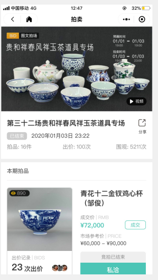
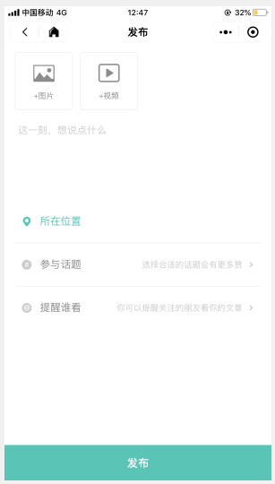

# day02 微信小程序

## 内容回顾

- 搭建环境
- 全局配置
  - pages
  - window
  - tabbar
- 页面
  - json
  - js
  - wxml
  - wxss

- flex布局
  - display: flex
  - flex-direction: row/column
  - justify-content:...
  - align-item:...
- 小程序开发
  - 组件（标签）
    - text
    - view
    - image
  - 样式
    - rpx

## 今日概要

- 指令
- api
- 页面


## 今日内容

### 1. 跳转

#### 1.1 对标签绑定点击事件

```
<view bindtap="clickMe" data-nid="123" data-name="SD" >点我跳转</view>
```

```
Page({
  ...
  /**
   *  点击绑定的事件
  */
  clickMe:function(e){
    var nid = e.currentTarget.dataset.nid;
    console.log(nid);
  }
})
```

#### 1.2 页面跳转

```
wx.navigateTo({
	url: '/pages/redirect/redirect?id='+nid
})
```

跳转到的页面如果想要接受参数，可以在onLoad方法中接受。

redirect.js

```
Page({
/**
   * 生命周期函数--监听页面加载
   */
  onLoad: function (options) {
    console.log(options);
  }
})
```


#### 1.3 通过标签跳转

```
<navigator url="/pages/redirect/redirect?id=666">跳转到新页面</navigator>
```


### 2.数据绑定

```
<html>
	...
	
	<div id="content"></div>
	
	<script>
		var name = "李业迟到";
		$('#content').val(name);
	</script>
	
</html>
```

- vue.js 

  ```
  <html>
  	<div id="app">
          <div>{{message}}</div>
      </div>
  
      <script>
          new Vue({
            el: '#app',
            data: {
              message: '老男孩教育Python'
            }
          })
      </script>
  	
  </html>
  ```


#### 2.1 基本显示

- wxml

  ```
  <view>数据1：{{message}}</view>
  ```

- 展示数据

  ```
  // pages/bind/bind.js
  Page({
  
    /**
     * 页面的初始数据
     */
    data: {
      message:"沙雕李业",
    }
  )}
  ```

#### 2.2 数据更新

- wxml

  ```
  <view>数据2：{{message}}</view>
  
  <button bindtap="changeData">点击修改数据</button>
  ```

- 修改数据

  ```
  Page({
    data: {
      message:"沙雕李业",
    },
    changeData:function(){
      // 修改数据
      this.setData({ message: "大沙雕李业"});
    }
  })
  ```

### 3.获取用户信息

#### 方式一

- wxml

  ```
  <view bindtap="getUserName">获取当前用户名</view>
  ```

- js

  ```js
    getUserName:function(){
    	// 调用微信提供的接口获取用户信息
      wx.getUserInfo({
        success: function (res) {
          // 调用成功后触发
          console.log('success',res)
        },
        fail:function(res){
          // 调用失败后触发
          console.log('fail', res)
        }
      })
    },
  ```

#### 方式二

- wxml

  ```
  <button open-type="getUserInfo" bindgetuserinfo="xxxx">授权登录</button>
  ```

- js

  ```
   xxxx:function(){
      wx.getUserInfo({
        success: function (res) {
          // 调用成功后触发
          console.log('success', res)
        },
        fail: function (res) {
          // 调用失败后触发
          console.log('fail', res)
        }
      })
    }
  ```

#### 示例

- wxml

  ```
  <!--pages/login/login.wxml-->
  <view>当前用户名：{{name}}</view>
  <view>
  当前头像：<image src="{{path}}" style="height:200rpx;width:200rpx;"></image>
    </view>
  <button open-type="getUserInfo" bindgetuserinfo="fetchInfo">获取信息button</button>
  
  ```

- js

  ```
  // pages/login/login.js
  Page({
  
    /**
     * 页面的初始数据
     */
    data: {
        name:"",
        path: "/static/default.png"
    },
    fetchInfo:function(){
      var that = this;
      wx.getUserInfo({
        success:function(res){
          console.log(res);
          that.setData({
            name:res.userInfo.nickName,
            path:res.userInfo.avatarUrl
          })
        }
      })
    },
    /**
     * 生命周期函数--监听页面加载
     */
    onLoad: function (options) {
  
    },
  
    /**
     * 生命周期函数--监听页面初次渲染完成
     */
    onReady: function () {
  
    },
  
    /**
     * 生命周期函数--监听页面显示
     */
    onShow: function () {
  
    },
  
    /**
     * 生命周期函数--监听页面隐藏
     */
    onHide: function () {
  
    },
  
    /**
     * 生命周期函数--监听页面卸载
     */
    onUnload: function () {
  
    },
  
    /**
     * 页面相关事件处理函数--监听用户下拉动作
     */
    onPullDownRefresh: function () {
  
    },
  
    /**
     * 页面上拉触底事件的处理函数
     */
    onReachBottom: function () {
  
    },
  
    /**
     * 用户点击右上角分享
     */
    onShareAppMessage: function () {
  
    }
  })
  ```

  注意事项：

  - 想要获取用户信息，必须经过用户授权（button）。 

  - 已授权

  - 不授权，通过调用wx.openSetting

    ```
    // 打开配置，手动授权。
    // wx.openSetting({})
    ```

    

### 4.获取用户位置信息

- wxml

  ```
  <view bindtap="getLocalPath">{{localPath}}</view>
  ```

- js

  ```
    data: {
        localPath:"请选择位置",
    },
    getLocalPath:function(){
      var that = this;
      wx.chooseLocation({
        success: function(res) {
          that.setData({localPath:res.address});
        },
      })
    },
  ```

  

### 5. for指令

- wxml

  ```
  <!--pages/goods/goods.wxml-->
  <text>商品列表</text>
  <view>
    <view wx:for="{{dataList}}" >{{index}} -  {{item}}</view>
    <view wx:for="{{dataList}}" wx:for-index="idx" wx:for-item="x">{{idx}} -  {{x}}</view>
  </view>
  <view>
    {{userInfo.name}}
    {{userInfo.age}}
  </view>
  <view>
    <view wx:for="{{userInfo}}">{{index}} - {{item}}</view>
  </view>
  
  ```

- js

  ```
    data: {
      dataList:["白浩为","海狗","常鑫"],
      userInfo:{
        name:"alex",
        age:18
      }
    },
  ```

### 6.获取图片

- wxml

  ```
  <!--pages/publish/publish.wxml-->
  <view bindtap="uploadImage">请上传图片</view>
  <view class="container">
    <image wx:for="{{imageList}}" src="{{item}}"></image>
  </view>
  
  ```

- js

  ```
    data: {
      imageList: ["/static/hg.jpg", "/static/hg.jpg"]
    },
  
    uploadImage:function(){
      var that = this;
  
      wx.chooseImage({
        count:9,
        sizeType: ['original', 'compressed'],
        sourceType: ['album', 'camera'],
        success:function(res){
          // 设置imageList，页面上图片自动修改。
          // that.setData({
          //   imageList: res.tempFilePaths
          // });
  
          // 默认图片 + 选择的图片； 
          that.setData({
            imageList: that.data.imageList.concat(res.tempFilePaths)
          });
        }
      });
    },
  ```

注意：图片目前只是上传到了内存。


## 总结

- 标签（组件）

  - text
  - view
  - image
  - navigator，跳转到其他页面（默认只能跳转到非tabbar页面）
  - button，按钮（特殊：建议获取用户信息时）

- 事件

  - bindtap

    ```
    <view bindtap="func"></view>
    
    <view bindtap="func" data-xx="123"></view>
    ```

    ```
    func:function(e){
    	e.currentTarget.dataset
    }
    ```

- api

  - navigateTo

    ```
    wx.navigateTo({
    	url: '/pages/redirect/redirect?id='+nid,
    })
    ```

  - openSetting

    ```
    wx.openSetting({})
    ```

  - getUserInfo

    ```
     wx.getUserInfo({
          success:function(res){
            console.log(res);
          }
        })
    
    注意：结合button按钮实现
    ```

  - chooseLocation

    ```
    wx.chooseLocation({
          success: function(res) {
            
          },
        })
    ```

  - chooseImage

    ```
    wx.chooseImage({
          count:9,
          sizeType: ['original', 'compressed'],
          sourceType: ['album', 'camera'],
          success:function(res){
            
          }
        });
    ```

- 数据绑定
- for指令
  注意：setData + that


## 作业

1. 拍卖详细页面
   

2. 发布消息的页面

   ```
   <textarea></textarea>
   ```

   

3. 功能点：
   - 拍卖列表页面通过for循环+后端数据展示信息。
   - 点击拍卖列表中的某项拍卖时，需要将自己的ID传递给 拍卖详细页面。 
   - 上传图片
   - 选择位置


