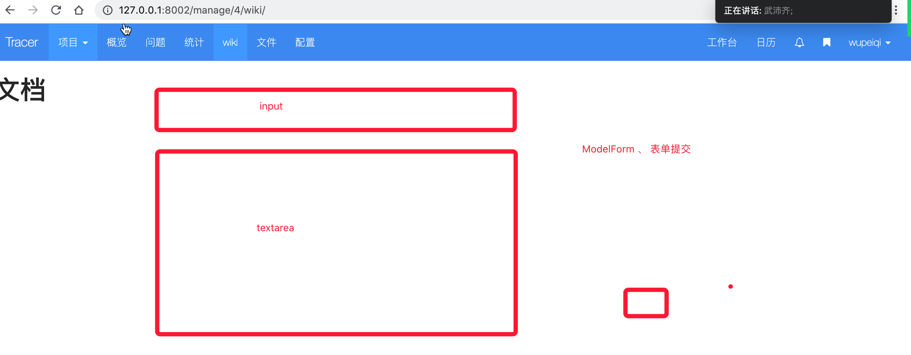

# day07

- 毕云峰
- 任伟博，基本完成。


## 今日概要

- 展示项目
- 星标项目
- 添加项目：颜色选择
- 项目切换 & 项目管理菜单处置
- wiki管理


## 今日详细

### 1.展示项目

#### 1.1 数据


```
1. 从数据库中获取两部分数据
	我创建的所有项目：已星标、未星标
	我参与的所有项目：已星标、未星标
2. 提取已星标
	列表 = 循环 [我创建的所有项目] + [我参与的所有项目] 把已星标的数据提取

得到三个列表：星标、创建、参与
```


#### 1.2 样式

```
    <style>
        .project {
            margin-top: 10px;
        }

        .panel-body {
            padding: 0;
            display: flex;
            flex-direction: row;
            justify-content: left;
            align-items: flex-start;
            flex-wrap: wrap;
        }

        .panel-body > .item {
            border-radius: 6px;
            width: 228px;
            border: 1px solid #dddddd;
            margin: 20px 10px;

        }

        .panel-body > .item:hover {
            border: 1px solid #f0ad4e;
        }

        .panel-body > .item > .title {
            height: 104px;
            color: white;
            display: flex;
            justify-content: center;
            align-items: center;
            border-top-left-radius: 6px;
            border-top-right-radius: 6px;
            font-size: 15px;
            text-decoration: none;
        }

        .panel-body > .item > .info {
            padding: 10px 10px;

            display: flex;
            justify-content: space-between;

            border-bottom-left-radius: 6px;
            border-bottom-right-radius: 6px;
            color: #8c8c8c;

        }

        .panel-body > .item > .info a {
            text-decoration: none;
        }

        .panel-body > .item > .info .fa-star {
            font-size: 18px;
        }

    </style>
```

### 2.星标项目（去除星标）

#### 2.1 星标

```
我创建的项目：Project的star=True
我参与的项目：ProjectUser的star=True
```

#### 2.2 移除星标

```
我创建的项目：Project的 star=False
我参与的项目：ProjectUser的 star=False
```

### 3.选择颜色

#### 3.1 部分样式应用BootStrap

```python
class BootStrapForm(object):

    bootstrap_class_exclude = []

    def __init__(self, *args, **kwargs):
        super().__init__(*args, **kwargs)
        for name, field in self.fields.items():
            if name in self.bootstrap_class_exclude:
                continue
            field.widget.attrs['class'] = 'form-control'
            field.widget.attrs['placeholder'] = '请输入%s' % (field.label,)
```

```python
class ProjectModelForm(BootStrapForm, forms.ModelForm):
    bootstrap_class_exclude = ['color']
    class Meta:
        model = models.Project
        fields = "__all__"
```

#### 3.2 定制ModelForm的插件

```python
class ProjectModelForm(BootStrapForm, forms.ModelForm):

    class Meta:
        model = models.Project
        fields = "__all__"
        
        widgets = {
            'desc': forms.Textarea,
            'color': ColorRadioSelect(attrs={'class': 'color-radio'})
        }
```

```python
from django.forms import RadioSelect


class ColorRadioSelect(RadioSelect):
    template_name = 'widgets/color_radio/radio.html'
    option_template_name = 'widgets/color_radio/radio_option.html'
```

```html

    <div id="{{ id }}" class="{{ widget.attrs.class }}">
        
            
                <label  for="{{ option.attrs.id }}" >
                    
                </label>
            
        
    </div>

```

```html

<span class="cycle" style="background-color:{{ option.label }}"></span>
```

#### 3.3 项目选择颜色

3.1、3.2知识点的应用 + 前端样式的编写 


### 4.切换菜单

```
1. 数据库中获取
	我创建的：
	我参与的：
2. 循环显示
3. 当前页面需要显示 / 其他页面也需要显示 [inclusion_tag]
```

### 5.项目管理


```
/manage/项目ID/dashboard
/manage/项目ID/issues
/manage/项目ID/statistics
/manage/项目ID/file
/manage/项目ID/wiki
/manage/项目ID/setting
```

#### 5.1 进入项目展示菜单

```
- 进入项目
- 展示菜单
```

##### 5.1.1 是否进入项目？【中间件】

判断URL是否是以manage开头

project_id 是我创建 or 我参与的 

##### 5.1.2 显示菜单

依赖：是否已经进入项目？

```
request.tracer.project
            <ul class="nav navbar-nav">
                <li><a href="#">概述</a></li>
                <li><a href="#">wiki</a></li>
                <li><a href="#">皮遏制...</a></li>
            </ul>
```

##### 5.1.3 修复bug

##### 5.1.4 默认选中菜单

## 总结

1. 项目实现思路
2. 星标/取消星标
3. inclusion_tag实现项目切换
4. 项目菜单 
   - 中间件 process_view
   - 默认选中：inclusion_tag
   - 路由分发
     - include("xxx.url")
     - include([ssfdsdf, ,sdf ])
5. 颜色选择：源码 + 扩展【实现】


## 作业

- 添加（颜色）
- 星标/取消星标
- 切换/项目菜单（中间件）
- wiki
  


