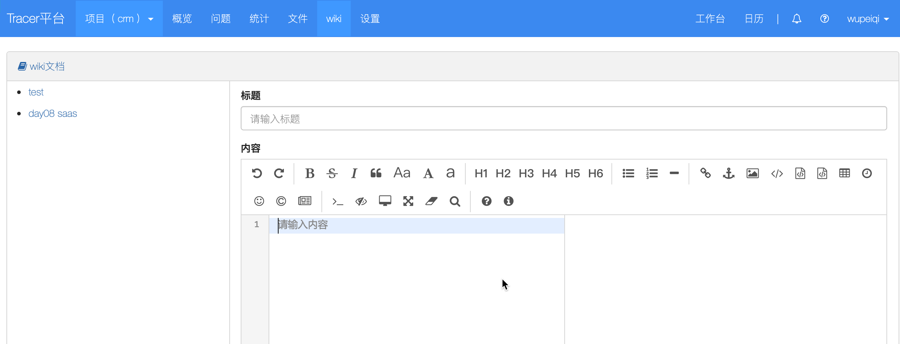

# day08 wiki

- 牛存果：不能说话

- 毕云峰：断网了

- 朱鑫潮：请假会北京

- 高楚凡：请假会北京

- 洪郭靖

- 江栋：项目菜单没实现；

- 邵婉婷：不看视频做不出来

  ```
  1. xxx
  2. xxx
  3. xxx
  ```

  

## 今日概要

- 表结构设计
- 快速开发
- 应用markdown组件
- 腾讯COS做上传

## 今日详细

### 1.表结构的设计




| ID   | 标题   | 内容   | 项目ID | 父ID     | 深度 |
| ---- | ------ | ------ | ------ | -------- | ---- |
| 1    | xx     | 你好呀 | 1      | 深度null | 1    |
| 2    | 张浩   | ffff   | 1      | null     |      |
| 3    | 牛存果 | fsd    | 1      | 1        |      |

```python
class Wiki(models.Model):
    project = models.ForeignKey(verbose_name='项目', to='Project')
    title = models.CharField(verbose_name='标题', max_length=32)
    content = models.TextField(verbose_name='内容')

    # 子关联
    parent = models.ForeignKey(verbose_name='父文章', to="Wiki", null=True, blank=True, related_name='children')
```


### 2.快速开发

#### 2.1 wiki首页展示

- 首页：已完成

- 多级目录

  - 显示多级目录思路：徐乐

    ```
    1级：
    	找到当前项目的所有的文章的name
    	页面循环展示。
    多级：
    	去数据库中获取每一级的数据
    ```

    ```
    模板渲染：
    	- 数据库中获取的数据要有层级的划分
    		queryset = model.Wiki.object.filter(project_id=2)
    		将数据构造
    		[
    			{
    				id:1,
    				title:'王元'
    				children:[
    					{
    						id:xxx,
    						name:'xxx'
    					}
    				]
    			}
    		]
    	- 页面显示，循环显示（不知道有多少层）
    		递归
    		
    缺点：
    	- 写代码费劲
    	- 效率低
    ```

    ```
    后端 + 前端完成ajax+ID选择器
    	- 前端：打开页面之后，发送ajax请求获取所有的文档标题信息。
    	- 后台：获取所有的文章信息
    		queryset = model.Wiki.object.filter(project_id=2).values_list('id','title','parent_id')
    		[
    			{'id':1, title:'王元',parent_id:None},
    			{'id':2, title:'尹立生',parent_id:None},
    			{'id':3, title:'王天然',parent_id:None},
    			{'id':4, title:'杨力',parent_id:3},
    			{'id':5, title:'张浩',parent_id:1},
    		]
    		直接返回给前端的ajax
    	- ajax的回调函数success中获取到 res.data，并循环
    		$.each(res.data,function(index,item){
    			if(item.parent_id){
    				
    			}else{
    				
    			}
    		
    		})
    		
    <ul>
    	<li id="1">王元
    		<ul>
    			<li id='5'>张浩</li>
    		</ul>
    	</li>
    	<li id="2">尹立生</li>
    	<li id="3">王天然
    		<ul>
    			<li id='4'>杨力</li>
    		</ul>
    	</li>
    <ul>
    
    ```


多级目录展示部分存在两个问题：

- 父目录要提前出现：排序 + 字段（深度depth)
- 点击目录查看文章详细


#### 2.2 添加文章

- 我目前已经完成
- BUG：已完成

#### 2.3 预览文章

#### 2.4 修改文章

#### 2.5 删除文章


## 今日作业

- 【必须】实现：多级目录

- 【必须】修改 & 删除

- 【可选】把MDEditor加入项目

  ```
  https://www.mdeditor.com/
  https://github.com/pandao/editor.md
  https://pandao.github.io/editor.md/examples/index.html
  
  提示：处理TextArea变成editor
  ```

- 【可选】上传图片 + 腾讯云的对象存储（看文档）


