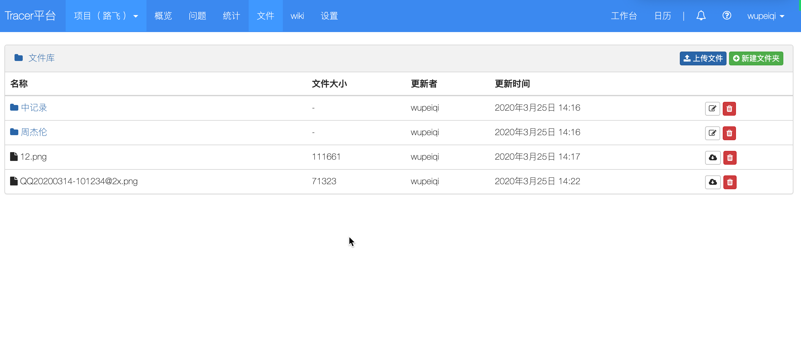
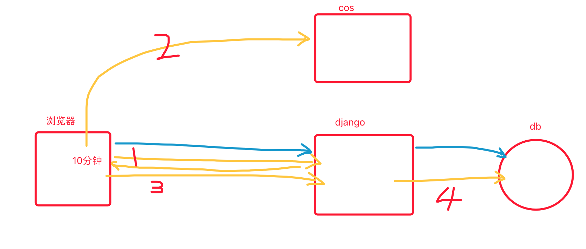
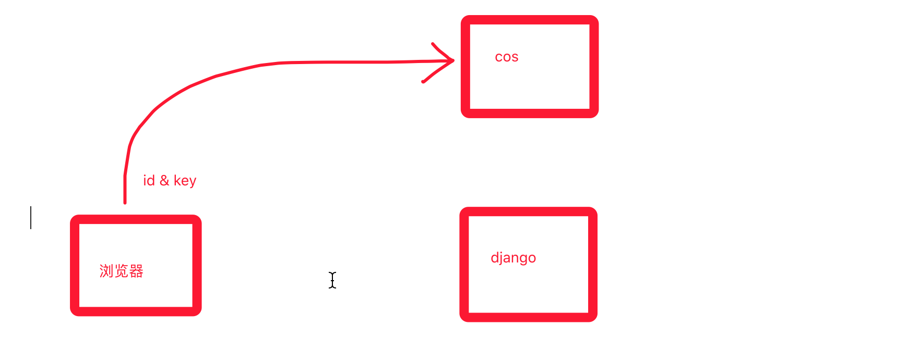
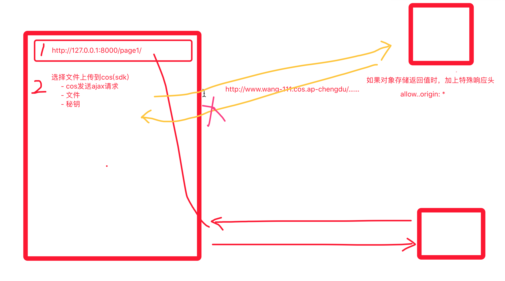
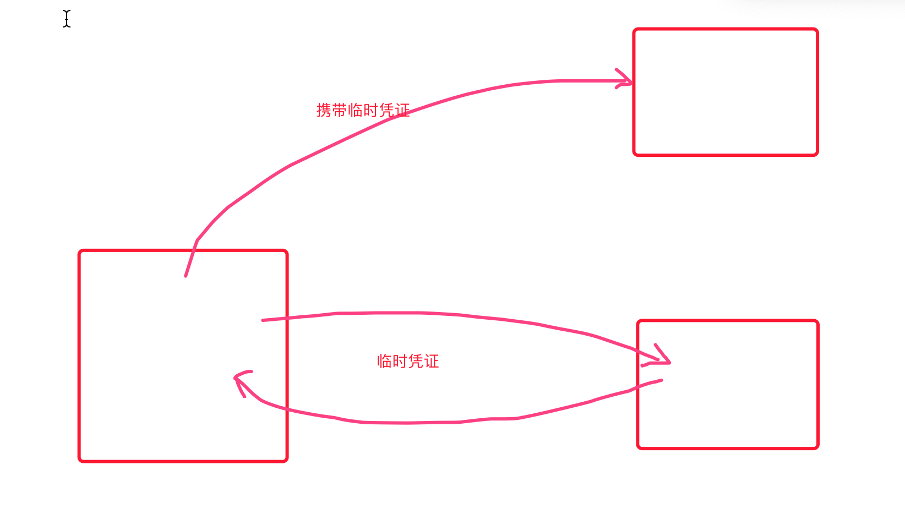

# day10 文件管理

- 毕云峰，遇到bug没找到，wiki没有写完呢。
- 任伟博，上传图片有问题。markdown配置：是否允许上传；
- 朱鑫朝：家里学习环境不好，去北京 落下2天的课。
- 高楚凡：路途太远；今天开始正产听课。
- 洪郭靖：
- 周子惠：上传图片有问题

功能介绍：

- 文件夹
- 文件

知识点：

- 莫泰对话框 & ajax  & 后台modelForm校验
- 目录切换：展示当前文件夹&文件
- 删除文件夹：嵌套的子文件 & 子文件夹 全部删除
- js上传文件到cos（wiki用python上cos上传文件）
- 进度条的操作
- 删除文件
  - 我们数据库中删除
  - cos中这个文件也需要删除
- 下载文件

## 今日概要

- 设计
- 表结构的创建
- 单独知识点

## 今日详细

### 1.功能设计





### 2.数据库的设计

| ID   | 项目ID | 文件<br />文件夹名 | 类型 | 大小   | 父目录 | key          |
| ---- | ------ | ------------------ | ---- | ------ | ------ | ------------ |
| 1    | 9      | 中记录             | 2    | null   | null   | null         |
| 2    | 9      | 周杰伦             | 2    | null   | null   | null         |
| 3    | 9      | 12.png             | 1    | 1000   | null   | x1sfsfs.png  |
| 4    | 9      | 12.png             | 1    | 1000   | null   | 12123asd.png |
| 5    | 9      | 侯佩岑             | 2    | null   | 2      | null         |
| 6    | 9      | 昆凌.avi           | 1    | 90     | 2      | x1sfsfs.png  |
| 7    | 9      | 王洋               | 1    | 100000 | 5      | x1sfsfs.png  |

```python
class FileRepository(models.Model):
    """ 文件库 """
    project = models.ForeignKey(verbose_name='项目', to='Project')
    file_type_choices = (
        (1, '文件'),
        (2, '文件夹')
    )
    file_type = models.SmallIntegerField(verbose_name='类型', choices=file_type_choices)
    name = models.CharField(verbose_name='文件夹名称', max_length=32, help_text="文件/文件夹名")
    key = models.CharField(verbose_name='文件储存在COS中的KEY', max_length=128, null=True, blank=True)
    file_size = models.IntegerField(verbose_name='文件大小', null=True, blank=True)
    file_path = models.CharField(verbose_name='文件路径', max_length=255, null=True, blank=True)# https://桶.cos.ap-chengdu/....
    
    parent = models.ForeignKey(verbose_name='父级目录', to='self', related_name='child', null=True, blank=True)

    update_user = models.ForeignKey(verbose_name='最近更新者', to='UserInfo')
    update_datetime = models.DateTimeField(verbose_name='更新时间', auto_now=True)
```

### 3.知识点

#### 3.1 URL传参/不传参

```
url(r'^file/$', manage.file, name='file'),
```

```python
# /file/
# /file/?folder_id=50
def file(request,project_id):
    folder_id = reqeust.GET.get('folder_id')
```

#### 3.2 模态框 + 警告框


#### 3.3 获取导航条

| ID   | 项目ID | 文件<br />文件夹名 | 类型 | 大小 | 父目录 | key          |
| ---- | ------ | ------------------ | ---- | ---- | ------ | ------------ |
| 1    | 9      | 中记录             | 2    | null | null   | null         |
| 2    | 9      | 周杰伦             | 2    | null | null   | null         |
| 3    | 9      | 12.png             | 1    | 1000 | null   | x1sfsfs.png  |
| 4    | 9      | 12.png             | 1    | 1000 | null   | 12123asd.png |
| 5    | 9      | 侯佩岑             | 2    | null | 2      | null         |
| 6    | 9      | 昆凌.avi           | 1    | 90   | 2      | x1sfsfs.png  |
| 7    | 9      | 王洋               | 2    | null | 5      | x1sfsfs.png  |

```python
# /file/
# /file/?folder_id=7
def file(request,project_id):
    folder_id = reqeust.GET.get('folder_id')
    
    url_list = [
        {'id':2,'name':"周杰伦"},
        {'id':5,'name':"侯佩岑"},
        {'id':7,'name':"王洋"},
    ]
    if not folder_id:
        pass
    else:
        file_object = models.FileRepository.objects.filter(id=folder_id,file_type=2).first()
        row_object = file_object
        while row_object:
            url_list.insert(0,{'id':row_object.id,"name":row_object.name})
            row_object = row_object.parent
	print(url_list)
```

#### 3.4 cos上传文件：Python

```python
def upload_file(bucket, region, file_object, key):
    config = CosConfig(Region=region, SecretId=settings.TENCENT_COS_ID, SecretKey=settings.TENCENT_COS_KEY)
    client = CosS3Client(config)

    response = client.upload_file_from_buffer(
        Bucket=bucket,
        Body=file_object,  # 文件对象
        Key=key  # 上传到桶之后的文件名
    )

    # https://wangyang-1251317460.cos.ap-chengdu.myqcloud.com/p1.png

    return "https://{}.cos.{}.myqcloud.com/{}".format(bucket, region, key)
```

详细：python操作COS的API（SDK）

注意：秘钥安全

#### 3.5 cos上传文件：js直接上传【建议官方文档】



1. 下载js（前端SDK）

   地址：https://github.com/tencentyun/cos-js-sdk-v5/tree/master/dist

   ```
   <script src="./cos-js-sdk-v5.min.js"></script>
   ```

2. 前端代码

   ```html
   
   
   <!DOCTYPE html>
   <html lang="en">
   
   <head>
       <meta charset="UTF-8">
       <meta name="viewport" content="width=device-width, initial-scale=1.0">
       <title>Document</title>
   </head>
   
   <body>
       <h1>示例1：直接通过秘钥进行上传文件</h1>
       <input type="file" name="upload_file" id="uploadFile" multiple />
   
       <script src=" "> </script>
       <script src=" "> </script>
       <script>
           var cos;
           $(function () {
               initCOS();
               bindChangeFileInput();
           });
   
           function initCOS() {
               cos = new COS({
                   SecretId: 'AKIDFPJSXQEk8PXVL3Tx5zf6MSL0Sf7Qoikg',
                   SecretKey: 'yiCWfZCXcQxJZlqncKvRu5DKHySg8sMp',
               });
           }
   
           function bindChangeFileInput() {
               $("#uploadFile").change(function () {
                   // 获取要上传的所有文件对象列表
                   // $(this)[0] = document.getElementById('uploadFile')
                   var files = $(this)[0].files;
                   $.each(files, function (index, fileObject) {
                       var fileName = fileObject.name;
                       // 上传文件
                       cos.putObject({
                           Bucket: 'wangyang-1251317460', /* 必须 */
                           Region: 'ap-chengdu',     /* 存储桶所在地域，必须字段 */
                           Key: fileName,              /* 必须 */
                           Body: fileObject, // 上传文件对象
                           onProgress: function (progressData) {
                               // 进度条
                               console.log("文件上传进度--->",fileName,JSON.stringify(progressData));
                           }
                       }, function (err, data) {
                           // 是否上传cos成功？
                           // 把上传成功的文件信息提交给django，django写入数据库。
                       });
   
                   })
   
               })
           }
       </script>
   </body>
   
   </html>
   ```

3. 跨域问题（浏览器导致）
   
   
   


#### 3.6 cos上传文件：临时秘钥【推荐】



1. 路由

   ```
   url(r'^demo2/$', manage.demo2, name='demo2'),
   url(r'^cos/credential/$', manage.cos_credential, name='cos_credential'),
   ```

2. 视图

   ```python
   def demo2(request):
   	return render(request,'demo2.html')
   	
   def cos_credential(request):
   	# 生成一个临时凭证，并给前端返回
   	# 1. 安装一个生成临时凭证python模块   pip install -U qcloud-python-sts 
   	# 2. 写代码
   	from sts.sts import Sts
       config = {
           # 临时密钥有效时长，单位是秒（30分钟=1800秒）
           'duration_seconds': 1800,
           # 固定密钥 id
           'secret_id': "AKIDFPJSXQEk8PXVL3Tx5zf6MSL0Sf7Qoikg",
           # 固定密钥 key
           'secret_key': "yiCWfZCXcQxJZlqncKvRu5DKHySg8sMp",
           # 换成你的 bucket
           'bucket': "wangyang-1251317460",
           # 换成 bucket 所在地区
           'region': "ap-chengdu",
           # 这里改成允许的路径前缀，可以根据自己网站的用户登录态判断允许上传的具体路径
           # 例子： a.jpg 或者 a/* 或者 * (使用通配符*存在重大安全风险, 请谨慎评估使用)
           'allow_prefix': '*',
           # 密钥的权限列表。简单上传和分片需要以下的权限，其他权限列表请看 https://cloud.tencent.com/document/product/436/31923
           'allow_actions': [
               'name/cos:PostObject',
               # 'name/cos:DeleteObject',
               # "name/cos:UploadPart",
               # "name/cos:UploadPartCopy",
               # "name/cos:CompleteMultipartUpload",
               # "name/cos:AbortMultipartUpload",
               "*",
           ],
   
       }
   
       sts = Sts(config)
       result_dict = sts.get_credential()
       return JsonResponse(result_dict)
   ```

3. html页面

   ```html
   
   
   <!DOCTYPE html>
   <html lang="en">
   
   <head>
       <meta charset="UTF-8">
       <meta name="viewport" content="width=device-width, initial-scale=1.0">
       <title>Document</title>
   </head>
   
   <body>
       <h1>示例2：临时凭证上传文件</h1>
       <input type="file" name="upload_file" id="uploadFile" multiple />
   
       <script src=" "> </script>
       <script src=" "> </script>
       <script>
           var cos;
           $(function () {
               initCOS();
               bindChangeFileInput();
           });
   
           function initCOS() {
               cos = new COS({
                   getAuthorization: function (options, callback) {
                       // 想django后台发送请求，获取临时凭证
                       // $.ajax({type:"GET"})
                       $.get('/cos/credential/', {
                           // 可从 options 取需要的参数
                       }, function (data) {
                           var credentials = data && data.credentials;
                           if (!data || !credentials) return console.error('credentials invalid');
                           callback({
                               TmpSecretId: credentials.tmpSecretId,
                               TmpSecretKey: credentials.tmpSecretKey,
                               XCosSecurityToken: credentials.sessionToken,
                               StartTime: data.startTime,
                               ExpiredTime: data.expiredTime,
                           });
                       });
                   }
               });
           }
   
           function bindChangeFileInput() {
               $("#uploadFile").change(function () {
                   // 获取要上传的所有文件对象列表
                   var files = $(this)[0].files;
                   $.each(files, function (index, fileObject) {
                       var fileName = fileObject.name;
                       // 上传文件（异步）
                       cos.putObject({
                           Bucket: 'wangyang-1251317460', /* 必须 */
                           Region: 'ap-chengdu',     /* 存储桶所在地域，必须字段 */
                           Key: fileName,              /* 必须 */
                           StorageClass: 'STANDARD',
                           Body: fileObject, // 上传文件对象
                           onProgress: function (progressData) {
                               console.log("文件上传进度--->", fileName, JSON.stringify(progressData));
                           }
                       }, function (err, data) {
                           console.log(err || data);
                       });
   
                   })
   
               })
           }
       </script>
   </body>
   
   </html>
   ```

4. 跨域解决
   


#### 总结

- python直接上传
- js + 临时凭证（跨域问题）

#### 3.7 cos的功能 & 项目

1. 创建项目 & 创建存储桶

   ```python
   def project_list(request):
       ...
       # POST，对话框的ajax添加项目。
       form = ProjectModelForm(request, data=request.POST)
       if form.is_valid():
           name = form.cleaned_data['name']
           # 1. 为项目创建一个桶 & 跨域规则
           bucket = "{}-{}-1251317460".format(request.tracer.user.mobile_phone, str(int(time.time())))
           region = 'ap-chengdu'
           create_bucket(bucket, region)
   
           # 2.创建项目
           form.instance.bucket = bucket
           form.instance.region = region
           form.instance.creator = request.tracer.user
           form.save()
           return JsonResponse({'status': True})
   
       return JsonResponse({'status': False, 'error': form.errors})
   ```

   ```python
   #!/usr/bin/env python
   # -*- coding:utf-8 -*-
   from qcloud_cos import CosConfig
   from qcloud_cos import CosS3Client
   from django.conf import settings
   
   
   def create_bucket(bucket, region="ap-chengdu"):
       """
       创建桶
       :param bucket: 桶名称
       :param region: 区域
       :return:
       """
   
       config = CosConfig(Region=region, SecretId=settings.TENCENT_COS_ID, SecretKey=settings.TENCENT_COS_KEY)
       client = CosS3Client(config)
       client.create_bucket(
           Bucket=bucket,
           ACL="public-read"  # private  /  public-read / public-read-write
       )
       
       cors_config = {
           'CORSRule': [
               {
                   'AllowedOrigin': '*',  
                   'AllowedMethod': ['GET', 'PUT', 'HEAD', 'POST', 'DELETE'],
                   'AllowedHeader': "*",  
                   'ExposeHeader': "*",  -meta-test1']
                   'MaxAgeSeconds': 500
               }
           ]
       }
       client.put_bucket_cors(
           Bucket=bucket,
           CORSConfiguration=cors_config
       )
   
   ```

#### 3.8  markdown上传图片【无改动】

#### 3.9 js上传文件

- 临时凭证：当前项目的 桶&区域（request.tracer.project...)
- js上传文件：设置当前的  桶&区域

#### 3.10 this

```html
var name = "全栈28期"

function func(){
	var name = "全栈25期"
	console.log(name)   // 全栈25
}

func();
```

```
var name = "全栈28期"

function func(){
	var name = "全栈25期"
	console.log(this.name) // 全栈28期
}

window.func();
```

```
var name = "王洋"
info = {
	name:"陈硕",
	func:function(){
		console.log(this.name) // 陈硕
	}
}
info.func()
```

```
var name = "王洋"
info = {
	name:"陈硕",
	func:function(){
		console.log(this.name)  // info.name > 陈硕
		function test(){
			console.log(this.name); // window.name > 王洋
		}
		test()
	}
}
info.func()
```

```
var name = "王洋"
info = {
	name:"陈硕",
	func:function(){
		var that = this;
		function test(){
			console.log(that.name); // info.name -> 陈硕
		}
		test()
	}
}
info.func()
```

总结：每个函数都是一个作用域，在他的内部都会存在this，谁调用的函数，函数里面this就是谁。

#### 3.11 闭包

```
data_list = [11,22,33]
for(var i=0;i++;i<data.length){
	console.log(i,data[i] )
}
```

```
data_list = [11,22,33]
for(var i=0;i++;i<data.length){
	// 循环会发送三次ajax请求，由于ajax是异步请求，所以在发送请求时候不会等待。
	$.ajax({
		url:"....",
		data:{value:data_list[i]},
		success:function(res){
			// 1分钟之后执行回调函数
		}
	})
}
console.log("全栈28期")
```

```
data_list = [11,22,33]
for(var i=0;i++;i<data.length){
	// 循环会发送三次ajax请求，由于ajax是异步请求，所以在发送请求时候不会等待。
	$.ajax({
		url:"....",
		data:{value:data_list[i]},
		success:function(res){
			// 1分钟之后执行回调函数
			console.log(i); // 输出：2
		}
	})
}
console.log(i) // 输出：2
```

```
    data_list = [11, 22, 33];
    for (var i = 0; i++; i < data.length) {

        function xx(data) {
            $.ajax({
                url: "....",
                data: {value: data_list[data]},
                success: function (res) {
                    // 1分钟之后执行回调函数
                    console.log(data); // 输出：0/1/2
                }
            })
        }

        xx(i)
    }
    console.log(i) // 输出：2
```

```
    data_list = [11, 22, 33];
    for (var i = 0; i++; i < data.length) {        
        (function(data){
            $.ajax({
                    url: "....",
                    data: {value: data_list[data]},
                    success: function (res) {
                        // 1分钟之后执行回调函数
                        console.log(data); // 输出：0/1/2
                    }
                })
        })(i)
    }
    console.log(i) // 输出：2
```

注意事项：如果你以后循环，循环内容发送异步请求，异步任务成功之后； 通过闭包来解决。


## 今日作业

1. 创建项目 & 创建桶 & 创建cors跨域
2. 临时秘钥上传文件功能实现【app01】不用写数据库
3. 列表页面 & 创建文件夹【web】写入数据库
4. 文件管理【可选】
   - 文件夹管理
   - 文件上传


